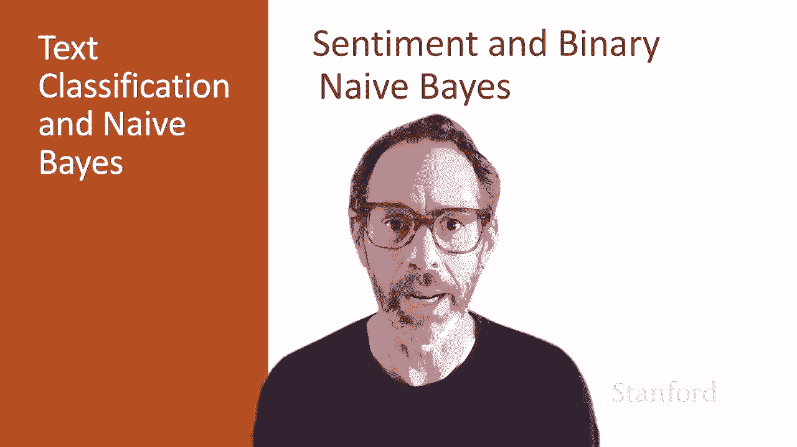
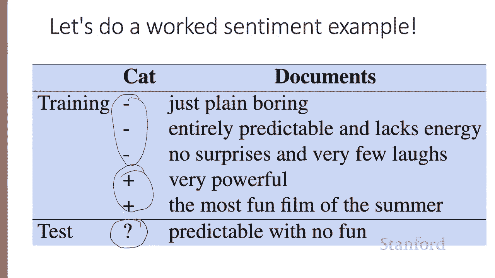
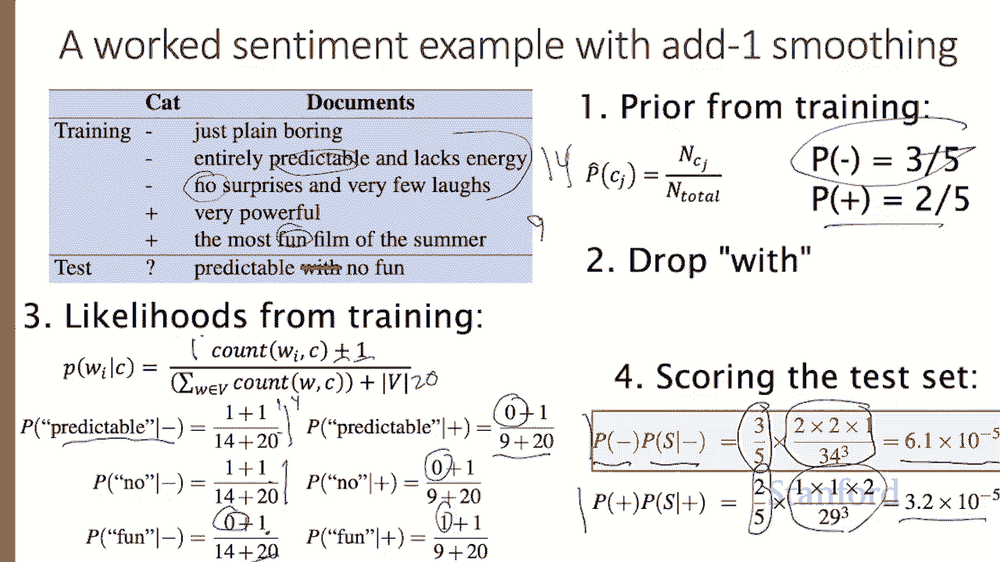
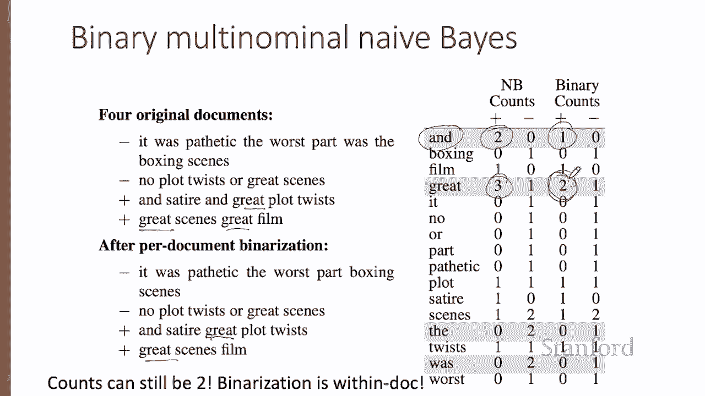
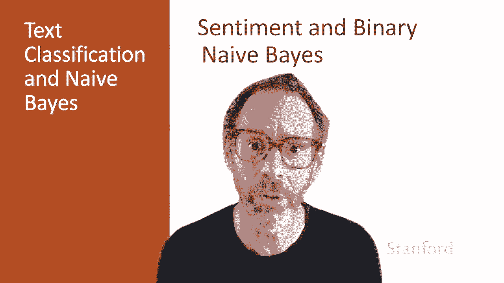

# 二十二：L4.4 - 情感分析与朴素贝叶斯 📊

在本节课中，我们将通过一个具体示例，学习如何应用朴素贝叶斯方法进行情感分析。我们还将介绍二元朴素贝叶斯算法。

---

## 概述

我们将通过一个简单的教学示例，演示如何从训练集中计算概率，以及如何为测试句子分配情感值。示例包含五个训练句子和一个测试句子。

## 计算先验概率

首先，我们需要计算两个类别（负面和正面）的先验概率。根据上一讲的内容，一个类别的概率等于该类别的文档数量除以文档总数。

我们有三个负面文档和两个正面文档。

因此，负面类别的先验概率为：
\[
P(\text{negative}) = \frac{3}{5}
\]

正面类别的先验概率为：
\[
P(\text{positive}) = \frac{2}{5}
\]

## 处理测试集词汇

接下来，我们移除测试集中未出现在训练集词汇表中的词。这意味着，如果一个词从未在训练集中出现过，我们在测试集中也将其忽略。

## 计算似然概率

我们将使用上一讲中提到的加一平滑公式来计算似然概率。对于给定类别中的任意一个词，其似然概率计算公式如下：
\[
P(w \mid c) = \frac{\text{count}(w, c) + 1}{\sum_{w' \in V} \text{count}(w', c) + |V|}
\]
其中，\(\text{count}(w, c)\) 是词 \(w\) 在类别 \(c\) 中出现的次数，\(|V|\) 是词汇表的大小。

我们需要知道每个词在类别中的出现次数，以及该类别中所有词的总出现次数（词条数）和词汇表大小。

*   在负面类别中，共有 14 个词条。
*   在正面类别中，共有 9 个词条。
*   词汇表大小 \(|V|\) 为 20（基于训练集统计）。

现在，让我们计算测试集中三个词（predictable, no, fun）的似然概率。

以下是计算过程：

*   **predictable 在负面类别中**：出现 1 次。
    \[
    P(\text{predictable} \mid \text{negative}) = \frac{1 + 1}{14 + 20}
    \]
*   **no 在负面类别中**：出现 1 次。
    \[
    P(\text{no} \mid \text{negative}) = \frac{1 + 1}{14 + 20}
    \]
*   **fun 在负面类别中**：出现 0 次。
    \[
    P(\text{fun} \mid \text{negative}) = \frac{0 + 1}{14 + 20}
    \]

类似地，我们可以计算这些词在正面类别中的似然概率。

## 对测试集进行分类

现在，我们准备对测试句子进行分类。我们将分别计算句子属于负面类别和正面类别的概率，并选择概率较高的类别作为预测结果。

计算公式为：
\[
P(c \mid d) \propto P(c) \times \prod_{w \in d} P(w \mid c)
\]

对于负面类别：
\[
P(\text{negative} \mid \text{test}) \propto \frac{3}{5} \times \frac{2}{34} \times \frac{2}{34} \times \frac{1}{34} \approx 6.1 \times 10^{-5}
\]

对于正面类别：
\[
P(\text{positive} \mid \text{test}) \propto \frac{2}{5} \times \frac{1}{29} \times \frac{1}{29} \times \frac{2}{29} \approx 1.1 \times 10^{-5}
\]

由于负面类别的概率更高，因此我们预测测试句子“predictable with no fun”的情感为负面。

## 二元朴素贝叶斯算法 🎯

在情感分析等任务中，一个词是否出现通常比它出现的频率更重要。例如，“fantastic”这个词的出现强烈暗示了用户对电影的积极感受，但这个词出现五次可能并不比出现一次提供多得多的信息。

基于这种直觉，我们引入**二元多项式朴素贝叶斯**算法（简称二元朴素贝叶斯）。该算法非常简单：

在训练和测试时，我们将每个文档内的词频截断为1。也就是说，如果一个词在文档中出现多次，我们只按出现一次处理。

> 请注意，这与**伯努利朴素贝叶斯**不同，后者通常不用于文本分类。

二元朴素贝叶斯的算法步骤如下：

**训练阶段：**
1.  计算先验概率，方法与标准朴素贝叶斯完全相同。
2.  在计算似然概率之前，对每个文档进行去重处理。对于文档 \(j\) 中的每个词类型 \(w\)，如果存在多个副本，只保留一个。然后将所有文档的文本拼接起来，像之前一样计算似然概率。

**测试阶段：**
1.  同样，先移除测试文档 \(d\) 中的所有重复词。
2.  然后使用标准的朴素贝叶斯公式进行计算。

让我们通过一个例子来理解二元化处理的影响。

假设我们有四个文档（两正两负）。在标准计数中，“and”在正面文档中出现2次，在负面文档中出现0次；“great”在正面文档中出现3次，在负面文档中出现1次。

在对每个文档进行二元化（即文档内去重）后：
*   原本有两个“and”的文档现在只计为一个“and”。
*   原本有两个“great”的文档现在只计为一个“great”。

然后，我们基于二元化后的文档重新统计词频。请注意，一个词在某个类别中的总计数仍然可能大于1，因为它可以出现在该类别的多个文档中。例如，“great”在二元化后，仍然在两个正面文档中出现，因此它在正面类别中的计数为2。

## 总结

本节课中，我们一起学习了朴素贝叶斯方法在情感分析中的详细应用。我们通过示例演示了如何计算先验概率和似然概率，并对测试句子进行分类。此外，我们还介绍了适用于情感分析任务的二元朴素贝叶斯算法，该算法通过文档内词频二元化来强调词的出现与否，而非出现频率，在实践中往往能取得更好的效果。