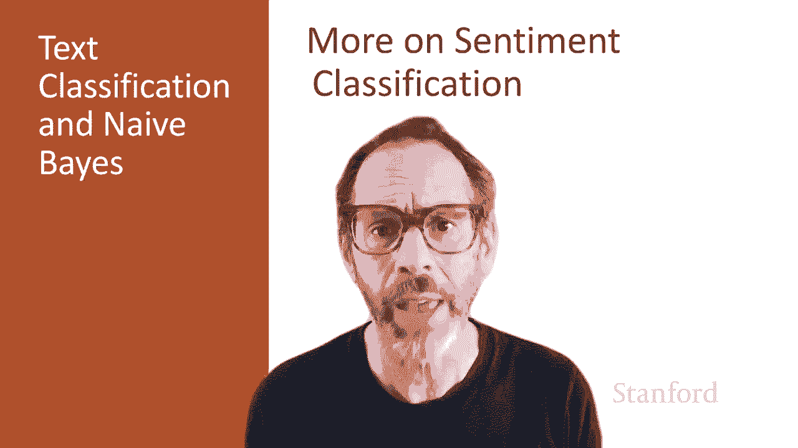
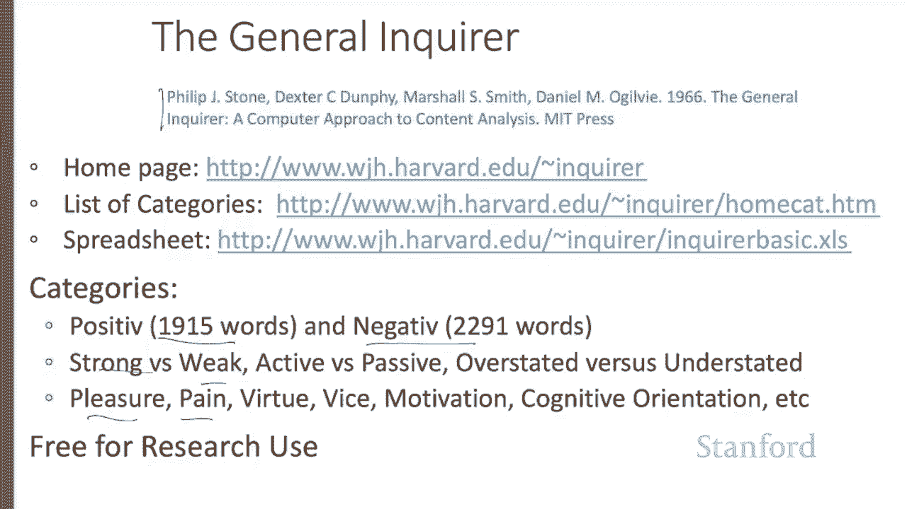
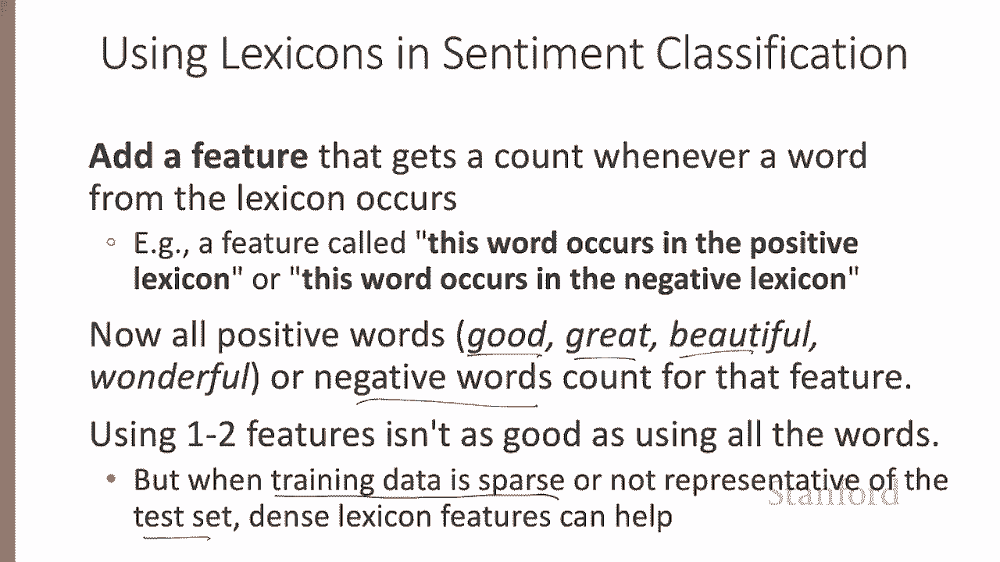
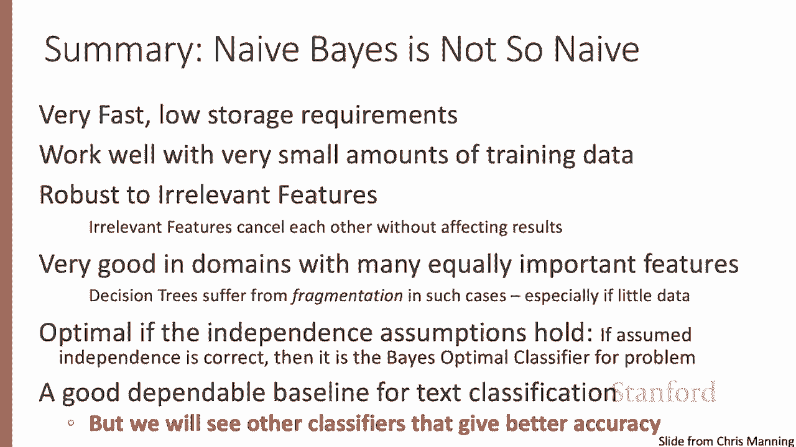
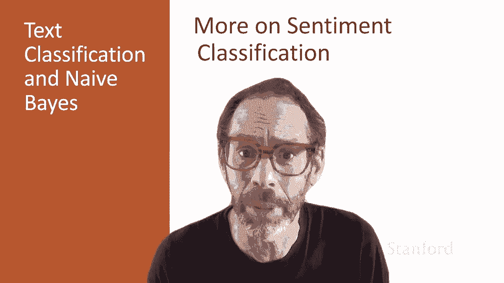

# 二十三：L4.5 - 情感分析延展内容



在本节课中，我们将要学习情感分析中的两个重要方面：语言否定现象和词典的使用。同时，我们也会探讨朴素贝叶斯模型在文本分类中的其他应用场景，例如垃圾邮件过滤和语言识别。

---

## 🔍 语言否定现象的处理

上一节我们介绍了情感分类的基础，本节中我们来看看一个在情感分类中常见的重要问题：语言否定现象。

例如，句子 **“I really like this movie”** 与 **“I really don't like this movie”** 的含义截然不同。在这里，否定词“don't”将“like”的含义从正面转变为负面。否定同样可以将负面含义弱化为相对正面，例如“dismiss this film”被“don't”修饰后，其负面程度会降低。

一个简单且经典的处理基线方法是：在否定词（如 `not`, `never`, `no`, `don't`）与其后的标点符号之间的每个单词前，添加字符串 `NOT_`。

以下是一个处理示例：
```python
# 原始句子: "didn't like this movie, but I..."
# 处理后: "didn't NOT_like NOT_this NOT_movie, but I..."
```
这种方法本质上是将词汇表大小翻倍，创建了如 `NOT_like` 这样的新词元，这些词元将成为判断负面评论的有力线索。

---

## 📖 词典在情感分析中的应用



有时，我们可能没有足够的标注训练数据，或者训练数据与测试数据的分布不同。在这种情况下，使用预先构建的词典会很有帮助。

以下是两个常用的公开情感词典示例：
*   **MP QA 主观性线索词典**：标注了约7000个单词的正负极性，例如 `admirable`（正面）、`awful`（负面）。
*   **General Inquirer 词典**：一个更早期的词典，除了正负面词，还包含如主动/被动、愉悦/痛苦等类别的词汇列表。

在情感分类中使用词典的方法是：创建新的特征。我们不再为每个具体的词（如 `good`, `great`）单独计数，而是将它们汇总。

以下是特征构建方式：
*   **正面词特征**：每当出现词典中的任何一个正面词时，该特征计数加1。
*   **负面词特征**：每当出现词典中的任何一个负面词时，该特征计数加1。

公式可以表示为：
**正面特征值 = Σ (文档中每个属于正面词典的词)**
**负面特征值 = Σ (文档中每个属于负面词典的词)**



这样，我们就将大量稀疏的词汇特征压缩成了两个密集的特征。这在训练数据稀疏或与测试集分布不一致时特别有用。

---

## ⚙️ 朴素贝叶斯的其他应用

朴素贝叶斯模型不仅适用于情感分析，也能很好地应用于其他文本分类任务。

### 垃圾邮件过滤
这是一个著名的应用场景。朴素贝叶斯分类器可以使用以下特征：
*   邮件正文是否包含“millions of dollars”。
*   发件人地址是否以数字开头。
*   邮件主题是否全部大写。
*   是否出现“100% guaranteed”等短语。

### 语言识别
这是确定一段文本使用何种语言的任务，是一个重要的预处理步骤。事实证明，基于字符N-gram的特征对此任务非常有效，因为某些字符组合对特定语言具有高度辨识度。

需要注意的是，训练时应涵盖每种语言的不同变体。例如，对于英语，应确保训练数据包含美式英语、非洲裔美国人英语、印度英语等多种变体。

---

## ✅ 课程总结



本节课中我们一起学习了情感分析的延展内容，包括如何处理语言否定现象以及如何利用词典来增强模型在数据稀缺情况下的表现。同时，我们也看到了朴素贝叶斯这一“并不朴素”的模型在其他文本分类任务（如垃圾邮件检测和语言识别）中的广泛应用。



总结来说，朴素贝叶斯模型速度快、存储需求低、对小规模训练数据友好，并且对无关特征相对稳健。在特征独立性假设成立的情况下，它甚至是最优分类器。因此，它是文本分类任务中一个可靠的基础模型。当然，当拥有足够训练数据时，逻辑回归、神经网络等分类器通常能获得更高的准确率。