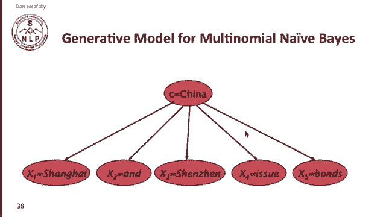
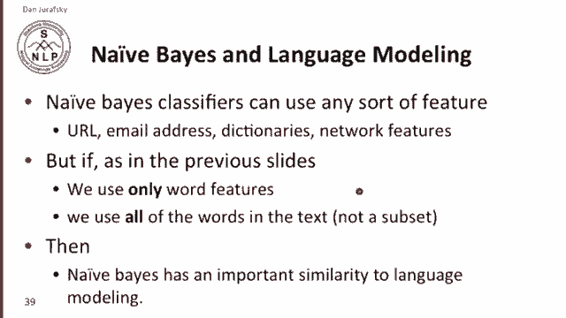
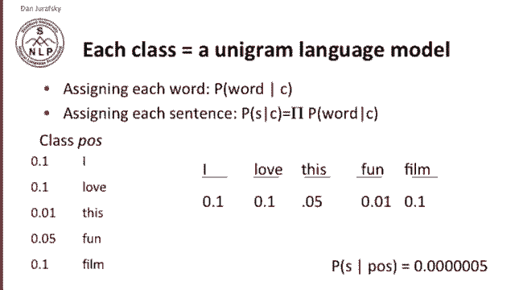
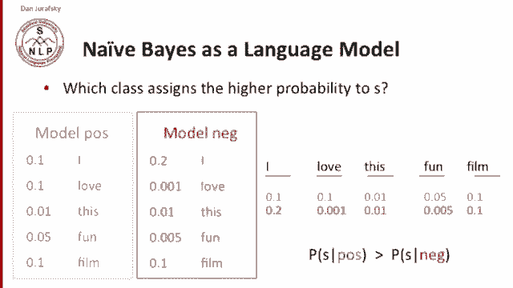

# 二十四：L4.6 - 朴素贝叶斯与语言模型的关系 📚 

在本节课中，我们将要学习朴素贝叶斯分类器与语言模型之间的紧密联系。我们将看到，朴素贝叶斯本质上可以被视为一种特殊的语言模型。

---

## 🔗 朴素贝叶斯与语言模型的联系

朴素贝叶斯与语言模型有着非常密切的关系。

让我们看看这是如何成立的。我们将从观察多项式朴素贝叶斯的生成模型开始。

想象我有一个类别，假设是“中国”。我们想象正在随机生成一篇关于中国的文档。

我们可能会这样开始：第一个词 `x1` 是“上海”，第二个词是“和”，第三个词是“深圳”，第四个词是“发行”，第五个词是“债券”，以此类推。我们就生成了一篇关于中国的小文档，一篇随机的小文档。

这个生成模型向我们展示的是，每个词都是独立地从某个类别中，以特定概率生成的词。我们为每个词都维护了一组概率。

让我们思考一下这一点。

---

## 🧩 朴素贝叶斯作为语言模型

通常，朴素贝叶斯分类器可以使用各种特征，如URL、电子邮件地址等。我们将在垃圾邮件检测中讨论这一点。但是，如果在前面的幻灯片中，我们只使用词作为特征，并且使用文本中的所有词，那么结果就是，朴素贝叶斯的这个生成模型使其与语言模型有了重要的相似性。朴素贝叶斯实际上是一种语言模型。

具体来说，在朴素贝叶斯分类器中，**每个类别都是一个一元语言模型**。

我们可以这样理解：在朴素贝叶斯分类器中，似然项为每个词分配了给定类别的概率 `P(词 | 类别)`。

对于一个句子（甚至整个文档），由于我们将所有词的概率相乘，我们计算的是给定类别的句子概率 `P(句子 | 类别)`。我们只是将所有词在给定类别下的似然相乘。

让我们看看这是如何运作的。想象我们有一个“积极”类别。我们有我们的似然：`P(I | 积极)`，`P(love | 积极)`，`P(this | 积极)` 等等。假设 `P(I | 积极)` 是 0.1，`P(love | 积极)` 是 0.1，以此类推。

好的，这就是我们的朴素贝叶斯分类器。我们可以将其完全视为一个语言模型。我们有一个词序列：“I love this fun film”。朴素贝叶斯为这个序列中的每个词分配了一组概率（来自该类别的概率），例如 0.1, 0.1, 0.05 等等。

因此，如果我们将所有这些概率相乘，我们就可以得到这个句子的概率。所以，朴素贝叶斯中的每个类别，就是一个以类别为条件的一元语言模型。

---

## 🏃‍♂️ 运行两个语言模型进行比较

上一节我们介绍了朴素贝叶斯如何作为语言模型，本节中我们来看看它是如何进行分类决策的。

当我们问“哪个类别为文档分配了更高的概率”时，这就像我们在运行两个独立的语言模型。

这里我展示了两个独立的语言模型：“积极”类别和“消极”类别。每个模型都有独立的概率。例如，这是 `P(I | 消极)`，这是 `P(I | 积极)`。我猜人们在不喜欢某物时更可能使用“I”这个词。

现在，如果我们取一个特定的句子：“I love this fun film”。我们问：这个序列的概率是多少？根据我们的第一个模型，这个序列的概率是多少？根据我们的第二个模型，概率又是多少？

每个模型为每个词分配一个概率，这就是朴素贝叶斯的似然。我们可以将它们全部相乘。通过观察，你可以看出，正面的概率相乘（主要因为这个词和那个词）将远高于负面的概率相乘。

因此，你可以将朴素贝叶斯视为：每个类别都是一个独立的、以类别为条件的语言模型。我们将运行每个语言模型来计算测试句子的似然，然后选择具有更高概率的语言模型作为其类别，也就是更可能的类别。

---

## 📝 总结

本节课中，我们一起学习了朴素贝叶斯与语言模型之间的紧密关系。我们了解到，朴素贝叶斯分类器中的每个类别都可以被看作一个一元语言模型，分类过程本质上是比较不同类别语言模型对文档生成概率的高低。