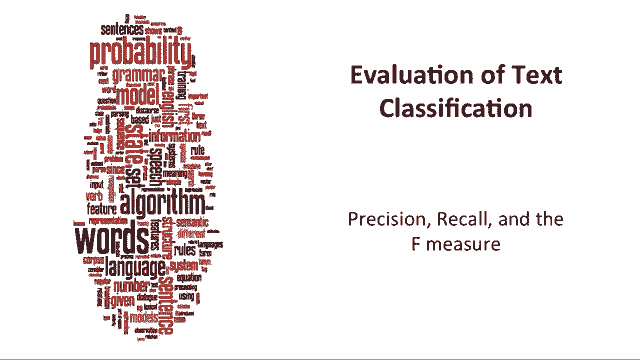
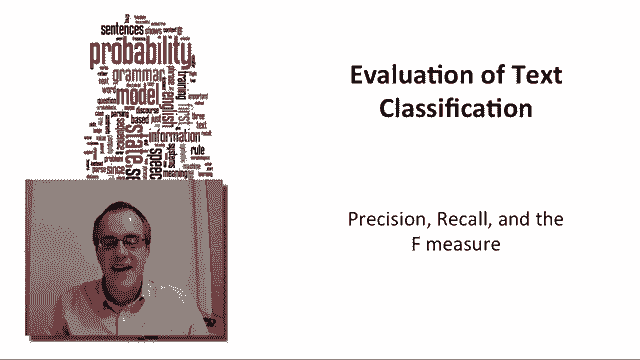
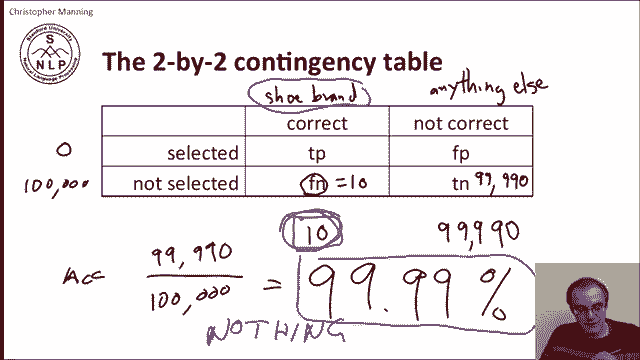
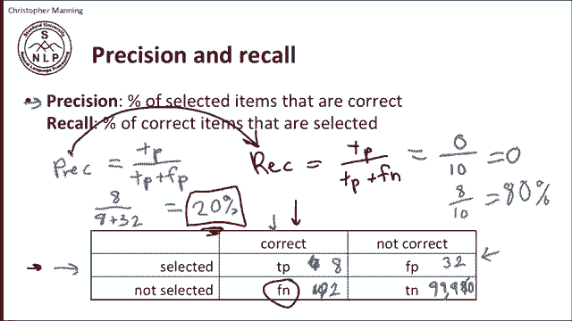
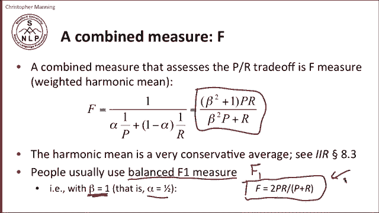
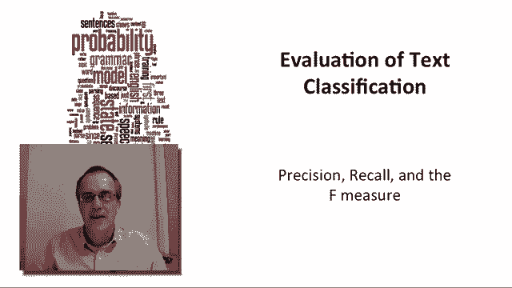

# 二十五：Le4.7 - 精确率、召回率与F值 📊 

在本节课中，我们将学习如何评估文本分类系统的性能。我们将正式介绍精确率（Precision）和召回率（Recall）这两个核心概念，并了解如何将它们组合成一个综合指标——F值（F-measure）。这些评估指标不仅适用于文本分类，也广泛应用于自然语言处理的其他任务中。

## 📈 理解评估的起点：混淆矩阵

上一节我们提到了评估的重要性，本节中我们来看看评估的起点——混淆矩阵。混淆矩阵是一个2x2的表格，它描述了分类系统在预测时可能出现的四种情况。

对于任何一条待评估的数据，其真实情况（Truth）和系统预测（System）可以构成以下四种状态：

*   **真正例（True Positive, TP）**：数据确实属于某个类别，系统也预测它属于该类别。
*   **假负例（False Negative, FN）**：数据确实属于某个类别，但系统预测它不属于该类别。
*   **假正例（False Positive, FP）**：数据不属于某个类别，但系统预测它属于该类别。
*   **真负例（True Negative, TN）**：数据不属于某个类别，系统也预测它不属于该类别。

## ⚖️ 准确率的局限性

在两类样本数量大致相当的分类任务中（例如垃圾邮件分类），一个合理的评估指标是准确率（Accuracy）。准确率衡量的是所有预测中正确的比例。

**准确率公式**：
`准确率 = (TP + TN) / (TP + FP + FN + TN)`

然而，当处理类别分布极不均衡的任务时，准确率会失效。例如，在网页中检测“鞋类品牌”的提及。假设在10万个词中，只有10个是鞋类品牌，其余99990个都不是。如果一个系统简单地预测“所有词都不是鞋类品牌”，那么它的准确率高达99.99%，但它完全没有完成我们检测品牌的目标。因此，我们需要更关注少数类别的评估指标。

## 🎯 精确率与召回率

为了解决上述问题，我们引入精确率和召回率。这两个指标完全聚焦于我们关心的“正例”（例如鞋类品牌）上。

以下是这两个指标的定义：

*   **精确率（Precision）**：在所有被系统判定为正例的样本中，真正为正例的比例。它衡量的是系统预测的“准度”。
    *   **公式**：`精确率 = TP / (TP + FP)`
*   **召回率（Recall）**：在所有真实为正例的样本中，被系统正确找出的比例。它衡量的是系统预测的“查全率”。
    *   **公式**：`召回率 = TP / (TP + FN)`

回到鞋类品牌的例子。如果一个系统预测了40个词为品牌，其中8个是正确的（TP=8），32个是错误的（FP=32），还有2个真实品牌没被找到（FN=2）。那么：
*   精确率 = 8 / (8+32) = 20%
*   召回率 = 8 / (8+2) = 80%

## 🔄 精确率与召回率的权衡

从上面的例子可以看出，精确率和召回率之间存在一种权衡关系。通常，为了提高召回率（找到更多正例），系统需要放宽判断标准，这会导致误判增加，从而降低精确率。反之，为了提高精确率（确保预测结果更可靠），系统需要更严格，这可能会漏掉一些正例，从而降低召回率。

这种权衡在不同应用场景下有不同的侧重点：
*   在法律证据发现等场景中，**高召回率**至关重要，因为不能遗漏任何相关证据。
*   在向用户展示推荐结果时，**高精确率**可能更重要，因为需要确保展示的内容是用户真正感兴趣的。

## 🧮 综合指标：F值

虽然精确率和召回率各自提供了有价值的信息，但有时我们需要一个单一指标来综合比较不同系统。这就是F值（F-measure）的作用。F值是精确率和召回率的加权调和平均数。

**F值通用公式**：
`F = ( (β² + 1) * P * R ) / ( β² * P + R )`
其中，P代表精确率，R代表召回率，β是一个参数，用于控制对召回率的相对重视程度（β>1时更重视召回率，β<1时更重视精确率）。

最常用的是平衡F值，即**F1值**，它赋予精确率和召回率相同的权重（β=1）。

**F1值简化公式**：
`F1 = 2 * P * R / (P + R)`

这个公式简洁明了，是实践中使用最广泛的综合评估指标。

## 📝 课程总结

本节课中，我们一起学习了文本分类的核心评估指标。
1.  我们首先通过**混淆矩阵**理解了分类结果的四种可能状态。
2.  我们认识到在类别不均衡的任务中，**准确率**这一指标存在严重缺陷。
3.  为此，我们引入了**精确率**和**召回率**，它们能有效评估系统对目标类别的识别能力。
4.  我们探讨了精确率与召回率之间存在的**权衡关系**，这在设计系统时需要根据应用场景进行考量。
5.  最后，我们学习了将两者结合的**F值**，特别是**F1值**，它为我们提供了一个单一、平衡的综合评估指标。

掌握这些概念，将帮助你更好地设计、优化和评估自然语言处理系统。