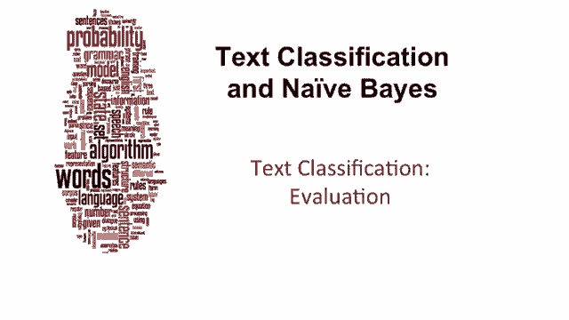
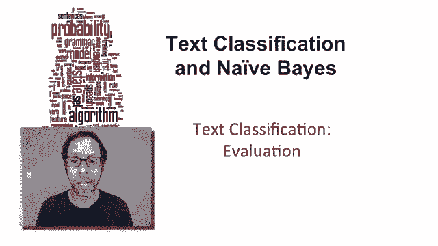
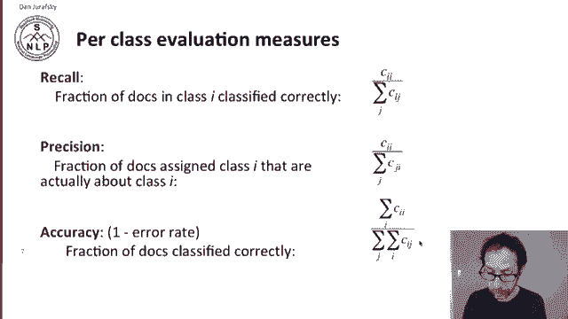
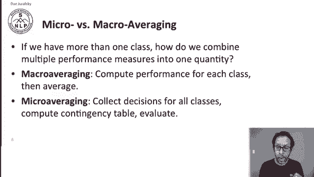
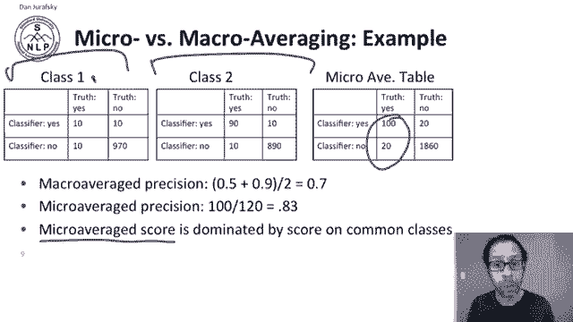
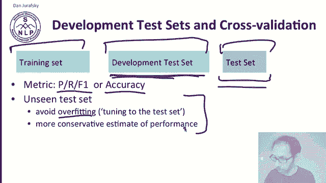
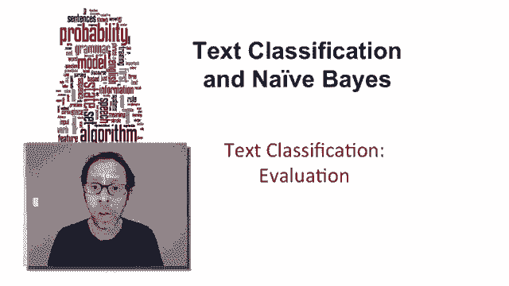

# 二十六：L4.8 - 文本分类评估 📊 

在本节课中，我们将学习如何评估文本分类系统的性能。我们将介绍多类别分类的评估方法，包括混淆矩阵、精确率、召回率以及如何通过宏平均和微平均来综合多个类别的性能。最后，我们会讨论如何正确划分数据集以避免过拟合。

---

## 📄 路透社数据集

上一节我们介绍了精确率和召回率，现在让我们转向文本分类评估中的其他问题。

一个常用的文本分类数据集是路透社数据集。它包含21000篇文档，并提供了标准的训练集和测试集划分。该数据集有118个类别，这是一个多值分类问题，因为一篇文章可以属于多个类别。这意味着我们将训练118个独立的分类器，每个分类器进行二元判断。平均每篇文档属于略多于一个类别。以下是一些常见类别及其训练和测试文档的数量：例如，有433篇关于谷物的训练文档和149篇测试文档，类别包括小麦、玉米、利率等。

以下是一篇路透社文档的示例，可以看到它涉及牲畜和猪两个主题。我们的任务是根据文本内容，将这篇文档分类到“牲畜”和“猪”这两个类别中。

---

## 📊 混淆矩阵

对于多类别分类，混淆矩阵非常重要。

混淆矩阵告诉我们，对于任意一对类别 C1 和 C2，有多少篇属于 C1 的文档被错误地分配到了 C2。这里有一个小例子：我们有一些关于家禽、小麦或咖啡的文档，以及它们的真实类别和文档数量。旁边是我们的分类器给出的预测类别。

例如，单元格 C(3,2) 中的数字 90 表示，有90篇实际上是关于小麦的文档，但我们的分类器认为它们是关于家禽的。这个分类器似乎非常“偏爱”鸡。混淆矩阵的每个单元格都告诉我们，每个类别的文档有多少被分类到了其他类别。这意味着混淆矩阵的对角线给出了正确分类的数量：例如，有95篇我们预测为“英国”的文档实际上就是关于英国的，而我们预测为“小麦”的文档中，实际上没有一篇是关于小麦的。

---

## 🧮 计算评估指标

我们可以使用混淆矩阵来计算之前讨论过的相同指标：精确率和召回率。

让我们从召回率开始。召回率是类别 i 中被正确分类的文档比例，即我们找到了多少篇属于类别 i 的文档。其计算公式为：

**召回率 = 真正例 (C_ii) / 该行总和**

回顾我们的表格，对于“小麦”这一行，如果我们的真正例是0（说明分类器对小麦的分类非常糟糕），那么召回率就是 0 除以该行所有数字之和（10 + 90 + 1）。

对于精确率，我们要问的是：在我们返回的文档（即整个预测列）中，有多少是正确的？例如，在我们预测为“小麦”的文档中，有多少篇真正是关于小麦的？其计算公式为：

**精确率 = 真正例 (C_ii) / 该列总和**

准确率则是所有被正确分类的文档比例，即混淆矩阵对角线元素之和除以矩阵中所有元素之和。

---

## ⚖️ 宏平均与微平均

由于我们有多个类别，我们需要一种方法将每个类别的精确率和召回率值合并为一个综合指标。通常，拥有一个单一指标很有用。有两种标准方法可以实现这一点。

在宏平均中，我们为每个类别单独计算性能指标（精确率、召回率或F1分数），然后取平均值。例如，如果我们有113个类别，我们将计算113个精确率，然后对它们进行平均，得到宏平均精确率。

在微平均中，我们将所有类别的决策汇总到一个单一的列联表中，然后基于这个总表计算精确率。

---

## 📈 宏平均与微平均示例

让我们看一个例子。这里有两个类别：类别1和类别2。表格显示了每个类别的真实正例和负例数量，以及分类器的预测结果。

对于宏平均精确率，我们分别为两个类别计算：
*   类别1：10 / (10 + 10) = 0.5
*   类别2：90 / (90 + 10) = 0.9
因此，宏平均精确率是 (0.5 + 0.9) / 2 = 0.7。

对于微平均，我们将两个列联表相加，得到一个单一的微平均列联表。然后直接从这个总表计算精确率：100 / (100 + 20) ≈ 0.83。

可以看到，微平均分数受常见类别（类别2）的分数主导，因为它的数量更大，在汇总的列联表中会占主导地位。而在宏平均中，每个类别平等参与计算。

---

## 🧪 数据集划分与交叉验证

对于文本分类评估，我们需要的不仅仅是精确率或召回率。与许多基于机器学习的自然语言处理算法一样，我们需要训练集、用于衡量性能的测试集，以及一个称为开发测试集或开发集的数据集。

我们在训练集上计算模型参数。开发集则用于在开发系统时测试性能。无论是查看精确率、召回率、F1分数还是准确率，我们都会根据开发集上的分数来发现算法中的错误并开发新特征。

一旦算法开发完成，我们就可以在一个干净的、未曾见过的测试集上进行最终测试。拥有这样一个干净的测试集非常重要，否则，如果我们一直在开发集上报告结果，最终会导致过拟合，报告的性能可能虚高，因为我们的算法已经针对这个开发集进行了调优。一个干净的、未见过的测试集能给我们一个更保守的性能估计。

---

## 🔄 交叉验证

由于数据集可能较小或不具代表性，我们可能会遇到抽样误差。因此，如前所述，交叉验证是常见做法。

例如，我们预留一部分数据作为开发集，用其余数据训练模型，然后在开发集上查看性能。接着，我们采用不同的划分方式，用另一部分数据训练，在同一开发集上报告性能。如此重复多次。最后，我们将每次划分的结果汇总，计算一个总的、汇总的开发集性能。这让我们可以避免使用非常小或不具代表性的测试集，并且大部分数据在不同的划分中都能既用于训练也用于测试。

尽管如此，在最后，我们仍然需要一个干净的、未见过的最终测试集，以避免对这些开发集产生过拟合。

---

## 📝 总结

本节课中，我们一起学习了多种评估文本分类的方法。我们介绍了精确率、召回率和F1分数，并讨论了在多类别（超过两个类别）问题中该如何处理。我们还了解了宏平均和微平均的概念。这些思想和方法将在整个自然语言处理领域中得到广泛应用。