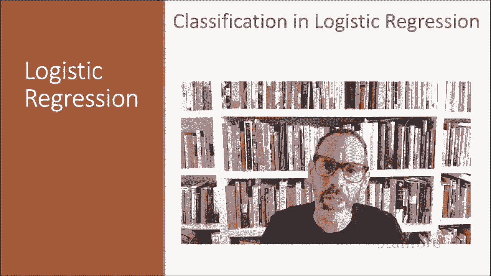
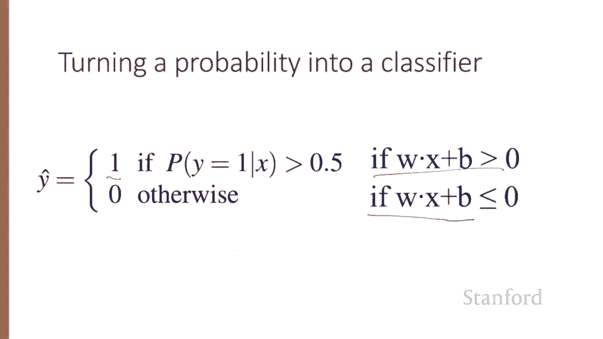

# 二十八：L5.2 - 逻辑回归分类 📚 

在本节课中，我们将学习如何使用逻辑回归进行分类，并介绍重要的 Sigmoid 函数。

## 📖 概述

我们将探讨逻辑回归如何将文本分类任务（如情感分析、垃圾邮件识别）转化为一个概率预测问题。逻辑回归通过加权特征和 Sigmoid 函数，为输入文档计算其属于某个类别的概率。

## 📝 文本分类任务

逻辑回归可用于多种文本任务，例如判断情感是积极还是消极，判断消息是否为垃圾邮件，或判断作者身份（例如著名的《联邦党人文集》作者是汉密尔顿还是麦迪逊的案例）。

对于文本分类，我们有一个文档 X 和一个固定的类别集合 C。我们的目标是输出一个预测类别 Y_hat，它是给定 X 后，从 C 中选出的一个类别。

给定一系列输入输出对（我们使用上标表示每个观测值 X 及其标签 Y），我们将表示一组特征向量 x^1 到 x^N。然后，我们将从集合 {0, 1} 中给出一个预测类别 Y_hat，这就是二元分类。

## ⚖️ 逻辑回归中的特征与权重

在逻辑回归中，我们利用特征。每个特征 X_i 表达了关于文本的某个事实，它有一个权重 W_i，告诉我们该特征对分类决策的重要性。

例如，一个特征 X_i 可能是“评论包含‘awesome’这个词”。假设其权重 W_i 是 +10，这表明对于情感分类器来说，包含“awesome”这个词是强烈指向积极情感的正面线索。

相反，特征“评论包含‘abysmal’”可能有一个权重 W_j = -10，这意味着“abysmal”的权重很高，但是负权重，因此强烈指向消极类别。

另一个特征 X_k，“评论包含‘mediocre’”，可能略微负面，因此其权重为轻微的负值，使我们略微倾向于消极类别。

总而言之，对于逻辑回归，我们取一个输入观测值，将其表示为一组特征。X 将被表示为一组 n 个特征。我们将有一组 n 个权重 W_1 到 W_n（有时这些权重被称为 θ_1 到 θ_n，有时我们将整个参数集称为 θ）。然后，我们将从集合 {0, 1} 中输出一个预测类别 Y_hat。

这就是二元逻辑回归。我们稍后会看到其扩展到多项逻辑回归，其中输出可以来自更大的可能类别集合，但目前我们专注于二元分类。

## 🧮 分类计算过程

权重 W 告诉我们特征的重要性。我们还会有一个偏置项（有时称为截距），这是另一个加到加权输入上的实数。

我们将所有这些加权特征和偏置项相加。也就是说，我们取每个特征 X 及其权重 W，将它们相乘，然后全部求和，再加上偏置项 B，计算出一个总分。

在这些课程中，我们将使用线性代数中的点积符号来表示此类求和。两个向量 A 和 B 的点积写作 A·B，是对应元素乘积的总和。因此，这里所有 W_i * X_i 的总和我们将表示为 **W·x**。

因此，我们计算这个总和 **Z = W·x + B**。如果 Z 值高，我们会说这是正类（例如积极情感）。如果 Z 值低（W·x + B 低），那么我们会说这是负类（y = 0）。

## 🎲 构建概率分类器

然而，我们的目标是构建一个概率分类器。我们希望形式化上一张幻灯片中提到的“如果总和高”这一概念。我们想要一个能给出概率的模型，就像朴素贝叶斯那样。

我们希望模型能给出一个概率，即在给定输入 x 和所有参数 θ（权重）的情况下，y=1 的概率 P(y=1 | x; θ)，或者 y=0 的概率 P(y=0 | x; θ)。

问题在于，**Z = W·x + B** 本身不是一个概率。它只是一个数字。实际上，没有任何东西强制 W·x + B 位于 0 和 1 之间，权重是实数值，它甚至可能是负数。事实上，Z 的范围是从负无穷到正无穷。

因此，我们将使用一个 Z 的函数，该函数的输出范围在 0 到 1 之间。我们将使用的函数是非常有用的 Sigmoid 函数或逻辑函数。

## 📈 Sigmoid 函数

**y = σ(z)**，其中 Sigmoid 函数定义为 **σ(z) = 1 / (1 + e^{-z})**。

下图展示了 Sigmoid 函数，因其形状像字母 S 而得名。该函数取一个实数值，并将其巧妙地映射到范围 (0, 1) 内。

请注意，它在零点附近几乎是线性的，但异常值会被压缩趋向于 0 或 1，因此它是一个非常有用的函数。

## 🔄 逻辑回归的工作流程

逻辑回归的工作流程如下：我们拥有特征、权重和偏置项，我们计算 **Z = W·x + B**，将其通过 Sigmoid 函数，然后将其视为概率。

现在，我们只需要弄清楚如何将 Sigmoid 的输出转化为概率。

## 🧾 从 Sigmoid 输出到概率

我们几乎已经完成了。如果我们将 Sigmoid 应用于加权特征的总和，我们得到一个介于 0 和 1 之间的数字。为了使其成为概率，我们只需要确保两种情况 P(y=1) 和 P(y=0) 之和为 1。

我们可以按如下方式实现：我们令 **P(y=0) = 1 - σ(W·x + B)**，而 **P(y=1) = σ(W·x + B)**。这样我们就保证了这两者之和为 1。

我们可以在这里做一点算术，代入 **σ(z) = 1 / (1 + e^{-z})**。顺便说一下，Sigmoid 函数有一个有用的性质：**1 - σ(x) = σ(-x)**。因此，概率 P(y=0)，即我们所说的 1 - σ(W·x + B)，也可以表示为 σ(-(W·x + B))。我们有时会看到这种形式。

## 🚦 决策边界

现在，为了将概率转化为分类器，我们的估计 Y_hat（我们对示例 X 类别的估计）是：如果 P(y=1) > 0.5，则 Y_hat = 1；否则 Y_hat = 0。这里的 0.5 就是决策边界。

在下图中，X 轴表示 W·x + B，Y 轴表示由我们的 Sigmoid 函数产生的概率 P(y=1)。这是我们的 σ(W·x + B) 图，这里是我们的决策边界。

因此，任何大于 0.5 的情况：如果 W·x + B > 0.5，那么 P(y=1) > 0.5，我们将把这个示例标记为正类。

换句话说，给定一个示例 x，如果 **W·x + B > 0**，我们将赋予其类别 Y_hat = 1；如果 **W·x + B ≤ 0**，我们将称其为类别 0。

## 📌 总结

本节课中，我们一起学习了逻辑回归如何使用 Sigmoid 函数，从输入示例 X 的加权特征出发，将其分配到类别 y=1 或 0。我们了解了特征权重的重要性、如何计算加权和 Z、以及如何通过 Sigmoid 函数将 Z 转化为概率，并最终利用决策边界（0.5）做出分类预测。逻辑回归为我们提供了一种强大而直观的方法来构建文本概率分类器。