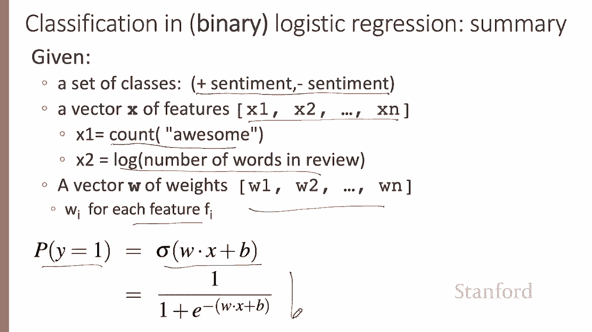

# 二十九：L5.3 - 应用逻辑回归解决文本情感分析问题 📝

在本节课中，我们将学习如何应用逻辑回归模型来解决一个具体的文本情感分析问题。我们将通过一个电影评论情感分类的例子，详细拆解从特征提取到最终分类预测的完整过程。

---

## 🎬 示例：电影评论情感分类

假设我们需要对一段电影评论进行二元情感分类。我们的目标是判断该评论的情感类别是 **1**（积极）还是 **0**（消极）。以下是待分析的评论文本：

> It's Hokey. There are virtually no surprises. The writing is second rate. So why was it so enjoyable, you get the idea.

我们将每一条评论视为一个观测样本，并使用六个特征来表征它。

以下是这六个特征的定义及其在该评论中的取值：

*   **特征 X1**：文档中出现在某个积极词典里的单词数量。
    *   **取值**：假设 “enjoyable”, “great”, “nice” 都在我们的积极词典中，那么 X1 的值为 **3**。
*   **特征 X2**：文档中出现在某个消极词典里的单词数量。
    *   **取值**：评论中出现了 “hokey” 和 “second rate”，因此 X2 的值为 **2**。
*   **特征 X3**：单词 “no” 是否出现在文档中。
    *   **取值**：出现了 “no”，因此该特征被激活。
*   **特征 X4**：文档中代词的数量。
*   **特征 X5**：文档中大写单词的数量。
*   **特征 X6**：文档单词总数的自然对数值。
    *   **取值**：该评论有 66 个单词，其自然对数值约为 **4.19**。

---

## ⚖️ 模型权重与偏置

上一节我们定义了特征，本节我们来看看模型如何利用这些特征进行决策。我们假设已经为每个特征学习到了一个实数值权重，并为模型学习到了一个偏置项。这六个特征对应的权重如下：

*   **权重 W1**：2.5
*   **权重 W2**：-5.0
*   **权重 W3**：-1.2
*   **权重 W4**：0.5
*   **权重 W5**：0.7
*   **权重 W6**：0.1

**偏置 B**：0.1

**权重的含义**：权重 W1 为正，表示积极词典中的单词数量对做出积极情感判断有正面贡献。权重 W2 为负，表示消极词典中的单词数量与积极情感判断呈负相关，并且其重要性（绝对值）大约是积极特征的两倍。权重揭示了不同特征对最终决策的影响力。

---

## 🧮 计算分类概率

现在，我们将特征值 `x` 和对应的权重 `w` 代入逻辑回归的公式，来计算该评论属于各个类别的概率。

要计算该文档为积极评论的概率，即 `P(y=1)`，我们计算 `sigmoid(W·X + B)`。

**点积计算 W·X**：
`W·X = (2.5*3) + (-5.0*2) + (-1.2*1) + (0.5*0) + (0.7*0) + (0.1*4.19) = 7.5 - 10 - 1.2 + 0 + 0 + 0.419 = -3.281`

**加上偏置并应用Sigmoid函数**：
`z = -3.281 + 0.1 = -3.181`
`P(y=1) = σ(z) = 1 / (1 + e^(-(-3.181))) ≈ 1 / (1 + 24.0) ≈ 0.04`

因此，该评论为消极评论的概率为：
`P(y=0) = 1 - P(y=1) ≈ 1 - 0.04 = 0.96`

**分类结果**：根据这个计算结果，该分类器会判定这条评论为 **消极** 评论。

> **注意**：此处的计算结果与视频中示例（0.7 和 0.3）不同，这是因为我们此处严格使用了给定的特征值和权重进行计算。视频中的演示可能使用了不同的数值或简化步骤以说明概念。本教程旨在展示正确的计算流程。

---

## 🔧 逻辑回归的通用性

逻辑回归的强大之处在于其灵活性，我们可以为任何分类任务构建特征。让我们随机选择另一个任务：句号消歧。

**任务描述**：判断一个句点 “.” 是表示句子结束，还是缩写的一部分（如 “Dr.” 中的句点）。

以下是可能用到的特征示例：

*   **特征 X1**：当前单词是否为小写。
    *   **可能权重**：正权重。因为以小写单词结尾的句点更可能是句子结束。
*   **特征 X2**：当前单词是否在我们的缩写词典中（如 “ST”, “DR”）。
    *   **可能权重**：负权重。因为缩写后的句点不太可能是句子结束。
*   **特征 X3**：一个更复杂的组合特征，例如 “句点前是一个大写单词，但该大写单词是 ‘ST’ 且再前一个单词也是大写”。
    *   **可能权重**：强负权重。这很可能表示是 “STREET” 的缩写形式。

---

## 📋 核心概念总结

本节课中我们一起学习了逻辑回归应用于文本分类的完整流程。

以下是逻辑回归二元分类的核心要素总结：

1.  **类别**：我们有两个类别，例如积极和消极情感，可以用 **0** 和 **1** 表示。
2.  **特征向量 (X)**：一组表征输入数据的值，可以是计数、布尔值或对数值等。
3.  **权重向量 (W)**：每个特征对应一个权重，表示该特征对决策的重要性。
4.  **偏置 (B)**：一个常数项，用于调整决策边界。
5.  **决策函数**：通过计算 `z = W·X + B`，并应用 **Sigmoid函数** `σ(z) = 1 / (1 + e^{-z})`，得到样本属于正类（y=1）的概率。

我们已经了解了逻辑回归如何接收特征值及其权重，并为输入样本计算出一个类别概率。关键在于设计能够有效捕捉问题本质的特征，并通过学习得到合适的权重与偏置。