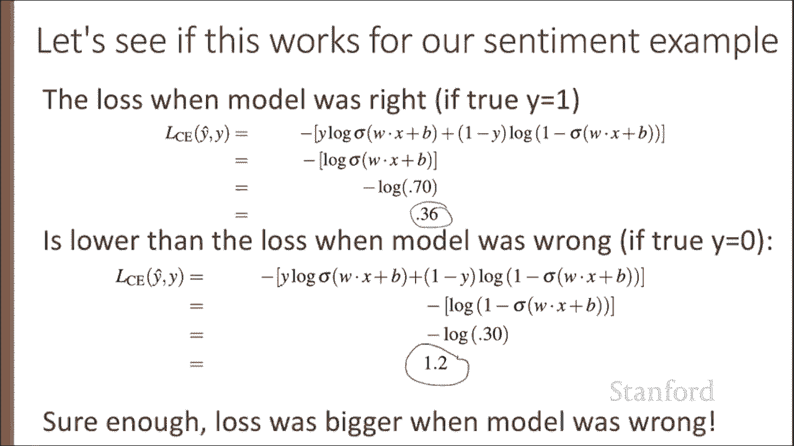
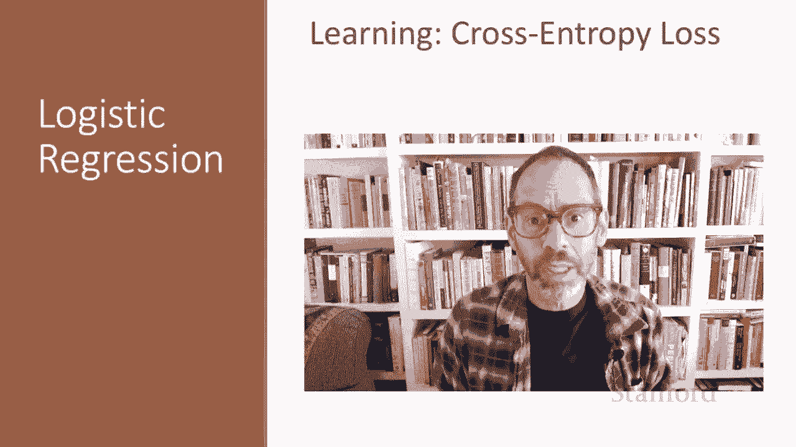

# 30：L5.4 - 交叉熵损失 📚 

在本节课中，我们将学习逻辑回归的参数学习过程。我们将从交叉熵损失函数开始，了解如何衡量模型预测与真实标签之间的差距，并理解其在训练过程中的作用。

## 🎯 概述：损失函数与优化算法

逻辑回归是一种监督分类方法。对于每个观测数据 `X`，我们知道其正确的标签 `Y`（0 或 1）。模型会输出一个预测值，我们称之为 `Y_hat`。我们的目标是学习参数 `W` 和 `B`，使得对于每个训练样本，`Y_hat` 都尽可能接近真实的 `Y`。

为了实现这个目标，我们需要两样东西：
1.  一个距离估计器，即**损失函数**或**成本函数**，用于衡量当前预测 `Y_hat` 与真实标签 `Y` 的差距。
2.  一个**优化算法**，用于迭代更新权重 `W` 和 `B`，以最小化这个损失函数。

我们将介绍逻辑回归和神经网络中常用的损失函数——**交叉熵损失**。在后续课程中，我们将介绍用于最小化损失的标准优化算法——**梯度下降**及其变体随机梯度下降。

## 📉 定义损失函数

我们需要一个损失函数 `L`，来表达对于观测 `X`，分类器输出 `Y_hat`（通过 `sigmoid(WX + B)` 得到）与真实输出 `Y`（0 或 1）之间的差距。我们希望损失函数能促使训练样本的正确标签拥有更高的预测概率，这种方法被称为**条件最大似然估计**。

我们选择参数 `W` 和 `B`，使得在给定观测 `X` 的条件下，训练数据中真实标签 `Y` 的对数概率最大。由此推导出的损失函数是**负对数似然损失**，通常称为**交叉熵损失**。

## 🔢 推导交叉熵损失

让我们推导应用于单个观测 `X` 的损失函数。我们希望学习到的权重能最大化正确标签 `Y` 的概率，即 `P(Y|X)`。由于只有两个离散结果（0 或 1），我们可以将分类器给出的概率 `P(Y|X)` 表示为以下两项的乘积：

`P(Y|X) = (Y_hat)^Y * (1 - Y_hat)^(1-Y)`

现在，让我们将真实值 `Y=1` 或 `Y=0` 代入这个方程：
*   如果 `Y=1`，方程简化为 `Y_hat`。
*   如果 `Y=0`，方程简化为 `1 - Y_hat`。

我们的目标是最大化这个概率。为了数学上的便利，我们对两边取对数，因此我们现在要最大化 `log P(Y|X)`：

`log P(Y|X) = Y * log(Y_hat) + (1-Y) * log(1 - Y_hat)`

因为最大化概率的对数等价于最大化概率本身。

在机器学习中，更常见的做法是讨论最小化一个损失，而不是最大化一个概率。因此，我们将这个要最大化的目标转化为要最小化的目标，这就得到了交叉熵损失。我们只需对 `log P(Y|X)` 取负值：

`L_CE = -log P(Y|X) = - [Y * log(Y_hat) + (1-Y) * log(1 - Y_hat)]`

我们可以代入 `Y_hat` 的定义来提醒自己如何计算：

`L_CE = - [Y * log(σ(WX + B)) + (1-Y) * log(1 - σ(WX + B))]`

## 🧪 在情感分析示例中验证

直观上，我们希望当模型预测接近正确时损失较小，当模型困惑（预测错误）时损失较大。让我们通过情感分析的例子来看看交叉熵损失是否做到了这一点。

**情况一：模型预测正确**
假设有一个影评：“Hokey. There are virtually no surprises, so why was it so enjoyable?”，其真实标签 `Y=1`（正面评价）。假设我们的模型计算 `σ(WX + B)` 后，给出 `Y_hat = 0.7`。这是一个不错的预测。

将 `Y=1` 和 `Y_hat=0.7` 代入交叉熵损失公式：
`L = -[1 * log(0.7) + 0 * log(1-0.7)] = -log(0.7) ≈ 0.36`
我们得到了一个相对较小的损失值 0.36。

**情况二：模型预测错误**
现在，假设同一个句子的真实标签其实是 `Y=0`（负面评价），例如评论是：“bottom line, this movie's terrible. I beg you not to see it.”。此时，我们的模型仍然给出了 `Y_hat = 0.7` 的高概率（认为它是正面的），模型是困惑的、错误的。我们希望此时的损失会更高。

对于 `Y=0`，模型认为它是负面评价的概率是 `1 - Y_hat = 0.3`。

将 `Y=0` 和 `Y_hat=0.7`（即 `1 - Y_hat = 0.3`）代入公式：
`L = -[0 * log(0.7) + 1 * log(0.3)] = -log(0.3) ≈ 1.20`
我们得到了一个更高的损失值 1.20，远大于模型正确时 0.36 的损失。

正如我们所愿，交叉熵损失确实做到了：当模型正确时损失小，当模型错误时损失大。

## 🎓 总结

本节课中，我们一起推导了交叉熵损失函数，并看到了它如何应用于我们的情感分析示例。交叉熵损失通过惩罚错误的预测并奖励正确的预测，有效地衡量了模型输出与真实标签之间的差异。这个损失函数对于逻辑回归至关重要，同样，正如我们将在未来的课程中看到的，它对于神经网络也同等重要。

