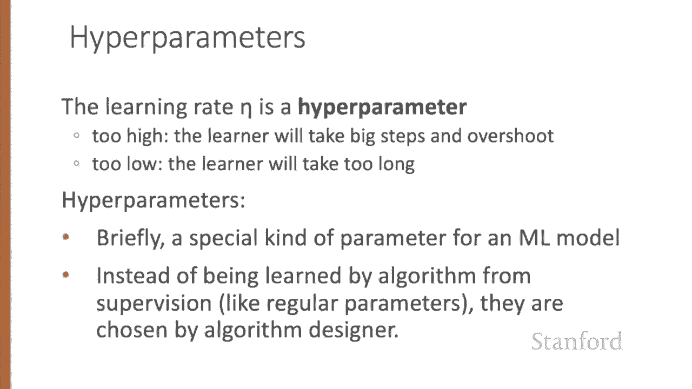

# 31：L5.5 - 随机梯度下降 🎯

在本节课中，我们将学习用于优化逻辑回归和神经网络权重的**随机梯度下降算法**。我们的目标是找到能够最小化模型损失函数的最优权重。

## 概述 📋

梯度下降是一种通过确定参数空间中函数斜率上升最陡的方向，并向相反方向移动，从而找到函数最小值的方法。对于逻辑回归，其损失函数是凸函数，只有一个最小值，因此梯度下降总能找到全局最优解。然而，对于多层神经网络，损失函数是非凸的，梯度下降可能会陷入局部最小值。

## 梯度下降的直观理解 🧭

假设我们的系统参数只是一个标量 `W`。损失函数 `L` 的形状如图所示，X轴代表参数 `W`。我们的目标是从起点（例如 `W=0`）出发，找到使损失函数最小的 `W` 值（`W_min`）。

梯度上升算法通过计算当前点的损失函数梯度，并向相反方向移动来回答“应该向左还是向右移动”的问题。对于单变量函数，梯度可以非正式地理解为斜率。如果斜率为负，则意味着我们应该向正方向移动以找到最小值。

## 学习率与参数更新 📈

移动的幅度由损失函数相对于 `W` 的斜率值乘以**学习率** `η` 决定。学习率越高，意味着每一步移动 `W` 的幅度越大。参数更新的公式为：

`W_new = W_old - η * (dL/dW)`

## 扩展到多变量情况 🔄

在实际应用中，我们通常需要处理多个参数（例如权重 `W` 和偏置 `B`）。梯度是一个向量，它表达了沿着每个维度最陡斜率的方向分量。对于二维情况，梯度向量有两个正交分量，分别告诉我们地面在 `W` 方向和 `B` 方向上的倾斜程度。

在逻辑回归中，参数向量 `W` 可能很长，因为输入特征向量 `x` 可能很长，我们需要为每个 `x_i` 分配一个权重 `w_i`。对于每个变量 `w_i`，梯度都有一个分量，告诉我们该变量对总损失函数 `L` 的影响。这个斜率表示为损失函数相对于 `w_i` 的偏导数 `∂L/∂w_i`。

梯度则定义为这些偏导数的向量：

`∇_θ L(ŷ, y) = [∂L/∂θ_1, ∂L/∂θ_2, ..., ∂L/∂θ_n]^T`

其中，`θ` 代表所有参数（`W` 和 `B`）。

因此，基于梯度更新 `θ` 的最终公式为：

`θ_new = θ_old - η * ∇_θ L(ŷ, y)`

## 逻辑回归的梯度计算 🧮

对于逻辑回归，交叉熵损失函数为：

`L = -[y * log(σ(wx + b)) + (1 - y) * log(1 - σ(wx + b))]`

这个函数关于单个权重 `w_j` 的梯度有一个非常直观的形式：

`∂L/∂w_j = (σ(wx + b) - y) * x_j`

它等于模型预测值 `ŷ` 与真实值 `y` 的差值，乘以对应的输入特征值 `x_j`。

## 随机梯度下降算法 ⚙️

随机梯度下降是一种在线算法，它通过在**每个训练样本**后计算损失函数的梯度，并将参数 `θ` 向梯度的相反方向“微调”，来最小化损失函数。

以下是算法的步骤：

1.  对于每个训练样本 `(x, y)`，计算预测值 `ŷ`。
2.  计算损失 `L(ŷ, y)`，了解预测值与真实值的差距。
3.  计算梯度 `∇_θ L`，它指示了哪个方向会增加损失。
4.  向梯度的相反方向更新参数：`θ = θ - η * ∇_θ L`。

算法可以在以下情况终止：
*   收敛（参数变化很小）。
*   梯度范数小于预设的阈值 `ε`。
*   在验证集上的损失开始上升（早停）。

## 超参数：学习率 ⚖️

学习率 `η` 是一个必须调整的**超参数**。
*   如果 `η` 太高，学习者步长过大，可能会越过损失函数的最小值。
*   如果 `η` 太低，学习者步长过小，需要很长时间才能到达最小值。

通常的做法是从一个较高的学习率开始，然后缓慢降低它。

**超参数**是机器学习模型中的一种特殊参数。与算法从训练集中学习的常规参数（如权重 `W` 和 `B`）不同，超参数是由算法设计者选择的，会影响算法的工作方式。

## 总结 🎓

本节课我们一起学习了**随机梯度下降算法**。我们了解了其核心思想：通过计算损失函数的梯度并沿反方向更新参数来寻找最小值。我们探讨了从单变量到多变量的扩展，学习了参数更新的公式，并理解了学习率这一关键超参数的作用。最后，我们概述了随机梯度下降在逻辑回归中的具体应用步骤。在下一讲中，我们将提供更多细节。