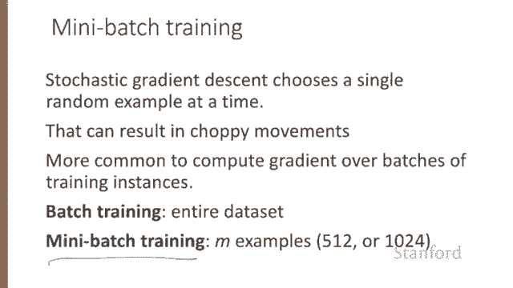

# 32：L5.6 - 随机梯度下降拓展 🚀

在本节课中，我们将通过一个具体的例子来演示随机梯度下降的过程，并补充一些相关细节。

我们将一起完成梯度下降算法的一个单步计算。

## 1. 设定示例场景

我们将使用一个简化版的情感分类示例，它处理一个单独的观测样本 **X**。其正确标签是 **y = 1**，代表这是一个正面评价。该样本仅有两个特征：**X1** 的值为 3，代表评论中正面词汇的数量；**X2** 的值为 2，代表评论中负面词汇的数量。

我们假设有三个参数：两个权重 **W1** 和 **W2**，以及一个偏置项 **B**。在初始阶段 **θ⁰**，我们假设所有参数值都设为 0。初始学习率 **η** 设为 0.1。

## 2. 计算梯度

以下是随机梯度下降的更新方程：
`θ_new = θ_old - η * ∇L(θ)`
为了执行这个更新，我们需要知道损失函数 **L** 的梯度，然后将其乘以学习率并减去。

在逻辑回归中，我们已经知道，对于权重 **Wⱼ** 的梯度计算公式为：
`∇Wⱼ = (σ(W·X + b) - y) * Xⱼ`
在我们的示例中，有三个参数，因此梯度向量有三个维度，分别对应 **W1**、**W2** 和 **B**。

我们可以按如下方式计算第一个梯度。这里我们直接使用预先推导出的导数公式进行计算。

首先，计算 **W·X + B**。在初始值下，这个值为 0。真实标签 **y** 是 1。因此，我们有 `σ(0) - 1`。而 `σ(0) = 0.5`。

最终，我们得到：
*   对于 **W1**：`(0.5 - 1) * X1 = -0.5 * 3 = -1.5`
*   对于 **W2**：`(0.5 - 1) * X2 = -0.5 * 2 = -1.0`
*   对于 **B**：`(0.5 - 1) * 1 = -0.5`

所以，我们最终的梯度向量 **∇L(θ)** 为 `[-1.5, -1.0, -0.5]`。

## 3. 更新参数

现在我们已经有了梯度，可以通过将初始参数向量 **θ⁰** 沿着梯度相反方向移动来计算出新的参数向量 **θ¹**。

新的参数计算公式为：
`θ¹ = θ⁰ - η * ∇L(θ)`

代入我们的数值：
*   新的 **W1** = 0 - 0.1 * (-1.5) = 0.15
*   新的 **W2** = 0 - 0.1 * (-1.0) = 0.10
*   新的 **B** = 0 - 0.1 * (-0.5) = 0.05

因此，第一步更新后，我们的参数 **θ¹** 变为 `[0.15, 0.10, 0.05]`。

需要注意的是，这个观测样本 **X** 恰好是一个正面例子。如果我们后续看到更多包含大量负面词汇的负面例子，我们可能会期望 **W2** 的值最终会变为负数。

## 4. 从随机到小批量梯度下降

上一节我们计算了单个样本的梯度更新。随机梯度下降之所以称为“随机”，是因为它每次随机选择一个样本来计算梯度并更新权重，以优化该单个样本的性能。这可能导致权重更新路径非常“颠簸”和不稳定。

因此，更常见的做法不是基于单个实例，而是基于一批训练样本来计算梯度。

*   **批量训练**：在整个数据集上计算梯度。这种方法能提供权重移动方向的极佳估计，但代价是需要花费大量时间处理训练集中的每一个样本来计算这个“完美”方向。
*   **小批量训练**：这是一种折衷方案。我们在一个包含 **M** 个样本的组（例如 512 或 1024，远小于整个数据集）上进行训练。

小批量训练还具有计算效率上的优势。小批量可以很容易地进行向量化操作，其大小可以根据计算资源来选择。这允许我们并行处理一个小批量中的所有样本，然后累加损失，这是单个样本训练或全批量训练所无法实现的。

## 5. 总结

本节课中，我们一起学习了随机梯度下降算法，并通过一个具体例子逐步计算了参数更新。我们还讨论了重要的变体——小批量训练，它通过在多个样本上计算梯度来平衡更新稳定性和计算效率，是实践中广泛采用的方法。