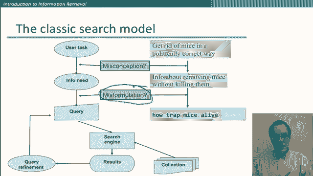

# 33：L6.1 - 网络爬虫与信息检索初步 🕷️🔍

在本节课中，我们将要学习信息检索任务的基本概念，特别是当前占主导地位的网络搜索形式。我们将从定义信息检索开始，了解其基本框架，并初步探讨如何评估检索系统的性能。

---

## 信息检索的定义

信息检索任务可以定义如下：我们的目标是从通常存储在计算机中的大型集合（通常是文本等非结构化文档）中，找到满足用户信息需求的材料。这里提到的“通常”是典型情况，也存在其他形式的信息检索，例如音乐信息检索（处理声音而非文本文档）。但本课程主要讨论所有“通常”情况都成立的情形。

信息检索有许多应用场景。如今人们首先想到的几乎总是网络搜索，但也存在许多其他场景，例如：搜索你的电子邮件、搜索笔记本电脑中的内容、在公司知识库中查找资料，或进行法律信息检索（例如为法律背景查找相关案例）。

长期以来，人类知识和信息的很大一部分都以人类语言文档的形式存储，但这也一直存在一个悖论。下图（并非真实图表，仅为示意）展示了这种状况：在20世纪90年代中期，尽管公司、组织和家庭中非结构化形式（即人类语言文本）的数据量已经远远超过结构化形式（如关系数据库和电子表格）的数据量，但当时结构化数据的管理和检索已是一个成熟的领域，并存在大型数据库公司。相比之下，非结构化数据管理领域则非常薄弱，只有少数小型公司从事企业文档检索等业务。

这种情况在千禧年前后发生了彻底改变。如今，数据量在两方面都变得更大，尤其是在非结构化方面——博客、推文、论坛等平台产生了海量信息。同时，在企业层面也发生了转变，现在已有大型公司（如主要的网络搜索巨头）在解决非结构化信息检索的问题。

---

## 信息检索的基本框架

上一节我们介绍了信息检索的定义和背景，本节中我们来看看其基本操作框架。

我们首先假设有一个文档集合，我们将在此集合上进行检索。目前我们假设这是一个静态集合，后续我们将讨论在类似网站搜索的场景中，当文档被添加或删除时，如何找到它们。

我们的目标是检索与用户信息需求相关、并能帮助用户完成任务的文档。

让我们通过下图更详细地分解这个过程：

1.  **用户任务**：用户有一个想要执行的任务。例如，我想清除车库里的老鼠，并且我不想用毒药杀死它们。这就是我的用户任务。
2.  **信息需求**：为了完成这个任务，我感觉需要更多信息。这就是信息需求：我想了解如何在不杀死老鼠的情况下清除它们。信息检索系统的评估正是基于这个信息需求。
3.  **查询**：我们无法直接将某人的信息需求输入计算机。我们必须将信息需求转化为可以输入搜索框的内容，这就是查询。例如，我尝试的查询可能是：`how trap mice alive`。这代表了我将信息需求具体化为一个特定查询的尝试。
4.  **检索与结果**：然后，这个查询被输入搜索引擎，搜索引擎查询我们的文档集合并返回一些结果。
5.  **查询优化**：有时，如果我对检索结果不满意，我可能会根据返回的证据，返回并构思一个更好的查询。例如，我可能认为“alive”这个词不好，换成“without killing”试试效果是否会更好。

在这个过程中，可能会出现一些问题。这里有几个解释阶段：
*   首先是我的初始任务，我决定了我的信息需求是什么。我可能在这里就产生了误解。
*   我们更关注的是信息需求和查询之间的转化。查询表述不当可能以多种方式出错：我可能选择了错误的词语来表达查询；我可能使用了查询搜索运算符（如引号），这可能对查询的实际效果产生或好或坏的影响。这些查询表述中的选择，并没有改变我的信息需求本身。

---

## 初步评估：精确率与召回率

在讨论了信息检索的基本流程后，了解如何评估其效果至关重要。当我们向信息检索系统提交查询时，会得到一些文档返回，我们想知道这些结果是否良好。

以下是评估结果质量的两个基本互补指标：

1.  **精确率**：精确率衡量系统返回的文档中有多少与用户的信息需求相关。它评估返回结果中“坏结果”的多少。其公式为：
    `精确率 = 相关且被检索出的文档数 / 系统检索出的文档总数`

2.  **召回率**：召回率衡量系统成功找到了文档集合中多少“好信息”。它评估系统找全相关文档的能力。其公式为：
    `召回率 = 相关且被检索出的文档数 / 文档集合中所有相关文档的总数`

我们将在后续课程中给出更精确的定义和测量方法。现在需要明确的一点是，要使这些指标有意义，必须根据用户的**信息需求**进行评估。

对于某些类型的查询（如下一节我们将看到的），返回的文档是由提交的查询确定的。如果我们仅根据用户查询来评估返回结果，那么精确率必然是100%。但我们并非如此操作，我们是根据用户的**信息需求**来评估结果的精确率。特别是，如果用户查询表述不当或构思不佳，这将被视为降低了返回结果的精确率。

---

## 总结

本节课中，我们一起学习了信息检索的初步知识。我们了解了信息检索的定义及其从结构化数据到非结构化数据主导的演变历程。我们探讨了信息检索的基本框架，包括从用户任务到信息需求，再到查询表述和结果返回的完整流程。最后，我们初步认识了评估检索系统性能的两个核心指标：精确率和召回率，并强调了评估必须基于用户的真实信息需求而非字面查询。这只是信息检索学习的开始，希望你已经对如何思考这一任务以及如何初步判断搜索引擎的优劣有了基本概念。