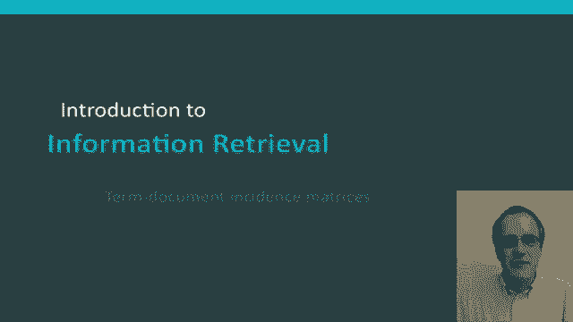
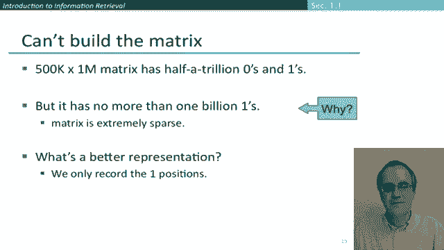

# 34：L6.2 - 词项-文档矩阵构建 📚 

在本节课中，我们将学习信息检索中的一个核心概念——**词项-文档矩阵**。我们将了解它的基本思想、如何用它来回答布尔查询，以及为什么在实际的大型系统中，我们通常不会直接存储这种完整的矩阵形式。

---

## 🧠 词项-文档矩阵的概念

上一节我们提到了信息检索的基本任务。本节中，我们来看看一个重要的概念工具：词项-文档矩阵。

我们以在莎士比亚作品中进行信息检索为例。假设我们有一个具体问题：**哪些莎士比亚的剧本包含单词“Brutus”和“Caesar”，但不包含“Calpurnia”？**

如果从最基本的文本搜索命令开始，你可能会想到的第一个解决方案是**穷举地搜索文档的文本内容**，这在 Unix 世界中被称为 `grep`。

我们可以先 `grep` 查找包含“Brutus”和“Caesar”的剧本。如果你熟悉 `grep` 命令，可以添加一个标志来排除匹配项，从而得到不包含“Calpurnia”的结果。

对于莎士比亚作品这种规模的数据集，使用 `grep` 来回答这类查询是完全可行的。我们的磁盘和计算机速度足够快，使用这种方法可以瞬间找到答案。

然而，这并非解决完整信息检索问题的好方法。它在多个方面存在不足：
*   一旦语料库变得庞大（例如你硬盘上的所有内容，或者更极端的，整个万维网），我们无法承受每次查询都对所有文档进行线性扫描。
*   像“非”这样的逻辑操作，实现起来比单纯查找更复杂。
*   我们将面临更复杂的查询，例如查找“Romans”出现在“countrymen”附近的用法，这是 `grep` 命令无法直接完成的。
*   更重要的是，信息检索领域发生的一大变革是**排序**的概念，即为查询找到最相关的文档返回。这是线性扫描匹配模型无法提供的。

我们将在后续课程中讨论现代信息检索系统如何处理所有这些问题。

---

## 📊 构建词项-文档矩阵

现在，让我们进入词项-文档矩阵的概念。

在词项-文档矩阵中，矩阵的**行**代表单词（在信息检索中也常被称为**词项**），矩阵的**列**代表**文档**。

我们在这里做一件非常简单的事情：根据单词是否出现在剧本中，来填充这个布尔矩阵中的每一个单元格。

例如，“Antony”出现在《安东尼与克莉奥佩特拉》中，但“Calpurnia”没有。

这个矩阵表示了单词在文档中的出现情况。如果我们有了这个矩阵，就可以直接回答布尔查询，例如我们之前的例子：查找包含“Brutus”和“Caesar”但不包含“Calpurnia”的文档。

让我们具体看看如何操作。我们将取出查询中词项对应的向量，然后用布尔运算将它们组合起来。

以下是具体步骤：
1.  首先，取出代表“Brutus”的行向量。
2.  然后，取出代表“Caesar”的行向量。
3.  最后，取出代表“Calpurnia”的行向量，并对其进行**取反**操作。

“Calpurnia”只出现在《尤利乌斯·凯撒》中。因此，取反后我们得到一个向量，其中除了《尤利乌斯·凯撒》的位置是0，其他位置都是1。

此时，我们将这三个向量相加。我们的答案是向量 `[1, 0, 0, 1, 0, 0]`。

这样，我们就成功地完成了信息检索，并可以判断出这个查询由《安东尼与克莉奥佩特拉》和《哈姆雷特》这两份文档满足。我们确实可以回到文档集去确认这一点。

这似乎表明，我们可以简单地通过操作词项-文档矩阵来进行信息检索。

---

## ⚠️ 实际应用中的挑战

然而，重要的是要认识到，一旦我们转向合理规模的集合，这种方法就不再真正可行。

让我们花一分钟来探讨一个规模合理但仍然较小的集合。假设我们有 **100万份文档**（我们常用 `N` 表示文档数量），每份文档平均有 **1000个单词**。

那么，我们的文档集合有多大？我们的矩阵又有多大？

如果我们假设每个单词（包括空格和标点）平均占6字节，那么这里的数据量大约是 **6 GB**。这只是你笔记本电脑上一块现代硬盘的极小一部分。

但让我们接着计算文档集合中**不同词项**的数量。我们需要知道这个数字，因为它对应着矩阵的**行数**。假设大约有 **50万** 个不同词项，这对于100万份文档来说是典型的数量。我们常用 `M` 来表示这个不同词项的数量。

这意味着什么？这意味着，即使是这种规模的文档集合，我们也无法构建这个完整的词项-文档矩阵。因为它将有 **50万行** 和 **100万列**。这就是 **5000亿个** 0和1，这个矩阵已经非常庞大，可能超出了我们的存储空间。

随着文档集合超过100万份，情况只会变得更糟。

但这里有一个非常重要的观察结果：尽管这个矩阵有5000亿个0和1的条目，但实际上，**几乎所有的条目都是0**。文档中最多只有10亿个“1”。

你可以停下来思考一下：为什么最多只有10亿个“1”？

答案是：如果我们有100万份文档，且平均每份文档有1000个单词，那么实际的**词项实例总数**只有 **10亿**。因此，即使我们假设每个文档中的每个单词都不同，我们也最多只能有10亿个“1”条目。而实际上，我们很可能远少于这个数字，因为像“the”、“of”、“to”这样的常见词会在每份文档中出现很多次。

因此，关键的观察结果是：我们处理的矩阵是**非常、非常稀疏的**。所以，信息检索数据结构设计的核心问题就是**利用这种稀疏性**，并提出更好的数据表示方法。

实现高效存储机制的秘诀在于：**我们只想记录那些值为1的位置，而不是那些值为0的位置**。

---

## 🎯 课程总结

本节课中，我们一起学习了**词项-文档矩阵**。它是一个重要的概念性数据结构，在我们讨论各种算法时，会反复回到这个矩阵的视角来思考问题。

然而，当我们实际进行存储和构建计算机系统时，我们也清楚地看到，我们实际上**永远不会**以这种完整矩阵的形式来存储文档及其信息检索表示。利用矩阵的稀疏性，设计更紧凑、高效的数据结构，是构建实用信息检索系统的关键。