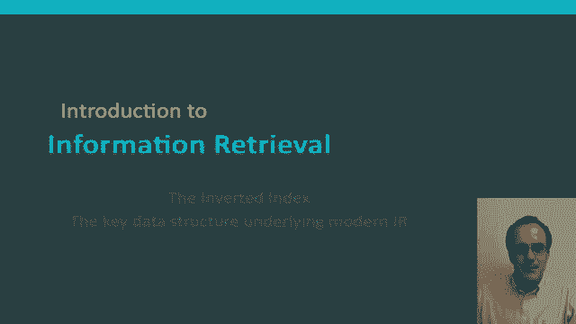
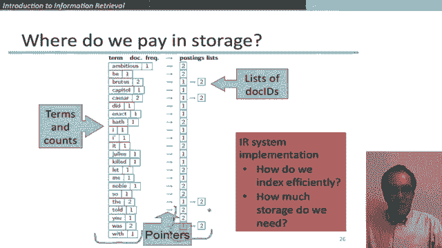

# 35：L6.3 - 倒排索引：信息检索背后的核心数据结构 📚

在本节课中，我们将要学习信息检索系统的核心数据结构——倒排索引。我们将了解它的构成、构建过程以及它在现代搜索系统中的重要性。

## 概述 📖

倒排索引是所有现代信息检索系统（从单机系统到大型商业搜索引擎）所依赖的关键数据结构。它利用了我们在上一节中讨论的“词项-文档矩阵”的稀疏性，能够实现非常高效的检索。在信息检索系统中，它基本上是无可替代的数据结构。

## 倒排索引的构成 🧱

上一节我们介绍了词项-文档矩阵，本节中我们来看看如何将其转化为更高效的倒排索引。

倒排索引的核心思想是：为每个词项存储一个包含该词项的所有文档的列表。每个文档由一个文档ID（即文档序列号）标识，例如第一个文档为1，第二个为2，依此类推。

以下是倒排索引的主要组成部分：

*   **词典**：包含所有出现在文档中的词项。
*   **倒排记录表**：对于词典中的每个词项，都有一个指向其“倒排记录表”的指针。该列表记录了包含该词项的所有文档ID。

一个“词项-文档”对的出现被称为一个**记录项**。所有倒排记录表的集合被称为**记录项列表**。倒排记录表的一个关键属性是它们按文档ID排序，这对于高效的检索操作至关重要。

这两个数据结构（词典和记录项列表）在规模和存储上有所不同。词典相对较小，但通常必须存储在内存中以实现快速访问。而记录项列表非常庞大，对于中小型企业搜索引擎，它们通常存储在磁盘上。

## 构建倒排索引 🛠️

现在，让我们深入了解如何从原始文档构建一个倒排索引。起点是一批待索引的文档，每个文档被视为一个字符序列。

构建过程首先需要一系列文本预处理步骤，然后才是核心的索引构建。

### 文本预处理

以下是文本预处理的主要步骤：

*   **分词**：将文档字符序列切分成基本的索引单位——词项（单词）。这涉及处理标点、连字符、所有格等问题。
*   **归一化**：将词项映射到规范形式，以确保匹配。例如，将“USA”和“U.S.A.”视为同一个词项，或者进行词干还原，使“author”和“authorship”映射到同一词干“author”。
*   **停用词移除**：传统上，许多搜索引擎会省略“the”、“a”、“to”等最常见词汇。但在存储空间充裕的现代，这种做法已不那么必要，因为某些查询（如“to be or not to be”）需要这些词。

经过预处理后，我们得到的是经过修改的词项序列，它们将被输入给索引器。

### 索引器：核心构建步骤

索引器的任务是将归一化后的词项序列转换为倒排索引。我们通过一个简单的例子（两个文档）来说明。

以下是构建倒排记录表的核心步骤：

1.  **收集与排序**：首先，我们收集所有文档中的所有词项及其对应的文档ID。然后，我们进行排序：**主排序键是词项（字母顺序），次排序键是文档ID**。这样，相同词项的所有出现会聚集在一起，并且按文档ID排序。
2.  **合并与构建**：接下来，我们对排序后的列表进行合并。对于同一文档内的同一词项的多次出现，我们将其合并为一个条目（记录文档ID和词频）。然后，我们将同一词项在所有文档中的条目汇总，构建出该词项的倒排记录表。由于之前的排序，这个列表自然就是按文档ID排序的。

最终，我们得到词典（词项及其总频率）和对应的、已排序的倒排记录表。

## 存储考量与效率 💾

在考虑倒排索引的大小时，我们需要分析存储开销：

*   **词典**：存储词项列表及其频率。词项数量相对适中（例如50万个）。
*   **指针**：存储指向每个词项倒排记录表的指针，数量与词项数相同。
*   **倒排记录表**：这是索引中最大的部分。但其总条目数受限于整个文档集合中所有词项的出现总数。例如，100万个平均长度为1000词的文档，记录项总数将少于10亿条，存储是可控的。

在实际构建高效的信息检索系统时，我们会进一步考虑如何通过压缩等技术来优化索引的存储和检索速度。虽然本节课不深入细节，但希望你能理解，倒排索引为检索操作提供了一个高效的基础。

## 总结 ✨

本节课中我们一起学习了倒排索引。我们了解到，倒排索引通过为每个词项维护一个排序的文档ID列表，巧妙地利用了数据的稀疏性。我们探讨了它的构成（词典和倒排记录表），并逐步解析了从文档预处理到核心排序、合并的构建过程。尽管其实现涉及复杂的工程优化（如压缩），但其核心思想并不复杂，正是这个数据结构支撑着所有现代信息检索系统的高效运行。

在下一节中，我们将详细讨论如何利用这个数据结构来执行实际的检索操作。