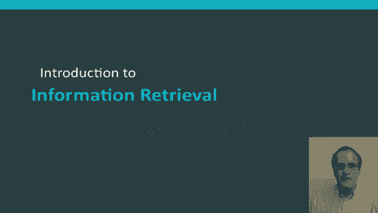
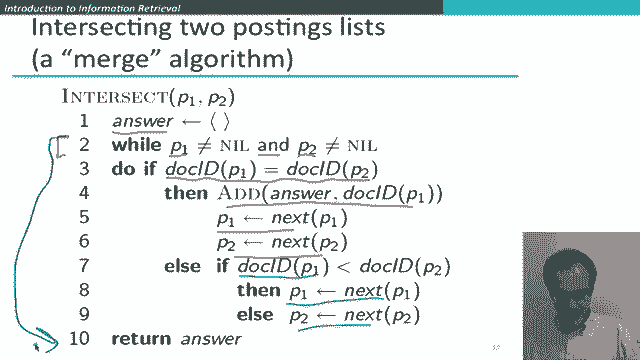
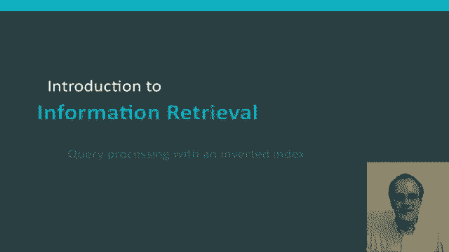

# 36：L6.4 - 基于倒排索引的请求预处理 📚



在本节课中，我们将继续学习倒排索引，并了解它为何是信息检索系统中用于执行查询操作的高效数据结构。我们将详细讲解如何处理一种常见的查询类型，即对两个词项进行“与”查询。

---

## 查询处理细节

上一节我们介绍了倒排索引的基本结构。本节中，我们来看看如何使用它来处理查询。

假设我们要处理一个查询。首先从一个简单的例子开始，假设我们想查询词项 **Brutus**。处理方式非常直接。我们在词典中定位 **Brutus**，然后返回其对应的倒排记录表。这个记录表就是包含 **Brutus** 的所有文档集合，无需进行其他操作。

现在，让我们看一个稍微复杂一点的例子。假设查询是 **Brutus AND Caesar**。我们需要在词典中定位这两个词项，并查找它们各自的倒排记录表。我们的目标是找出同时包含 **Brutus** 和 **Caesar** 的文档。将两个列表组合起来的过程，通常被称为 **合并** 这两个倒排记录表。

这里“合并”一词可能有些误导，因为对于“与”查询，我们实际上是在对两个文档集合求**交集**，以找到两个词项都出现的文档。而“合并”一词通常暗示进行某种**并集**操作。但在算法领域，“合并”算法家族指的是一类可以遍历一对有序列表并对其执行各种布尔运算的算法。

---

## 合并算法的具体步骤

接下来，我们具体看看如何通过合并操作来处理 **Brutus AND Caesar** 查询。

我们有两个已按文档ID排序的倒排记录表。算法开始时，我们有两个指针，分别指向两个列表的头部。

我们的目标是计算两个列表的交集。具体做法如下：我们比较两个指针当前所指的文档ID是否相等。如果不相等，则将指向**较小文档ID**的指针向前移动一位。如果相等，则将该文档ID加入结果集，并将两个指针都向前移动一位。重复此过程，直到其中一个列表被遍历完毕，此时即可停止并返回结果集。

以下是该过程的逐步演示：

1.  初始指针位置不同，不相等。移动指向较小ID的指针。
2.  再次比较，不相等。再次移动指向较小ID的指针。
3.  此时指针指向的文档ID相等（例如文档2）。将其加入结果集，然后两个指针同时前进。
4.  重复上述比较和移动步骤。
5.  当再次发现相等的文档ID（例如文档8）时，将其加入结果集。
6.  继续此过程，直到其中一个列表的指针到达末尾。此时，交集计算完成。

最终，我们得到的结果集是文档2和文档8，它们同时包含了 **Brutus** 和 **Caesar**。

如果两个列表的长度分别是 `x` 和 `y`，那么这个合并算法的时间复杂度是 **O(x + y)**，即与两个倒排记录表长度之和成线性关系。

使该操作保持线性时间复杂度的关键，在于倒排记录表是**按文档ID排序**的。正因为如此，我们可以对两个列表进行线性扫描。如果列表无序，该算法将退化为时间复杂度更高的算法。

---

## 倒排记录表求交算法

以下是倒排记录表求交算法的伪代码描述，它精确地对应了上述手动演示的步骤：

```python
def intersect(p1, p2):
    answer = []  # 初始化结果集
    while p1 is not None and p2 is not None:  # 当两个列表均未遍历完时
        if docID(p1) == docID(p2):  # 如果文档ID相同
            add(answer, docID(p1))  # 加入结果集
            p1 = next(p1)  # 移动p1指针
            p2 = next(p2)  # 移动p2指针
        elif docID(p1) < docID(p2):  # 如果p1的ID较小
            p1 = next(p1)  # 移动p1指针
        else:  # 如果p2的ID较小
            p2 = next(p2)  # 移动p2指针
    return answer  # 返回结果集
```

算法从空的结果集开始。只要两个指针都不为空（即未到达列表末尾），就持续循环。在每一步中，判断两个指针所指的文档ID是否相同。如果相同，则将其加入答案并同时推进两个指针。如果不同，则推进指向较小文档ID的那个指针。一旦任一列表被遍历完，循环结束并返回结果集。

---



## 总结



本节课中，我们一起学习了如何利用倒排索引处理查询。我们首先回顾了处理单个词项查询的简单方法，然后重点讲解了如何使用**合并算法**对两个已排序的倒排记录表进行求交操作，以高效地完成“与”查询。我们详细分析了算法的步骤、时间复杂度（**O(x+y)**），并强调了倒排记录表**有序存储**对于保证算法效率的关键作用。理解这个基础算法，是构建更复杂信息检索功能的重要一步。