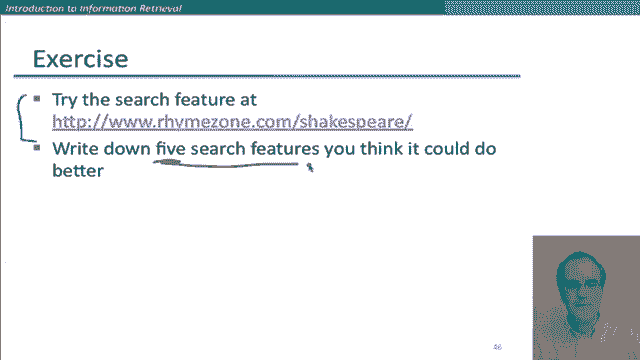
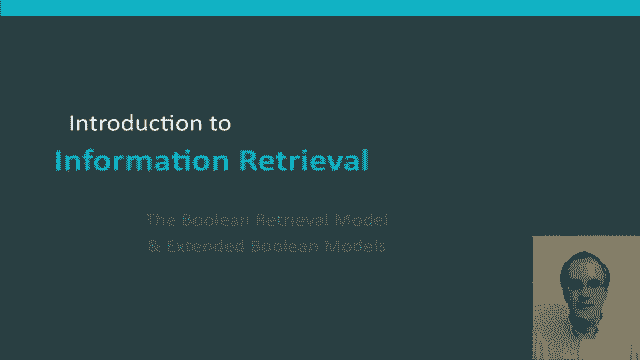

# 37：L6.5 - 二值检索模型及拓展 📚


在本节课中，我们将要学习二值（布尔）检索模型，并了解其在商业信息检索系统中的扩展应用。二值检索模型是信息检索领域的基础模型之一，它通过精确匹配布尔表达式来满足用户的信息需求。

***

## 二值检索模型简介 🔍

上一节我们介绍了信息检索的基本概念，本节中我们来看看二值检索模型的具体定义。

信息检索模型是指支撑信息检索操作的底层数学形式化框架。二值检索模型就是其中一个例子。在该模型中，底层的数学模型是传统的布尔表达式空间。用户可以进行查询，查询可以是单个词项，也可以是词项之间通过布尔运算符（如 AND、OR、NOT）组合而成的更复杂表达式。

在二值模型中，每个文档被视为一个词的集合。一个文档要么完全匹配布尔表达式，要么完全不匹配。正如我们在之前的词项-文档矩阵例子中看到的那样，这是构建信息检索系统最简单的模型。虽然现代世界通常不再主要使用这个模型，但它是一个很好的起点，因为现代排名检索所使用的相同数据结构可以叠加在这个基础之上。

***

## 二值模型的历史与现状 📜

二值检索模型不仅是历史性的，至今仍有许多应用场景。

二值检索曾是商业检索的主要工具，从上世纪60年代信息检索起步到90年代，持续了三十年。尽管学术界在70年代和80年代就开始倡导排名检索模型，但直到90年代网络兴起，它才真正渗透到商业信息检索领域。

目前仍有许多搜索系统基于二值检索模型。例如，你邮箱的搜索系统、学校图书馆的目录系统，或者像 Mac OS X 的 Spotlight 这样的桌面搜索系统，很可能仍然是二值检索系统。

***

## 扩展二值模型：以 Westlaw 为例 ⚖️

接下来，我们来看一个扩展二值检索模型的例子，这个例子来自 Westlaw 系统。

Westlaw 是付费用户规模最大的商业搜索服务，主要用于法律行业查找案例文档和相关法律。它始于1975年，1992年增加了排名功能，并在2010年推出了新的联邦搜索模型。它最初就是一个二值系统，有趣的是，至今仍有大量用户使用布尔查询。在法律行业，律师们喜欢通过指定自己的布尔查询来获得精确结果，并且法学院有教授 Westlaw 系统布尔查询语言的传统，因此用户对此非常熟悉。

以下是 Westlaw 查询的一个示例，它展示了法律搜索这类专业搜索场景的特点：查询通常更长、更精确。

**信息需求**：查找涉及《联邦侵权索赔法》的诉讼时效法规和案例。

**Westlaw 查询**：
```
"statute of limitations" & "federal tort claims act" /s
```

Westlaw 的扩展布尔查询语言有一些特殊约定：
*   两个单词之间仅用空格隔开，表示 `OR` 关系，而不是 `AND`。
*   除了基本的 `AND` 和 `OR`，它还拥有一系列关系运算符，用于指定词项在特定距离内共现。例如 `/3` 表示在三个词以内，`/s` 表示在同一句子内。
*   使用感叹号 `!` 指定词尾通配符。例如 `limit!` 会匹配 `limit`、`limited`、`limitations` 等。

因此，这个查询精确地指定了所有信息需求的要素。

**另一个信息需求示例**：关于残疾人进入工作场所的要求。

**对应的查询可能包含**：通配符、`/p`（同一段落内）、`/s`（同一句子内）以及析取（`OR`）关系。

这让你对 Westlaw 典型的查询类型有了初步了解。许多专业搜索者仍然喜欢这种扩展布尔搜索，因为他们能够精确控制通配符的用法或词项之间的接近程度，而这些功能在大多数典型的网络搜索引擎查询语言中是无法由用户自行控制的。

***

## 复杂布尔查询的处理 🤔

现在让我们回到纯粹的二值检索模型，并思考如何处理其他类型的查询。

假设我们不想查询 `Brutus AND Caesar`，而是想查询 `Brutus AND NOT Caesar` 或 `Brutus OR NOT Caesar`。一个值得思考的问题是：我们能否使用合并算法来处理这类查询？能否在时间复杂度与两个词项的倒排记录表长度之和成正比的情况下完成？如果不能，这些操作的时间复杂度是多少？

如果你思考了这些情况，那么可以考虑更一般的布尔表达式，例如 `(A AND B) OR (C AND D)`。在这些情况下，我们能否在线性时间内完成合并？如果可以，线性于什么？我们能否想象出比合并算法更好的方法来解决这些问题？这些都是值得你在课后深入思考的好问题。

***

## 查询优化策略 ⚡

如果你有一个包含多个词项的复杂查询（再次回想那些 Westlaw 查询），我们可以尝试找出满足该查询的最佳算法路径。

考虑一个由 `n` 个词项进行 `AND` 操作的查询：`term1 AND term2 AND ... AND termn`。

我们需要获取每个词项的倒排记录表，然后对它们进行 `AND` 操作。为了最小化工作量，我们应该使用什么启发式策略？

一个相当直接的策略是：**从文档频率最低（出现文档最少）的词项开始处理**。对于一个纯 `AND` 查询，我们知道这个词项的倒排记录表是我们可能返回的最大结果集。然后，我们需要遍历其他词项的倒排记录表，过滤掉那些不在其列表中的文档ID。

例如，对于查询 `Brutus AND Caesar AND Calpurnia`，假设它们的倒排记录表如下：
*   `Brutus` -> [1, 4, 16, ...]
*   `Caesar` -> [1, 2, 4, 16, ...]
*   `Calpurnia` -> [13, 16, ...]

我们应该从最短的列表 `Calpurnia`（文档频率最低）开始。然后检查 `Brutus` 的列表，发现 13 不在其中，所以排除。接着检查 `Caesar` 的列表，确认 16 存在。最终返回结果 `[16]`。

这个操作通过从最小的倒排记录表开始，显著提高了效率（包括时间和内存占用）。这也清楚地说明了为什么将每个词项的文档频率与词项一起存储在词典中是一个非常好的主意，因为这让我们可以快速进行内存查找，以确定最佳的查询优化策略。

***

## 更一般查询的优化 🧠

现在假设我们有一个更一般的查询，例如：`(madding OR crowd) AND (ignoble OR strife)`。

我们当然可以轻松获取每个词项的文档频率，但优化这个查询需要更复杂一些。我们可以看到，对于每一对析取（`OR`）词项，我们将对它们的倒排记录表进行合并（`OR` 操作），产生的新列表可能比其中任何一个单独词项的列表都大。

我们可以通过取每个析取词项的文档频率之和，来估算这些子表达式结果的大小，这将给出结果倒排记录表可能长度的保守上界。然后，如果这些析取结果之间再进行 `AND` 操作，我们可以使用与之前相同的启发式策略：**按估算出的结果大小递增顺序进行处理**。

这里有一个练习，你可以在听课时思考：

**查询**：`(t1 OR t2) AND (t3 OR t4) AND (t5 OR t6)`

**词典子集（词项及频率）**：
*   `t1` -> 50
*   `t2` -> 40
*   `t3` -> 30
*   `t4` -> 20
*   `t5` -> 10
*   `t6` -> 5

问题：我们应该首先处理哪两个词项对应的析取表达式？

思考这些合并操作的细节是非常有益的。以下是更多例子：
*   如果查询是 `friends AND romans AND NOT countrymen`，我们如何在查询优化方法中使用 `countrymen` 的频率？
*   对于更一般的任意布尔查询，我们能否保证执行时间与倒排记录表总大小成线性关系？你可能需要思考一下，特别是当一个查询词项在查询中只出现一次时，看看能否确定总合并时间的界限。

***

## 实践思考与总结 🎯

在更实际的层面，你也可以开始思考搜索界面的工作原理以及对用户有用的功能。

例如，可以尝试使用一个能搜索莎士比亚作品的小型搜索引擎。一个有用的练习是：进行一些搜索，看看你是否能想到一些如果这个搜索引擎能做得更好，将会对用户更有用的功能。



***



本节课中我们一起学习了二值检索模型，它是历史上最重要的检索模型，也是理解现代检索系统工作原理的重要基础。我们还探讨了其在专业领域（如 Westlaw）的扩展应用，以及查询优化的基本策略。理解这些基础概念，将有助于我们后续学习更复杂的排名检索模型。