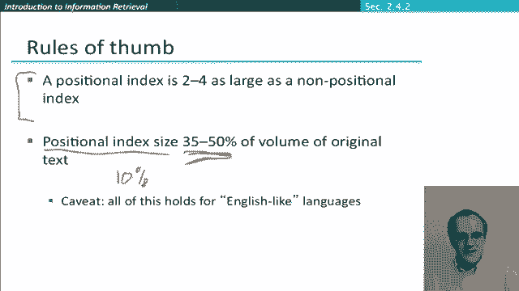

# 38：L6.6 - 短语查询与位置索引 📚


在本节课中，我们将学习短语查询，这是实践中最重要的扩展布尔查询类型之一。我们还将探讨如何扩展倒排索引数据结构，以支持对短语查询的处理。

---

## 什么是短语查询？🔍

上一节我们介绍了基本的布尔查询。本节中我们来看看短语查询。

在实践中，我们不仅希望查询单个词语，还希望查询由多个词语组成的单元。许多有用的查询对象都是多词单元，例如“信息检索”或“斯坦福大学”。我们需要一种机制，能够将这些词语对作为一个整体进行匹配。

现代网络搜索引擎中标准的语法是使用双引号，例如 `"Stanford University"`。如果一个文档的内容是“我在斯坦福上大学”，它**不会**匹配这个短语查询。用户通常能轻松理解使用双引号表示短语查询的概念。

值得注意的是，除了这种显式的短语查询，还存在隐式的短语查询现象。例如，用户可能输入查询“San Francisco”，他们实际上希望将其解释为一个短语，但可能没有或不知道加上引号。现代搜索引擎的一个研究热点就是如何识别这些隐式短语，并利用这一信息来调整返回的文档。不过，我们暂时将这个问题放在一边，专注于处理显式短语查询，并研究如何让我们的信息检索系统高效地匹配它们。

---

## 双词索引的初步方案 🤔

为了处理短语查询，仅存储词语及其对应的文档列表显然是不够的。因为这样我们只能找到包含两个词语的文档，却无法知道这两个词语在文档中是否相邻。

一种解决方案是构建**双词索引**。以下是其工作原理：

*   我们将文本中每两个连续的词语作为一个短语单元进行索引。
*   例如，对于文本“friends Romans countrymen”，我们会生成双词单元“friends Romans”和“Romans countrymen”。
*   每个双词单元都成为词典中的一个词项，并拥有自己的倒排记录表。

这意味着，如果我们想查询短语“friends Romans”，只需在词典中查找这个双词单元，然后获取其对应的文档列表即可。

对于更长的短语，我们可以将其分解。例如，查询“Stanford University Palo Alto”可以分解为“Stanford University” **AND** “University Palo” **AND** “Palo Alto”三个双词单元的查询。通过双词索引找到同时包含这三个双词单元的文档，虽然不能完全保证文档中一定包含连续的完整短语（可能存在误报），但可能性很高。

然而，双词索引存在一个主要问题：词典规模会急剧膨胀，因为可能的双词组合数量是词语数量的平方级。因此，虽然双词索引的概念有用，但它通常不是处理短语查询的标准解决方案。

---

## 标准解决方案：位置索引 🎯

处理短语查询的标准方案是使用**位置索引**。位置索引的核心思想是，在倒排记录表中不仅记录词语出现在哪些文档，还记录它在每个文档中出现的位置。

其数据结构组织如下：
*   在词典中，存储词项及其文档频率。
*   在倒排记录表中，对于每个文档ID，不再是一个简单的列表，而是附加一个**位置列表**，记录该词项在该文档中出现的所有词位置。

例如，词项“be”的倒排记录表可能如下所示（用代码结构表示）：
```
"be": {
    "doc_freq": 999999,
    "postings": [
        {"doc_id": 1, "positions": [7, 18, 33, ...]},
        {"doc_id": 2, "positions": [1, 3]},
        {"doc_id": 4, "positions": [17, 190, 191, 429, 430, ...]},
        ...
    ]
}
```

有了位置索引，我们就可以通过检查词语的位置是否相邻，来精确判断短语是否出现。

---

## 处理短语查询的合并算法 ⚙️

现在，我们来看看如何使用位置索引处理短语查询。其算法是之前文档ID合并算法的扩展，但更复杂一些，因为我们需要同时检查文档ID的匹配和词位置的匹配。

假设我们的短语查询是 `"to be or not to be"`。处理步骤如下：

1.  **获取倒排记录表**：获取短语中每个独立词语（“to”, “be”, “or”, “not”）的倒排记录表（包含位置信息）。
2.  **渐进式合并**：
    *   首先，像处理普通AND查询一样，对文档ID列表进行合并，找出包含所有词语的候选文档。
    *   然后，对于每个候选文档，我们需要深入到位置列表层面进行另一轮合并检查。例如，要匹配“to be”，我们需要在文档中找到位置 `i` 和 `i+1`，使得“to”出现在位置 `i`，“be”出现在位置 `i+1`。
3.  **算法细节**：这本质上是一个两层循环的合并过程。外层循环遍历文档ID，内层循环遍历并检查词语在文档内的位置是否符合短语顺序（例如，对于K个词的短语，位置需要连续递增）。算法需要高效地处理位置列表的遍历和匹配条件。

这种基于位置索引的方法不仅适用于精确的短语查询（词语偏移为1），也适用于我们之前看到的邻近查询，例如“wordA within 3 words of wordB”。只需将匹配条件从“位置相差1”修改为“位置差在K以内”即可。

---

## 位置索引的代价与权衡 ⚖️

位置索引功能强大，但有其代价：倒排记录表的体积会显著增大。因为我们需要为词语的每一次出现都存储一个位置，而不仅仅是存储它出现在哪个文档。

索引的大小取决于文档的平均长度。对于短文档，影响不大；对于长文档，索引体积的膨胀会更明显。通常，对于典型的网页文本，位置索引的体积可能是非位置索引的2到4倍，并且可能达到原始文本体积的1/3到1/2。

尽管如此，由于其在处理短语和邻近查询方面的强大能力和灵活性，使用位置索引已成为完全标准的做法。这种能力无论是用于显式的短语查询，还是用于提升系统在识别隐式短语时的排名效果，都至关重要。

---

## 混合索引策略：结合双词索引 🚀

虽然双词索引本身不是标准方案，但其思想并非无用。我们可以将两种方法结合，形成一种高效的混合策略。



观察发现，在高流量查询服务（如网络搜索引擎）中，某些短语查询会反复出现，例如名人姓名“Michael Jackson”或乐队名“The Who”。如果每次都使用位置索引进行复杂的合并操作，效率较低。

一种更复杂的混合索引系统应运而生：
*   对于**高频出现的短语**（如常见人名、热门短语），系统会预先计算并索引其双词单元。
*   对于**不常见的短语**，则使用通用的位置索引进行处理。

研究表明，在典型的网络查询混合负载下，这种混合索引策略的执行时间可以缩短至仅使用位置索引时的四分之一，而空间开销仅比纯位置索引增加约26%。这是一个非常有吸引力的权衡。

在实践中，现代系统可能会更动态地实现这一点，例如缓存常见短语查询的结果，这相当于动态地将这些高频双词单元“添加”到了索引中。

---

## 总结 📝

本节课中，我们一起学习了经典布尔检索模型最有用的扩展之一：对短语查询的支持。

我们重点介绍了两种方法：
1.  **双词索引**：通过索引相邻词对来快速处理短语，但会带来词典规模的显著膨胀。
2.  **位置索引**：在倒排记录表中存储词语位置信息，通过扩展的合并算法精确处理短语查询和邻近查询。这是当前的标准方案，虽然增加了存储开销，但提供了强大的查询能力。


最后，我们还探讨了将两者结合的混合索引策略，通过为高频短语建立专门索引，可以在可接受的额外空间成本下，大幅提升查询效率。