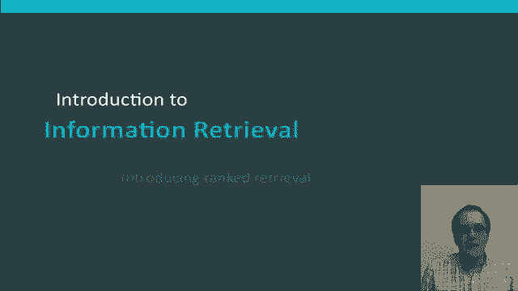
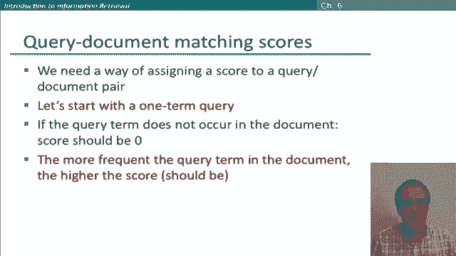

# 39：L7.1 - 检索排序介绍 🚀

在本节课中，我们将要学习**检索排序**的基本概念，了解它与布尔检索的区别，并探讨为什么排序检索模型更适合大多数用户的需求。

---

## 概述

到目前为止，我们讨论的查询都是**布尔查询**。例如，输入查询 `Ocean AND liner`，搜索引擎会精确返回包含“ocean”和“liner”这两个词的文档，文档要么匹配，要么不匹配。

这种模式对于需求明确、对文档集有深刻理解的专家用户是有效的。当信息检索系统作为一个大型应用的组件，并且系统能处理成千上万的结果、按需调整查询时，它也是有效的。

然而，对于绝大多数用户来说，这种系统实际上并不好用。大多数用户无法写出好的布尔查询，或者即使能写，他们也认为这太费功夫。特别是，布尔系统常常产生成千上万的结果，而用户并不想费力浏览这么多结果，这在网络搜索应用中尤其明显。

---

## 布尔检索的问题：盛宴或饥荒 🍽️

布尔检索存在一个普遍问题，即“盛宴或饥荒”问题。

布尔查询通常导致两种极端结果：要么返回的结果太少（一两个甚至为零），因为文档无法精确满足搜索请求；要么返回的结果太多，数量级达到数千甚至更多。

以下是该问题的具体表现：

*   **结果过多**：例如，查询 `standard user dlink 650` 可能返回 200,000 个结果。
*   **结果为零**：尝试让查询更具体，如 `standard user dlink 650 no card found`，则可能得到零个结果。
*   **技能要求高**：要写出能产生可控数量匹配结果的查询，需要很高的技巧。

基本问题在于：如果在词之间使用 **AND**，得到的结果太少；如果使用 **OR**，得到的结果又太多。

---

## 排序检索模型：解决方案 💡

上一节我们介绍了布尔检索的局限性，本节中我们来看看排序检索模型如何解决这些问题。

排序检索模型的核心思想是：系统不再返回一个满足查询的文档集合，而是根据查询，对文档集中的文档进行排序，并返回一个按相关性排序的顶部文档列表。

伴随这一思想而来的是**自由文本查询**的采用，它取代了像布尔检索模型那样带有 AND、OR、NOT 的显式查询语言。

用户的查询现在只是人类语言中的一些词。理论上，排序检索和自由文本查询是两个可以分开操作的选择，但在实践中，排序检索模型通常与自由文本查询相关联，而布尔检索模型则相反。

---

## 排序检索的优势

在排序检索中，“盛宴或饥荒”问题不复存在。当系统产生大量结果集时，用户并不会真正注意到。

结果集的大小基本上不再是个问题，因为系统通常一开始只向用户展示最顶部的少数几个结果，从而不会让用户不知所措。用户甚至可能不知道或没注意到结果的总数。

这一切都依赖于一个运行良好的排序算法，以确保顶部的结果是优质结果。

---

## 排序的基础：评分系统 ⚖️

排序检索的基础是拥有一个良好的**评分系统**。我们需要能够返回对搜索者最可能有用的文档，这就引出了一个问题：我们如何根据查询对文档进行排序？

我们将要探讨的方法是：为每个文档分配一个**分数**（例如，一个介于 0 和 1 之间的数字）。这个分数衡量了文档与查询的匹配程度。

因此，我们需要一种为“查询-文档”对分配分数的方法。让我们从一个单术语查询开始。

*   如果查询词没有出现在文档中，该文档的分数应为 **0**。
*   除此之外，我们可能想说：查询词在文档中出现的频率越高，分数就应该越高。
*   在此之后，如何精确地为文档评分就不那么明确了。因此，在接下来的课程中，我们将探讨几种不同的评分方案。

---

## 总结

本节课中，我们一起学习了**排序检索模型**的基本概念。我们了解了它与**布尔检索模型**的区别，认识到排序检索通过返回一个按相关性排序的文档列表，并结合自由文本查询，能更好地解决“盛宴或饥荒”问题，从而更适合大多数普通用户的使用习惯。排序检索的核心在于建立一个有效的**评分系统**，我们将在后续课程中深入探讨具体的评分方法。