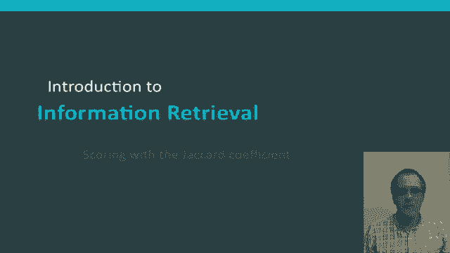
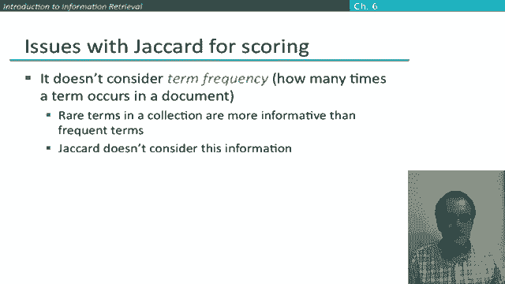

# 40：L7.2 - 基于Jaccard相关系数的打分 📊

在本节课中，我们将要学习一个简单的排序检索模型示例：基于Jaccard相关系数进行文档打分。我们将了解其定义、计算方法，并探讨其作为检索模型的优缺点。

---

## 概述

作为排序检索模型的一个简单入门示例，我们来考虑使用Jaccard系数进行打分。

Jaccard系数是衡量两个集合A和B之间重叠程度的常用指标。

---

## Jaccard系数的定义与计算

Jaccard系数的计算方法是：取两个集合交集的大小，除以它们并集的大小。

用公式表示如下：
**Jaccard(A, B) = |A ∩ B| / |A ∪ B|**

如果计算一个集合与其自身的Jaccard系数，交集和并集的大小相同，因此比值为1，Jaccard系数为1。

如果两个集合不相交，没有共同成员，那么Jaccard系数的分子为零，因此Jaccard系数为零。

两个集合的大小不必相同。可以理解，Jaccard系数始终会给出一个介于0和1之间的数值，因为交集的大小最大只能等于并集的大小。

---

## 应用于文档检索

假设我们决定将查询与文档的匹配分数，定义为两者所包含词语集合的Jaccard系数。

具体思路是：假设我们的查询是“Ides of March”，包含三个词。我们有两个文档。我们可以这样计算：查询中有三个不同的词。

对于文档1，“Caesar”未出现，“die”未出现，“in”未出现，“March”出现了。因此，交集的大小仅为1个词，总词数为6。

对于文档2，“that”未在查询中出现，“long”未在查询中出现，但“March”再次在查询中出现。因此，文档2的Jaccard系数将是1除以总词数，这次是5。

于是，这个文档将以更高的Jaccard得分胜出。当然，这个差异可能看起来并不显著。本质上，这个文档胜出仅仅是因为它更短。

如果我们设想另一个例子，也许第二个文档中包含了单词“of”，那么文档2的Jaccard系数将变成两个重叠词除以六。这可能让你觉得更合理，因为获得了更多的重叠，所以Jaccard分数更高。但“在其他条件相同的情况下，更短的文档应被优先考虑”这个想法，是我们在信息检索模型中会再次看到的常见理念。

---

## Jaccard打分的局限性

那么，Jaccard打分作为通用的检索模型是一个好主意吗？通常认为它不是。它存在几个问题。

首先，它不考虑词频，它只使用文档中的词语集合，忽略了词语在文档中出现的次数。但这通常不是我们想要的全部信息。我们稍后将看到处理词频的模型。

其次，还有一个更细致的点：在评估查询时，集合中的稀有术语比频繁术语更具信息量。这也是我们希望纳入模型的因素。

Jaccard系数效果不佳的另一个方面在于，它通过除以并集进行归一化的方式不一定完全正确。具体来说，在本课程后面的部分，我们将引入使用余弦相似度的概念。

我们将为更一般的情况推导其数学原理。但如果你在了解之后，想回过头来计算一下，当仅使用1/0词袋模型时，余弦相似度得分是多少，你会发现它类似于Jaccard系数，只是在分母上略有不同：我们现在取并集大小的平方根。事实证明，这是一种更好的长度归一化形式。

---

## 总结

本节课中，我们一起学习了Jaccard系数作为排序检索模型的一个非常简单的示例。希望这也是一种展示优秀检索模型需要处理的一些问题的方式：如何考虑词频、词语的稀有度，以及如何对不同长度的文档进行分数归一化。