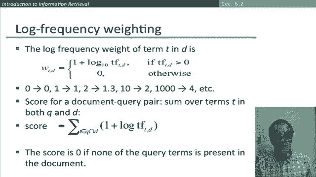

# 41：L7.3 - 词频权重 📊

在本节课中，我们将要学习信息检索系统中的一个核心概念：词频权重。我们将了解如何从简单的词项-文档出现矩阵，发展到词袋模型，并最终利用词频信息来计算文档的检索得分。

上一节我们介绍了词项-文档出现矩阵，它是一种基础的文档表示方法。本节中我们来看看如何在此基础上引入词频信息。

最初，我们使用词项-文档出现矩阵，矩阵中的每个单元格记录一个值：如果词项在文档中出现则为1，否则为0。这样，每个文档就被表示为一个二进制向量，其维度等于词汇表的大小。

但我们不必局限于这种二进制向量表示。一个显而易见的替代方案是使用计数向量。现在，每个文档仍然是一个向量，但我们不再填入1或0，而是填入该词项在文档中出现的次数。

因此，我们得到一个维度为词汇表大小的向量，但现在是自然数向量空间中的一个向量。在之前的布尔检索模型中，我们只关注文档中出现的词项集合，并进行“与”、“或”等集合运算。现在，通过这个计数模型，我们过渡到了常用的词袋模型。

在词袋模型中，我们不考虑文档中词项的顺序，但会考虑一个词项在文档中出现的次数。词袋是集合的一种扩展，它额外记录了词项被使用的频率。

词袋模型存在一些巨大的局限性。例如，“John is quicker than Mary”和“Mary is quicker than John”这两个句子具有完全相同的向量表示，模型无法区分它们。这显然限制了其表达能力。

在某种意义上，这是一种倒退。早些时候，当我们引入位置索引时，它们能够通过邻近度或短语查询来区分这类文档。我们后续会希望恢复位置信息，但眼下，我们将重点发展词袋模型及其在向量空间检索模型中的应用。

我们有了“词项在文档中的词频”这个量，它就是一个词项出现的次数。那么问题来了：我们如何在检索得分中使用它呢？

稍加思考，你可能会被说服：原始的词频或许并非我们真正想要的。利用词频的基本思想是：如果我搜索“squirrels”，那么我应该更倾向于一个提到“squirrel”三次的文档，而不是只提到一次的文档。

但另一方面，如果我找到一个提到“squirrel”三十次的文档，我不确定是否应该认为它比只提到一次的文档好三十倍。因此，建议是：相关性随着提及次数的增加而增加，但不是线性增长。我们需要找到一种方法来缩放词频，使其与频率相关，但增长低于线性。

在继续概述这种度量方法之前，让我强调最后一点：我们在这里谈论“词频”。实际上，“频率”这个词有两种用法：一是指某事发生的速率（如盗窃案的频率），另一个是信息检索中一直使用的含义——当我们谈论信息检索中的“频率”时，它仅指计数，即一个词在文档中出现的次数。

以下是处理词频的标准做法。我们取词频的对数。现在，如果词频为0（即词项未在文档中出现），那么0的对数是负无穷，这有点问题。

标准的解决方法是采用一个两段式构造：如果词项确实出现在文档中，我们给词频加1。因此，如果它出现一次，这个值将变为1（因为log(1)=0），然后我们再加1，最终返回的值为0。如果词项未出现，则直接返回0。

这意味着，如果我们使用以10为底的对数（如上所示），你可以看到我们是如何实现低于线性增长的：如果一个词在文档中出现两次，其权重为1.3（略高于1）；出现10次，权重为2；出现1000次，权重为4，依此类推。

为了给一个文档-查询对打分，我们只需对查询和文档中共有的每个词项的这些权重值进行求和。因此，只需取查询和文档中共同出现的词项交集即可，因为其他词项对得分没有贡献。然后，对交集内的每个词项，我们计算这个量并求和。

特别要注意，如果查询中的词项没有一个出现在文档中，得分确实仍为0。

好的，这就是词频权重的概念，以及它如何用于为特定查询下的文档给出一个得分，该得分可用于对返回的文档进行排序。

本节课中，我们一起学习了词频权重。我们从基础的二进制表示出发，引入了词袋模型和词频计数。我们讨论了原始词频的局限性，并介绍了通过取对数（`log(tf+1)`）来获得低于线性增长的权重值的标准方法。最后，我们了解了如何将这些权重求和，以得到文档对于查询的检索得分，从而实现文档排序。