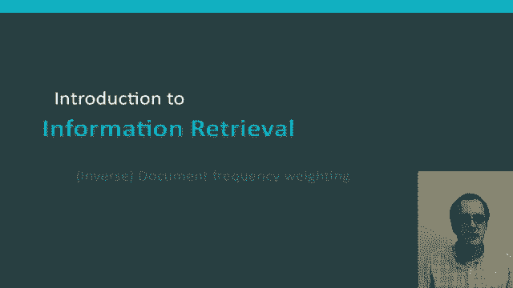
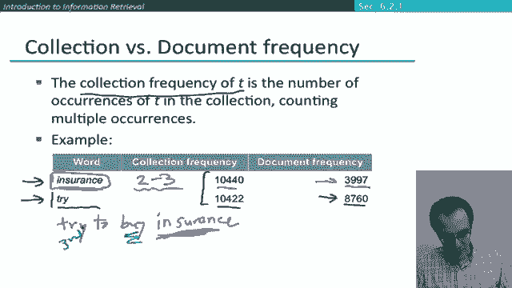
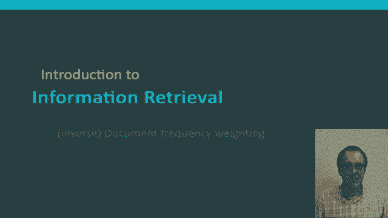

# 42：L7.4 - 逆文本频率权重 🧮

在本节课中，我们将要学习一种用于评估文档与查询匹配程度的重要评分方法——逆文本频率权重。我们将了解其核心思想、计算方法，以及它为何比简单的词频统计更有效。

---

## 概述

上一节我们介绍了文档频率的概念。本节中，我们来看看如何利用文档频率的倒数来为查询中的词语分配权重，这种方法被称为逆文本频率权重。其核心思想是：在文档集合中出现频率较低的词语，通常比常见词语包含更多信息。

## 核心思想：稀有词 vs. 常见词

利用文档频率背后的理念是，**稀有术语比常见术语更具信息量**。

例如，我们之前讨论过停用词，如“the”、“and”、“to”。这些词语非常普遍，语义信息量少，因此在信息检索系统中，它们对判断文档与查询的匹配度贡献很小。相反，如果一个查询词在文档集合中非常罕见，例如“arachnocentric”（蜘蛛中心论），那么包含该词的文档很可能就是用户想找的。因此，我们希望为这类稀有术语赋予更高的匹配权重。

另一方面，常见术语的信息量较低。例如，“high”、“increased”、“line”这类词可能出现在许多文档中。虽然包含这些词的文档比不包含的文档更可能与查询相关，但这并非一个非常确定的关联指标。因此，对于常见术语，我们仍会给予正向权重，但权重要低于稀有术语。

## 逆文档频率的计算

我们将通过使用**文档频率**这一概念来实现上述目标。

**文档频率** 是指包含某个术语的文档数量。它衡量的是术语在整个集合中的分布广度，而非出现总次数。文档频率是术语信息量的一个反向指标。

以下是逆文档频率的计算公式：

**IDF(t) = log₁₀(N / df(t))**

其中：
*   **N** 是文档集合中的文档总数。
*   **df(t)** 是术语 **t** 的文档频率（即包含 t 的文档数量）。
*   **log** 用于抑制 IDF 值的绝对大小，避免其对最终评分产生过强的影响。虽然这里以10为底，但实际使用中对数底数的选择并不关键。

这个公式的结果值域在 0 到 log₁₀(N) 之间。如果一个词出现在所有文档中，其 IDF 值为 0，这意味着它对文档排序没有影响，这符合逻辑，因为它不具备区分文档的能力。

## 计算示例

假设我们的文档集合包含 1,000,000 个文档。

以下是不同文档频率的术语其 IDF 值计算示例：

*   **极罕见词**（如“Caluria”，仅出现在1个文档中）：
    IDF = log₁₀(1,000,000 / 1) = 6
*   **较罕见词**（出现在100个文档中）：
    IDF = log₁₀(1,000,000 / 100) = 4
*   **常见词**（出现在10,000个文档中）：
    IDF = log₁₀(1,000,000 / 10,000) = 2
*   **极常见词**（出现在所有文档中）：
    IDF = log₁₀(1,000,000 / 1,000,000) = 0

由此可见，逆文档频率权重会为稀有词赋予较大的乘数因子，从而在排序时更关注这些词。

> 需要注意的是，IDF 值是针对集合中每个术语预先计算好的一个静态值，不随具体查询而改变。

## IDF 对排序的影响

现在有一个问题：IDF 对单术语查询的排序有影响吗？

答案是否定的。对于单术语查询，IDF 只是一个应用于所有文档的相同缩放因子，因此不会改变文档之间的相对排名。

IDF 只在**多术语查询**中发挥作用。例如，对于查询“capricious person”（善变的人），“capricious”是一个比“person”罕见得多的词。IDF 机制会在排序检索结果时，更加重视包含“capricious”的文档，而不是仅包含“person”的文档。

## 为何使用文档频率而非总词频？

你可能想知道，为什么我们使用文档频率而不是**总词频**。总词频是指一个术语在整个集合中出现的总次数（多次出现累加），这在构建语言模型或垃圾邮件分类器时常用。

但在信息检索排序中，我们通常使用文档频率。以下例子可以说明原因：

考虑“insurance”（保险）和“try”（尝试）这两个词。假设它们在集合中的总词频几乎相同，都略高于10,000次。

*   **“try”** 出现在约 8,700 个文档中。
*   **“insurance”** 出现在略低于 4,000 个文档中。

这意味着：“try”分布广泛，但在每个文档中通常只出现一次；而“insurance”则倾向于集中在某些特定文档中，并在这些文档中多次出现（例如，关于保险的文档会反复提及该词）。

对于查询“try to buy insurance”，最重要的匹配词是“insurance”，其次是“buy”，“try”的重要性相对最低。**文档频率**能够正确反映这一点，为“insurance”赋予更高的权重。而如果使用**总词频**，则“try”和“insurance”会被视为同等重要，这不符合信息检索的直觉。

## 总结

本节课中我们一起学习了逆文档频率权重的概念。我们了解到：
1.  IDF 通过 `log(N/df)` 公式计算，用于衡量术语的稀有程度和信息含量。
2.  稀有词获得高 IDF 权重，常见词（尤其是停用词）获得低权重或零权重。
3.  IDF 是一个全局的、与查询无关的静态值。
4.  它主要影响多术语查询的排序结果，对单术语查询的排序无影响。
5.  在信息检索中，使用文档频率而非总词频来计算 IDF，能更好地捕捉术语的区分能力，因为文档频率反映了术语的分布集中度，而总词频可能被少数文档中的多次出现所主导。

理解 IDF 是掌握现代信息检索排序模型（如 TF-IDF 及其变体）的重要基础。