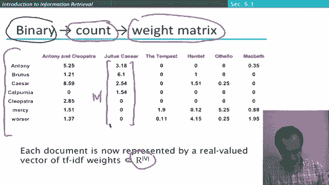

# 43：L7.5 - TF-IDF权重 🧮

在本节课中，我们将学习如何将词频（TF）和逆文档频率（IDF）结合，形成信息检索中最核心的权重计算方案——TF-IDF权重。我们将详细介绍其计算公式、特性，并展示如何利用它进行文档排序。

---

我们已经介绍了信息检索排序过程中使用的两种权重：词频（TF）和逆文档频率（IDF）。本节中，我们将把它们结合起来，得到词的TF-IDF权重。

一个词在文档中的TF-IDF权重，就是其经过对数缩放的TF权重与其IDF权重的乘积。公式如下：

**TF-IDF(t, d) = TF(t, d) × IDF(t)**

这是信息检索领域最著名、最核心的词权重计算方案。虽然存在许多其他研究方案，但这是必须掌握的一个。请注意，公式中的连字符“-”表示乘积关系，而非减法，有时也会用点号或乘号来更明确地表示。

---

那么，TF-IDF权重有哪些特性呢？

以下是TF-IDF权重的核心特性：
*   **与文档内词频正相关**：一个词在文档中出现的次数越多，其TF-IDF权重通常越高。这意味着，一个查询词的权重是依赖于具体文档的。
*   **与词在集合中的稀有度正相关**：一个词在整个文档集合中出现的文档越少（即越稀有），其IDF部分权重越高，从而提升整体的TF-IDF权重。

---

上一节我们介绍了TF-IDF权重的特性，本节我们来看看如何利用它对查询进行文档排序。

为了计算一个文档相对于某个查询的得分，我们执行以下步骤：
1.  找出同时出现在查询和文档中的词。
2.  对于每一个这样的词，计算其在当前文档中的TF-IDF权重。
3.  将所有词的TF-IDF权重相加，得到该文档的总得分。

然后，根据这个得分对所有文档进行降序排列，得分最高的文档被认为与查询最相关。

---

至此，我们已经逐步完成了从布尔模型到向量空间模型的演进。

我们最初使用的是布尔模型中的二值向量。随后，我们使用了未经缩放的词频计数向量。现在，我们为每个文档构建了由TF-IDF值组成的实数值权重向量。

例如，文档《Julius Caesar》可以由这样一个实数值向量表示。每个文档都位于一个高维实数向量空间中，其维度等于我们文档集合中不同词项的数量。

当我们为集合中的所有文档都构建了这样的向量后，我们就得到了一个**实数值的词-文档矩阵**。

这个矩阵是后续许多信息检索操作的基础。我们稍后会再讨论它的一些性质。目前，通过这个实数值矩阵，我们已经能够清晰地看到如何根据查询，利用为每个词和每个文档计算的TF-IDF得分来进行文档排序了。

---

本节课中，我们一起学习了信息检索系统的核心概念之一——TF-IDF权重。我们了解了它是词频（TF）和逆文档频率（IDF）的结合，掌握了其计算公式和特性，并明白了如何利用它为文档评分和排序。通过构建实数值的词-文档矩阵，我们为文档建立了一种更精细、更有效的数学表示，这是现代信息检索技术的基石。