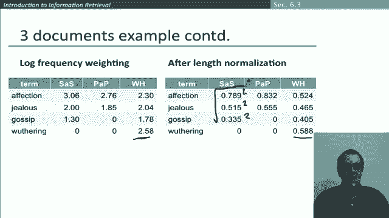

# 44：L7.6 - 向量空间模型 🧮


在本节课中，我们将学习信息检索中最常用的模型之一——向量空间模型。我们将了解如何将文档和查询表示为向量，并利用向量之间的角度（余弦相似度）来衡量它们的相似性，从而对文档进行排序。

---

## 从词频到向量空间

上一节我们介绍了词频和逆文档频率等概念。本节中，我们将看看如何利用这些概念构建一个实用的检索模型——向量空间模型。

在之前的章节中，我们学习了如何将文档转换为实值向量。现在我们拥有一个 V 维的向量空间，其中 V 是我们词汇表中的单词数量。

*   词汇表中的单词是这个空间的坐标轴。
*   文档可以被视为这个空间中的点，或者是从原点指向这些点的向量。

在实际系统（如网络搜索引擎）中应用此模型时，我们会得到一个非常高维的空间，维度可能达到数千万。这些向量的一个关键属性是它们非常稀疏，因为每个单独的文档通常只包含几百或几千个单词，所以向量中的大多数条目都是零。

---

## 查询处理与相似性排序

既然我们有了文档的向量空间，那么当查询到来时，我们如何处理呢？核心思想是，我们用完全相同的方式处理查询，查询也将是同一空间中的向量。

以下是处理查询的关键步骤：
1.  将查询转换为向量。
2.  根据文档向量与查询向量在空间中的接近程度对文档进行排序。

接近程度对应于向量的相似性，因此它大致与距离成反比。我们这样做是为了摆脱“非此即彼”的布尔模型，获得一个关于文档与查询匹配程度的相对分数，从而将更相关的文档排在不太相关的文档之前。

---

## 从欧氏距离到角度度量

让我们尝试让这个概念更精确一些。如何在向量空间中形式化地定义“接近”？

最初的尝试是计算两点之间的距离，即它们向量端点之间的欧氏距离。但事实证明，仅使用欧氏距离并不是一个好主意，因为对于长度不同的向量，欧氏距离会很大。

让我解释一下这是什么意思。假设在我们的向量空间中，两个点之间的距离很大。但如果我们从信息检索的角度思考，这似乎是不对的。

在一个简化的例子中，我们有两个词轴：“gossip”和“jealous”。如果查询是“gossip and jealous”，那么查询向量在这两个轴上都有相等的权重。文档1主要关于“gossip”，与“jealousy”无关；文档3主要关于“jealousy”，与“gossip”无关；而文档2则同时大量涉及这两个主题。我们希望文档2被认为是与查询最相似的文档。

这启发我们采用另一种方法：与其只讨论距离，不如开始关注向量空间中的角度。

---

## 余弦相似度的引入

我们可以使用角度来代替距离。让我们通过一个思想实验来进一步说明这一点。

假设我们取一个文档 D，并将其自身附加一次，得到文档 D‘。显然，D 和 D’ 在语义上具有相同的内容。但如果我们在使用欧氏距离的常规向量空间中计算，这两个文档之间的距离会相当大，因为 D‘ 的向量长度是 D 的两倍。我们不希望这样。

相反，我们注意到这两个向量在同一条直线上，它们之间的角度为零，对应于最大的相似性。因此，我们的想法是根据文档向量与查询向量之间的角度来对文档进行排序。

以下两个概念是等价的：
*   按照查询与文档之间角度的**递减**顺序对文档进行排序。
*   按照查询与文档之间角度的**余弦值**的**递增**顺序对文档进行排序。

你经常会听到“余弦相似度”这个短语，这就是我们在这里引入的概念。其原理在于，余弦函数在 0 到 180 度的区间内是单调递减的。因此，余弦分数可以作为一种角度的逆度量。

---

## 向量长度归一化与余弦公式

使用余弦相似度的另一个原因是，有一种非常高效的方法可以使用向量算术来计算文档之间的角度余弦，而无需实际计算耗时的超越函数（如余弦函数）。

计算的起点是理解向量的长度以及如何归一化向量长度。对于任何向量 **x**，其长度可以通过对其每个分量的平方求和，然后取外部平方根来计算。

**公式：向量长度**
`|x| = sqrt( sum(x_i^2) )`

例如，向量 (3, 4) 的长度是 `sqrt(3^2 + 4^2) = 5`。

如果我们取任何向量并将其除以其长度，就会得到一个单位长度向量，你可以将其视为触及原点周围单位超球面表面的向量。

回到之前 D 和 D‘ 的例子，如果对它们都进行长度归一化，它们将回到完全相同的位置。这样一来，经过长度归一化后，长文档和短文档就具有了可比较的权重。

我们余弦度量的秘诀就是进行这种长度归一化。两个文档之间的余弦相似度，即它们之间角度的余弦，计算方式如下：

**公式：余弦相似度**
`cos_sim(q, d) = (q · d) / (|q| * |d|) = sum(q_i * d_i) / ( sqrt(sum(q_i^2)) * sqrt(sum(d_i^2)) )`

在分子中，我们计算点积（对应分量相乘后求和）。在分母中，我们考虑两个向量的长度。实际上，这等价于先对每个向量进行长度归一化，然后计算它们的点积。

具体来说，我们可以预先对文档向量进行长度归一化，并在查询到来时对查询向量进行长度归一化。这样，余弦相似度度量就简化为长度归一化向量的点积。

在实际操作中，我们不会遍历向量的所有元素，而只会遍历同时出现在查询 Q 和文档中的词汇项。

---

## 实例解析：简·奥斯汀的小说

现在让我们通过一个具体的例子来深入理解。在这个例子中，我们有三本简·奥斯汀的小说，我们将它们在向量空间中表示为长度归一化的向量，然后计算不同小说之间的余弦相似度。

我们的起点是这些小说的词频计数向量。词汇表包括“affection”、“jealous”、“gossip”等词。为了简化，本例中我们只使用词频加权，暂不考虑逆文档频率加权。

首先，我们对词频进行对数加权处理。然后，我们对这些向量进行长度归一化，使每个向量的长度变为 1。



**代码：长度归一化向量示例（概念）**
```
# 假设原始加权向量
vec_sense = [log(115), log(10), log(2), ...] # 对应 affection, jealous, gossip...
vec_pride = [log(58), log(7), log(0), ...]
vec_wuthering = [log(20), log(11), log(6), ...]

# 长度归一化后（数值为示意）
norm_sense = [0.996, 0.087, 0.017, ...] # 模长为1
norm_pride = [0.993, 0.120, 0, ...]
norm_wuthering = [0.847, 0.466, 0.254, ...]
```

然后，我们可以通过简单计算点积来得到余弦相似度：
*   《理智与情感》和《傲慢与偏见》的相似度：`0.996*0.993 + 0.087*0.120 + ... ≈ 0.94`
*   《理智与情感》和《呼啸山庄》的相似度：`0.996*0.847 + 0.087*0.466 + ... ≈ 0.79`
*   《傲慢与偏见》和《呼啸山庄》的相似度：`0.993*0.847 + 0.120*0.466 + ... ≈ 0.69`

为什么《理智与情感》和《傲慢与偏见》的相似度高于《理智与情感》和《呼啸山庄》？我们可以观察向量。《理智与情感》向量中最大的分量是“affection”，这与《傲慢与偏见》中该词的高权重产生了很大的相似性贡献，而《呼啸山庄》中该词的权重较低。因此，点积的结果更大，相似度更高。这表明文档中不同单词的出现比例对整体相似性度量有很大影响。

---

## 总结


本节课中，我们一起学习了信息检索中的向量空间模型。其核心思想是，我们可以基于文档在高维向量空间中与查询向量的角度相似性（通过余弦相似度计算）来对文档进行检索排序。关键步骤包括将文档和查询表示为 TF-IDF 加权向量，进行长度归一化，然后计算余弦相似度作为排序依据。这种方法克服了布尔模型的局限性，能够对相关度进行量化评分。