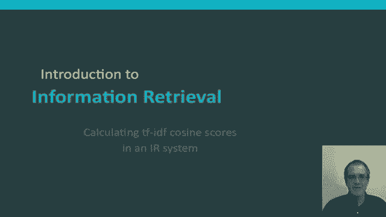
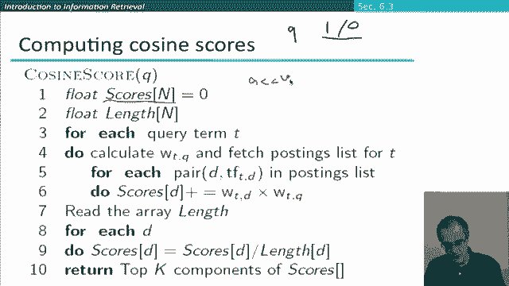
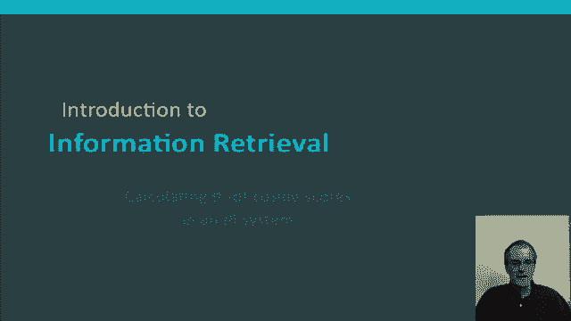

# 45：L7.7 - 信息检索中计算TF-IDF的余弦得分 📊

在本节课中，我们将学习如何将TF-IDF权重与余弦相似度度量结合使用，以构建一个排序式信息检索系统。我们将了解TF-IDF加权的不同变体，并通过一个具体示例演示如何为一个查询计算单个文档的得分。最后，我们将概述在大型文档集合中高效计算余弦得分的算法思路。

---

## TF-IDF加权：一个家族方法 👨‍👩‍👧‍👦

上一节我们介绍了TF-IDF的基本概念。实际上，TF-IDF加权并非单一方法，而是一个方法家族。让我们更详细地了解一下。

以下是构成TF-IDF加权的几个核心组件及其常见选择：

*   **词频（TF）处理**：可以使用原始词频，但通常会对词频进行某种“钝化”处理，例如对数加权（`log(1 + tf)`）。这是最常见的方法，但并非唯一。
*   **文档频率（DF）处理**：可以完全不使用文档频率加权，也可以使用对数逆文档频率加权（`log(N/df)`）。后者极为常见，但人们也尝试过其他方法。
*   **向量归一化**：为了获得更好的相似度计算，我们可能希望以某种方式对向量进行归一化。我们讨论过使用余弦长度归一化，它既有优点也有缺点。人们还尝试过其他方法，例如近年来提出的“枢轴长度归一化”。

总的来说，我们有一系列广泛的选择。在著名的SMART信息检索系统（由信息检索领域的先驱Gerry Salton在康奈尔大学开发）的背景下，这些选择被赋予了字母代号。我们主要讨论的系统对应着 **LTC** 加权方案，即对数词频（L）、对数逆文档频率（T）和余弦归一化（C）。

---

## 查询与文档的不同加权方案 ⚖️

这种加权方案可以分别应用于查询和文档，并且方式可以不同。根据SMART的表示法，标准方式是用六个字母（中间用点分隔）来表示，前面是文档加权方案，后面是查询加权方案。

有多种变体，但20世纪90年代SMART工作中一个相当标准的方案是 **lnc.ltc**。让我们更详细地了解一下这个方案。

*   **查询部分（.ltc）**：
    *   **对数查询归一化（l）**：这主要对长查询（可能多次提及某些词）有影响。对于短查询，如果每个词只出现一次，那么权重就是1（出现）或0（未出现）。
    *   **查询词的IDF加权（t）**
    *   **余弦归一化（c）**
*   **文档部分（lnc.）**：
    *   **对数词频加权（l）**
    *   **无IDF加权（n）**：文档部分没有IDF归一化。这值得思考：这是一个坏主意吗？有一些理由支持这样做。其中之一是，相同的词已经在查询部分加入了IDF因子（因为只有同时出现在查询和文档中的词才会得到非零分数）。此外，不在文档索引中存储IDF值，在压缩索引和提高效率方面也有优势。
    *   **余弦归一化（c）**

---

## 具体计算示例 🔢

让我们使用 **lnc.ltc** 加权方案，通过一个具体示例来计算一个查询与一个文档的得分。我们将进行深入计算。

我们的文档是：“car insurance auto insurance”。查询是：“best car insurance”。

### 第一步：计算查询向量

首先处理查询“best car insurance”。

1.  **原始权重**：每个出现词的权重为1。
    | 词项 | 原始权重 |
    | :--- | :--- |
    | best | 1 |
    | car | 1 |
    | insurance | 1 |

2.  **对数缩放（l）**：由于每个词只出现一次，权重保持为1。
    | 词项 | 对数权重 |
    | :--- | :--- |
    | best | 1 |
    | car | 1 |
    | insurance | 1 |

3.  **IDF加权（t）**：获取每个词的文档频率并映射为逆文档频率。越稀有的词（如insurance）获得越高权重。
    | 词项 | 文档频率 (df) | IDF = log(N/df) |
    | :--- | :--- | :--- |
    | best | 50,000 | 0.3 |
    | car | 10,000 | 1.0 |
    | insurance | 1,000 | 2.0 |

4.  **相乘**：将对数权重列与IDF列相乘。
    | 词项 | 权重 (l * t) |
    | :--- | :--- |
    | best | 0.3 |
    | car | 1.0 |
    | insurance | 2.0 |

5.  **余弦归一化（c）**：将上述向量转换为单位向量。计算向量的欧几里得长度：`sqrt(0.3^2 + 1.0^2 + 2.0^2) = sqrt(0.09 + 1 + 4) = sqrt(5.09) ≈ 2.256`。然后将每个分量除以该长度。
    | 词项 | 归一化后权重 |
    | :--- | :--- |
    | best | 0.133 |
    | car | 0.443 |
    | insurance | 0.886 |

**最终查询向量**：`[0.133, 0.443, 0.886]`（对应顺序：best, car, insurance）

### 第二步：计算文档向量

现在处理文档“car insurance auto insurance”。

1.  **原始词频**：
    | 词项 | 词频 (tf) |
    | :--- | :--- |
    | auto | 1 |
    | car | 1 |
    | insurance | 2 |

2.  **对数词频加权（l）**：应用公式 `1 + log(tf)`。
    | 词项 | 加权后 tf |
    | :--- | :--- |
    | auto | 1 + log(1) = 1 |
    | car | 1 + log(1) = 1 |
    | insurance | 1 + log(2) ≈ 1.693 |

3.  **无IDF加权（n）**：文档部分不使用IDF，所以权重保持不变。
    | 词项 | 权重 (l * n) |
    | :--- | :--- |
    | auto | 1 |
    | car | 1 |
    | insurance | 1.693 |

4.  **余弦归一化（c）**：计算向量的欧几里得长度：`sqrt(1^2 + 1^2 + 1.693^2) = sqrt(1 + 1 + 2.866) = sqrt(4.866) ≈ 2.206`。然后将每个分量除以该长度。
    | 词项 | 归一化后权重 |
    | :--- | :--- |
    | auto | 0.453 |
    | car | 0.453 |
    | insurance | 0.767 |

**最终文档向量**：`[0.453, 0.453, 0.767]`（对应顺序：auto, car, insurance）。注意，查询中有但文档中没有的“best”项，在文档向量中对应权重为0。

### 第三步：计算余弦相似度得分

余弦相似度是这两个长度归一化向量的点积（内积）。只有同时出现在两个向量中的维度（即“car”和“insurance”）才对点积有贡献。

*   对于“car”：查询权重(0.443) * 文档权重(0.453) ≈ 0.201
*   对于“insurance”：查询权重(0.886) * 文档权重(0.767) ≈ 0.679
*   总分 = 0.201 + 0.679 = **0.88**

该文档与查询匹配度很高。需要注意的是，由于余弦函数在顶部较为平缓，对于相当相似的文档，余弦得分往往偏向于较高的值。因此，记住分数的排序比记住精确的值更重要。

**一个小练习**：如果你知道本例中使用的IDF分数和文档频率，你应该能推算出这个示例基于的文档总数N是多少。

---

## 在检索系统中计算余弦得分 🖥️

上一节我们为一个文档计算了得分。现在，让我们看看如何在一个向量空间检索系统中为整个文档集合计算余弦得分。以下是我们要使用的大致算法思路。

我们假设查询是典型的短查询（如网页搜索），因此我们只考虑词项是否在查询中出现（即二进制权重）。同时，我们将跳过查询长度归一化这一步。原因在于，在这种情况下，查询向量有一个固定的长度，对其进行长度归一化只是一个对所有查询-文档计算都适用的缩放操作，不会改变最终的排序结果。

基于这个背景，算法步骤如下：

1.  **初始化**：
    *   创建一个`scores`数组，为所有文档设置初始得分为0。我们将在此累积不同查询词项为文档贡献的分数。这些分数也常被称为**累加器（accumulators）**。
    *   创建另一个`lengths`数组，用于存储各文档向量的（未归一化）长度。

2.  **遍历查询词项**：
    *   对于查询中的每个词项`t`（其查询权重`w_q`简化为1，因为我们假设二进制查询且跳过查询归一化）：
        *   获取词项`t`的倒排记录表（postings list）。
        *   对于倒排记录表中的每个文档`d`：
            *   获取词项`t`在文档`d`中的词频`tf_{t,d}`。
            *   应用文档的词频加权（如对数加权），得到文档权重`w_{d,t}`。
            *   将`w_q * w_{d,t}`（本例中即`w_{d,t}`）累加到`scores[d]`中。
            *   （同时，我们可以在另一轮预处理中或此处计算并存储每个文档的向量长度平方`length^2[d]`，即各词项`w_{d,t}^2`的和）。

3.  **文档长度归一化**：
    *   对于每个有分数的文档`d`，计算其归一化长度：`norm_length[d] = sqrt(length^2[d])`。
    *   将`scores[d]`除以`norm_length[d]`，完成文档的长度归一化。根据开头的假设（查询向量长度为1且未归一化），此时`scores[d]`的值就等同于余弦相似度分数。

4.  **排序与返回**：
    *   我们不需要线性扫描整个`scores`数组来找出最高分。在实际系统中，会使用更高效的数据结构（如堆）来找出分数最高的前K个文档。
    *   返回这Top K个（例如前10个）文档的ID或表示给用户作为初始结果。如果用户要求，可以展示更多。

**关于算法实用性的说明**：这还不是一个完全实用的算法。如果文档集合非常庞大（例如200亿个文档），我们不会真的为每个文档都创建一个累加器单元。系统会使用方法来确定哪些文档可能有希望，只为这些文档创建累加器。同样，在最后一步，寻找最相关文档也有比线性扫描更高效的方法。但希望这个概述能让你对如何将余弦相似度评分构建到排序检索引擎中有一个总体的认识。

---

## 总结 📝

本节课中，我们一起学习了向量空间检索的核心步骤：

1.  将查询表示为一个TF-IDF向量。
2.  将每个文档也表示为一个TF-IDF向量。
3.  为了给一个查询和文档对评分，我们计算它们的余弦相似度分数。公式可以表示为：
    `cosine_similarity(q, d) = (q · d) / (||q|| * ||d||)`
    其中`q · d`是点积，`||q||`和`||d||`是向量的欧几里得范数。
4.  使用这个分数对所有文档进行排序。
5.  首先返回前K个（例如Top 10）分数最高的文档给用户作为初始结果。如果用户需要，再展示更多结果。

这就是构建一个基于TF-IDF的排序检索系统的基本思路。