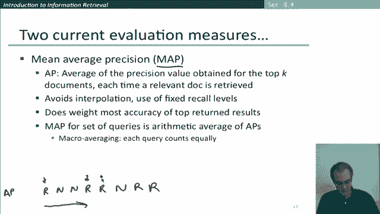

# 46：L7.8 - 搜索引擎评估 📚 

在本节课中，我们将学习如何评估搜索引擎的质量。我们将探讨多种评估指标，并重点学习如何衡量搜索引擎返回结果的相关性，特别是针对返回排序结果的系统。

---

评估搜索引擎质量的方法有很多。

技术指标包括索引速度和搜索速度。
我们还可以考察查询语言的表达能力，例如系统是否能通过短语查询、邻近查询或析取查询来表达复杂的信息需求。
用户还有其他期望，例如界面简洁、使用成本低廉。
所有这些指标都是可量化的，我们可以为它们打分以衡量其优劣。

但在实践中，尽管这些指标很重要，但往往被另一个衡量用户满意度的指标所主导，即用户在使用搜索引擎时是否感到满意。响应速度和索引规模固然是影响因素，但仅凭这些，如果返回的答案毫无用处，速度再快也无法让用户满意。
因此，用户满意度的很大一部分在于返回的结果是否符合他们的需求，这就是结果与用户信息需求的相关性指标。

我在一开始就提到过，但需要再次重申：评估信息检索系统时，我们是针对信息需求进行评估。
信息需求被转化为查询，这才是信息检索系统实际运行的对象。
但相关性是相对于信息需求而非查询来判定的。例如，如果用户的信息需求是“了解喝红酒是否比喝白酒更能降低心脏病风险”，他们可能会构造一个查询，比如“红酒 白酒 心脏病 效果”。在评估搜索引擎返回相关结果的有效性时，我们不是问搜索引擎返回的文档是否仅仅包含这些词，而是问这些文档是否解决了用户的信息需求。

那么，我们如何进行评估呢？如果搜索引擎返回一组结果，我们可以通过以下三样东西进行评估：一个用于评估的基准文档集合、一组在某种意义上能代表目标信息需求的基准查询集合，以及我们收集的第三样东西——评估员对特定文档是否与特定查询相关的判断。
在实践中，通常无法穷尽地收集所有判断，尤其是在文档集合很大的情况下。但至少，我们可以让评估员判断特定搜索引擎返回的特定文档集是否与查询相关。
如果我们拥有包含这三样东西的结果集，我们就可以开始评估了，因为我们可以使用之前见过的相同指标：精确率、召回率以及结合二者的F值。
这些是合适的优秀指标，原因与我们讨论命名实体识别时相同：通常只有少数文档与特定查询相关，因此通过精确率和召回率来衡量效果更好。

但是，如果我们现在面对的是一个返回排序结果的搜索引擎，就不能直接使用精确率、召回率和F值这些指标了，因为系统可以返回任意数量的结果。实际上，返回的数量通常取决于我们点击“查看更多”的频率。
不过，如果我们查看结果的任意初始子集，就可以计算出该子集的精确率和召回率，然后将它们组合起来，得到一条精确率-召回率曲线。让我们看看这是如何工作的。

假设这是搜索引擎返回的前10个结果，我们根据评估员的判断标记了每个结果是相关或不相关的。
然后，我们可以取这些文档的任意初始子序列来计算召回率和精确率。
对于第一个文档，系统判断正确，它是一个相关文档。假设整个集合中共有10个相关文档，那么系统找到了10个相关文档中的1个，因此其召回率是0.1。
由于该文档是相关的，系统第一个答案就正确，此时其精确率是1。
下一个文档不相关，因此前两个文档的召回率仍是0.1，精确率现在是0.5。
又一个不相关文档，召回率仍为0.1，精确率现在降至约0.33。
如果我们看前四个文档的集合，现在找到了10个相关文档中的2个，召回率是0.2，精确率回升到0.5。
第五个文档也是相关的，现在召回率上升到0.3，精确率是3/5=0.6。
我们可以继续往下计算。

我想提到的另一个指标，也是近年来最常用的指标之一，是**平均精确率均值**。
假设我们有以下排序检索结果（为方便说明，顺序如下）：第一个返回文档相关，第二个不相关，第三个不相关，然后一个相关，又一个相关，接着不相关、相关、相关。假设这是我们的前8个结果。
计算平均精确率均值时，首先需要计算单个查询的平均精确率。
方法是：计算在每个返回相关文档的位置上的精确率，因为此时召回率在增加。
所以，在第一个相关文档处，精确率是1。
在第四个文档处（此时已返回两个相关文档），精确率是0.5。
在第五个文档处，精确率是0.6。
在第七个文档处，返回了7个文档，其中4个相关，精确率约为0.57。
在第八个文档处，返回了8个文档，其中5个相关，精确率是0.625。
然后，为了计算平均精确率均值，我们继续计算这些数字。在实践中，通常不会穷尽计算，而是计算到某个点，比如前100个结果，然后取所有这些数字的平均值，这就是该查询的平均精确率。
接着，对基准查询集合中的所有其他查询计算相同的平均精确率，再取这些平均精确率的平均值，就得到了平均精确率均值。
具体来说，这被称为**宏平均**，即每个查询在计算平均精确率均值时权重相等。

这是一个很好的指标，它在某种程度上评估了不同召回率水平下的精确率，同时仍然最看重前几个返回文档的精确率。
在跨查询的层面上，它给予不同查询相等的权重，这往往是有用的做法，因为你总是希望系统在处理稀有词查询和常见词查询时都能表现良好。因此，这是评估信息检索系统时一个相当不错的指标。

当然，还有更多方法可以讨论，但以上内容已经很好地说明了如何评估排序检索系统的性能。

---

本节课中，我们一起学习了搜索引擎评估的核心概念。我们了解到，除了技术指标，用户对结果相关性的满意度至关重要。我们回顾了精确率、召回率和F值在评估固定结果集时的应用，并重点学习了如何通过**精确率-召回率曲线**和**平均精确率均值**来评估返回排序结果的搜索引擎。MAP是一个广泛使用的优秀指标，它综合考虑了不同召回率下的精确率，并对所有查询给予平等关注。