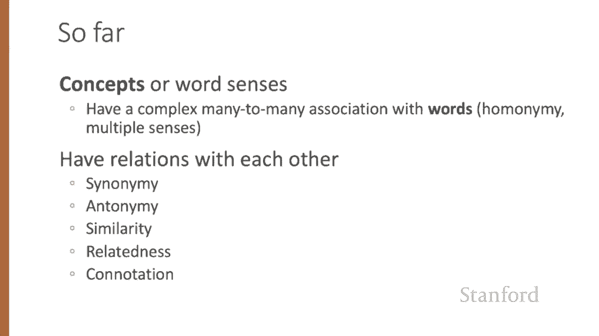

# 47：L8.1- 词义学习 📚

在本节课中，我们将要学习词义的基本概念，了解语言学如何定义和描述词义，并探讨这些概念如何为自然语言处理中的计算模型提供基础。

## 词义的语言学背景

让我们从词义的一些语言学背景知识开始。

在自然语言处理系统中，我们如何表示词义？在经典的自然语言处理应用中，我们对一个词的唯一表示就是它的一串字母，或者是词汇表中的一个索引。

这种表示方式与哲学中的另一种传统并无太大不同，或许你在入门逻辑课程中见过。那种传统中，词义仅仅通过将单词大写来表示，例如将“dog”的含义表示为 **DOG**，将“cat”的含义表示为 **CAT**。

仅仅通过大写来表示词义也是一个相当不令人满意的模型。你可能见过一个最初由芭芭拉·帕蒂提出的笑话：生命的意义是什么？**LIFE**。我们当然可以做得比这更好。一个词义理论应该为我们做什么？让我们看看从词汇语义学（语言学研究词义的领域）中得出的一些要求。

## 词元与词义

首先，我们来考虑词元和词义的概念。

这里有一个从在线同义词库WordNet中提取的单词“mouse”的定义，它包含两个词义。你会注意到我们有一个词元“mouse”。回想一下，词元代表一个词的核心词干，而像“mice”这样的词形则代表不同的屈折或派生形式。

同时注意，“mouse”有两个词义：词义1是“任何多种小型啮齿动物”；词义2是“一种手动操作、控制光标的设备”，这是大家都熟悉的。因此我们说，一个词义（有时我们也称之为概念）是单词的意义组成部分，并且词元可以是多义的，意味着它们可以有多个词义。在这个例子中，单词“mouse”就有两个词义。

## 词义间的关系

既然我们已经定义了词义，我们可以看到这些词义之间存在着各种关系。

### 同义关系

词义之间一种可能的关系是同义关系。同义词在部分或全部语境中具有相同的含义。例如，我们常称为“hazelnut”的坚果也可以叫做“filbert”；“couch”和“sofa”似乎是同义词；“big”和“large”或“automobile”和“car”也是。

然而，事实证明，可能不存在完美的同义词。即使两个词在许多方面的含义可能相同，它们仍可能因礼貌程度、俚语、语域或体裁等因素而有所不同。

例如，考虑“water”与“H₂O”。“H₂O”用于科学语境，在冲浪指南或徒步手册中使用是不合适的，而“water”在那里则更合适。这种体裁差异就是词义的一部分。

再以“big”和“large”为例。虽然它们的含义有重叠，但各自都有对方不具备的词义。例如，我们可以说“my big sister”来表示“我的姐姐”，但“my large sister”就没有这个意思。因此，在实践中，“同义词”这个词被用来描述一种近似或粗略的同义关系。

语言学的一个基本原则叫做“对比原则”，它指出形式上的差异总是与意义上的差异相关联。这个原则可以追溯到18世纪，当时阿贝·吉拉尔首次指出语言似乎没有完美的同义词。

### 词相似性

虽然单词没有很多同义词，但大多数单词确实有很多相似的词。例如，“cat”不是“dog”的同义词，但猫和狗无疑是相似的词。汽车与自行车相似，汽车与马相似。当然，这些都不是同义词。

词相似性的概念在许多语义任务中非常有用。知道两个词有多相似，有助于计算两个短语或句子的含义有多相似，这是自然语言理解任务（如问答、释义和摘要）中非常重要的组成部分。

获取词相似性数值的一种方法是请人类判断一个词与另一个词的相似程度。许多数据集就是由这类实验产生的。例如，SimLex-999数据集给出了从0到10的评分，范围从近乎同义词的“vanish”和“disappear”（极其相似），到“whole”和“agreement”这类几乎没有任何共同点的词对。

### 词关联性

两个词的含义除了相似性之外，还可以通过其他方式关联。其中一类连接被称为词关联性，在心理学中也传统地称为词联想。

例如，“coffee”与“tea”相似，但“coffee”与“cup”不相似。它们几乎没有共同特征。咖啡是一种植物或饮料，杯子是一个具有特定形状和功能的制成品。但“coffee”和“cup”显然是相关的，它们通过参与日常事件（用杯子喝咖啡这件事）而关联起来。

同样，“scalpel”和“surgeon”不相似，但在事件上是相关的，外科医生倾向于使用手术刀。

词之间一种常见的关联性是它们是否属于同一语义场。语义场是一组覆盖特定语义领域并彼此具有结构化关系的词。例如，与医院语义场相关的词，如“surgeon”、“scalpel”、“nurse”；或与餐厅相关的词，如“waiter”、“menu”、“plate”；或与房屋相关的词，如“door”、“kitchen”、“bed”。

### 反义关系

词义之间的另一种关系是反义关系。这些词义是相反的，但仅针对含义的某一个特征而言。反义词在其他方面极其相似。考虑像“dark/light”、“hot/cold”或“up/down”这样的反义词。“Hot”和“cold”非常相似，它们都是描述温度、温度标尺上某一点的术语，以及温度在现实世界中的所有含义。它们的不同仅在于描述的是标尺上的哪一点。

更正式地说，反义词可以定义二元对立，或者处于一个标尺的两端。例如，我们可以有一个像温度这样的标尺，“hot”在这一端，“cold”在另一端。或者它们可以是反向的，所以你可以有像“up/down”或“fall/rise”这样的词，这些词所表示的动作方向是相反的。

### 情感意义或内涵

词语具有情感意义或内涵。“Connotation”这个词在不同领域有不同的含义，但在这里我们用它来表示与作者或读者的情感、情绪、意见或评价相关的词义方面。

例如，有些词有积极的内涵，如“happy”，而另一些则有消极的内涵，如“sad”。即使在其他方面含义相似的词，其内涵也可能不同。考虑“copy”、“replica”、“reproduction”这一组词，与“fake”、“knock-off”、“forgery”另一组词之间的内涵差异。它们共享许多含义（即都是复制品），但在内涵上却有很大不同。

有些词描述积极的评价，如“great”和“love”，有些则描述消极的评价，如“terrible”和“hate”。消极或负面的评价语言被称为情感，正如我们已经看到的，词语情感在情感分析、立场检测以及自然语言处理在政治语言和消费者评论中的应用等任务中扮演着重要角色。

奥斯古德及其合作者关于情感意义的早期研究发现，词语在三个重要的情感意义维度上存在差异，这三个维度被称为效价、唤醒度和支配度。效价指刺激的愉悦度；唤醒度指其引发情绪的强度；支配度指控制的程度。

例如，像“love”这样的词，效价非常高，非常愉悦，是情感上积极的概念。“Happy”也是积极的。而“toxic”或“nightmare”则效价非常低，非常不愉快。这些数值来自赛义德·穆罕默德的NRC效价-唤醒度-支配度词典。

唤醒度是刺激引发的情绪强度，无关积极或消极，而是强度如何。例如，“mellow”的唤醒度可能非常低，而“elated”或“frenzy”的唤醒度可能非常高。支配度是控制的程度。像“powerful”或“leadership”这样的词意味着非常高的控制程度，而“weak”或“empty”则意味着很低的控制程度。

## 总结

本节课中，我们一起学习了词义的一些基本方面。我们看到，概念或词义与词语之间存在着复杂的多对多关联，并且这些词义彼此之间存在如同义、反义、相似、关联和内涵等关系。这些知识为我们构建计算模型提供了一些基本要求。