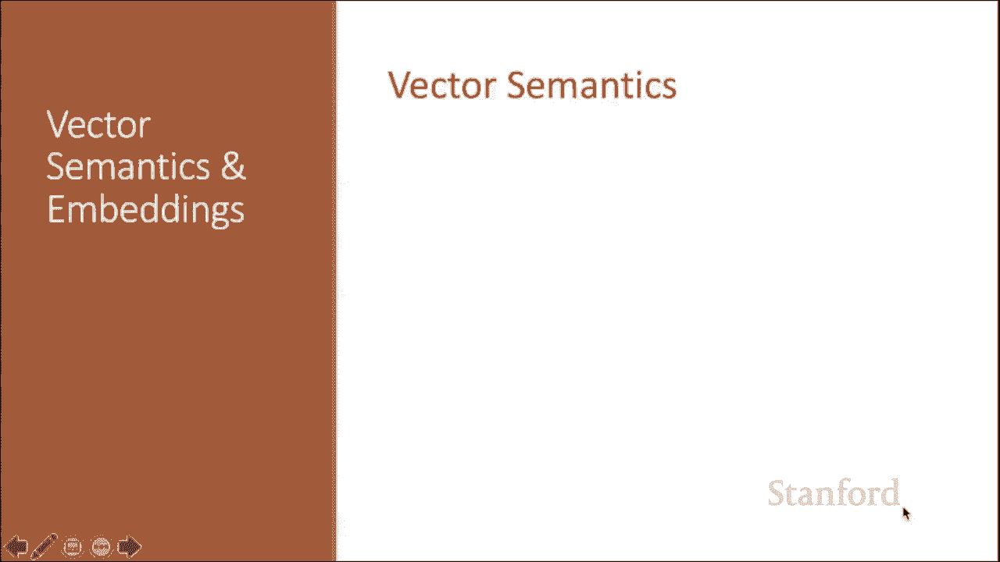
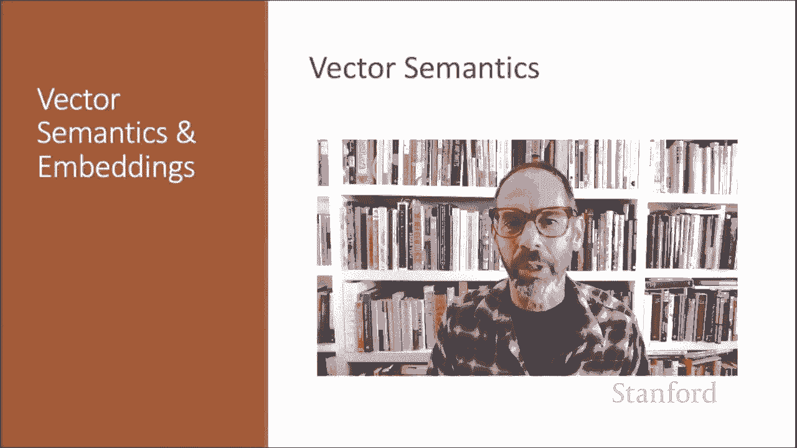
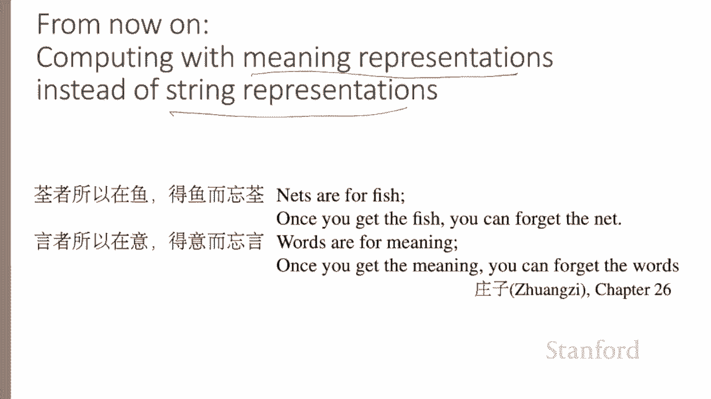
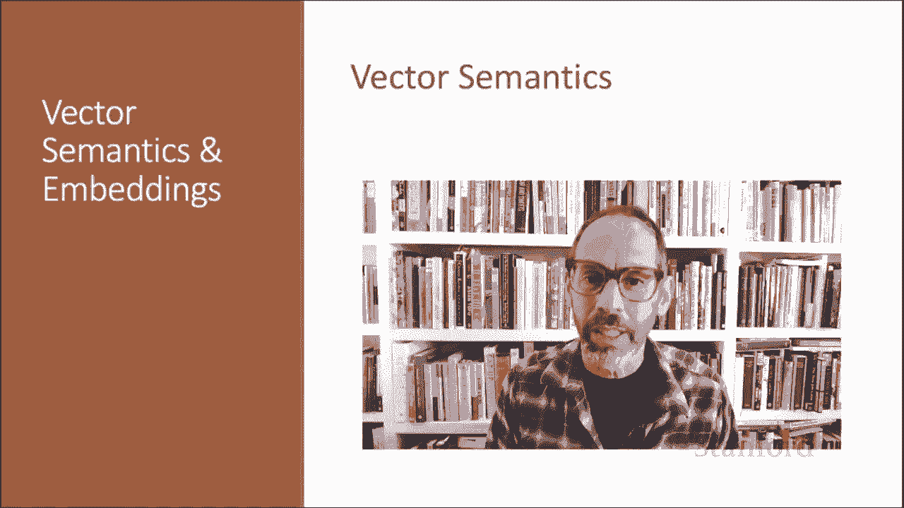

# 48：L8.2 - 语义向量 📚

在本节课中，我们将要学习**语义向量**，这是自然语言处理中表示词义的标准方法。我们将探讨其核心思想、工作原理以及它如何帮助我们更好地理解和处理语言。

***

## 概述

语义向量是自然语言处理中表示词义的标准方法。它帮助我们建模上一节讨论过的词义的诸多方面。该模型的根源可追溯至20世纪50年代，当时有两个重要思想交汇。

***

## 核心思想：从分布到向量

上一节我们介绍了词义的不同层面，本节中我们来看看如何用数学化的方式表示词义。

第一个思想源于哲学家维特根斯坦的观点：一个词的意义应与其**使用方式**紧密相连。语言学家哈里斯和费斯等人提出了一个相关理念，即通过一个词在语言使用中的**分布**来定义其意义，也就是它周围的词或语法环境。

以下是泽利格·哈里斯的一段引述：
> 如果A和B拥有几乎相同的环境（即周围的词或语法结构），我们就说它们是同义词。

让我们考虑一个例子。假设你不知道“空心菜”这个词的意思，但你在以下语境中看到它：
*   空心菜用大蒜炒很好吃。
*   它配米饭非常棒。
*   空心菜的叶子沾着咸酱汁。

同时，你也看到“大蒜”、“米饭”、“叶子”这些词与“菠菜”、“牛皮菜”等词出现在相似的语境中。你可能会推断“空心菜”是一种类似菠菜或牛皮菜的绿叶蔬菜。这个推断正是基于“叶子”、“大蒜”、“米饭”、“好吃”等词既出现在“空心菜”周围，也出现在我们已知的“菠菜”等词周围。

事实上，空心菜就是“Ipomoea aquatica”（水蕹菜）。所以，这第一个思想就是：**我们将通过一个词在语言使用中的分布（即其邻近的词或语法环境）来定义其意义**。

第二个思想是奥斯古德在1957年提出的，我们在上一讲中提到过。他认为一个词的**内涵**可以用三个数字来表示：效价、唤醒度和优势度。例如，“爱”可能有很高的效价，“柔和”可能有较低的唤醒度。但每个词在这三个维度上都有分数。

既然每个词在三个维度上都有分数，那就意味着我们本质上是在用一个**三维空间中的点**来表示一个词的内涵。如果我们能用空间中的一个点来表示内涵，那么我们或许也能用空间中的一个点来表示更多关于意义的信息。

因此，我们将结合这两个思想：**通过语言分布来定义意义，并将意义表示为多维空间中的一个点**。

***

## 什么是语义向量？🔢

在语义向量模型中，我们根据分布将意义定义为空间中的一个点。因此，每个词都是一个**向量**，而不是像“G-O-O-D”这样的字母串，或像 `W_45` 这样的索引。相似词在语义空间中彼此靠近。关键的是，正如我们将看到的，我们可以通过观察文本中哪些词彼此邻近来自动构建这个空间。

下图展示了一个情感分析项目中学习到的词嵌入可视化结果，其中部分词语从高维空间（本例中是60维）投影到二维空间以便观察。请注意，积极词、消极词和中性的功能词分别聚集在不同的区域。

总而言之，**我们将词义定义为一个向量**。由于历史原因（涉及将其“嵌入”到空间中），这些向量通常被称为**嵌入**。这些嵌入是NLP中表示意义的标准方法，所有现代NLP算法都使用某种嵌入来表示词义。

***

## 为什么使用向量？🤔

为什么从字母串或索引转向用向量来表示词义是有帮助的？

考虑情感分析任务。假设我们使用词语本身进行情感分类，那么一个特征可能是“前一个词是‘糟糕的’”。这个特征只有在训练集和测试集中看到完全相同的词时才会被激活，否则不会。

相比之下，使用嵌入时，特征是一个**向量**。我们可能将特征表示为“前一个词是向量 `[35, 22, 17, ...]`”。现在，在测试集中，我们可能会看到一个像“可怕的”这样的词，它虽然不是“糟糕的”，但可能拥有一个相似的向量。这样，我们的分类器就能**泛化**到语义相似但未见过的词。

***

## 主要嵌入类型简介

在接下来的课程中，我们将讨论两大类嵌入模型。

以下是两种主要的嵌入类型：

1.  **TF-IDF 嵌入**
    *   TF-IDF 是信息检索的主力，也是一种常见的嵌入基线模型。
    *   TF-IDF 向量是**稀疏**的，这意味着它们是**非常长**的向量，其中大部分值为0。
    *   向量中的值是基于邻近词计数的简单函数计算得出。

2.  **Word2Vec 嵌入**
    *   这是最简单的**稠密**向量模型。在稠密向量模型中，大部分值**非0**。
    *   这些向量比TF-IDF向量**短得多**。
    *   Word2Vec 表示是通过训练一个分类器来预测一个词是否可能出现在附近而创建的。

稍后，我们还将讨论更丰富的嵌入类型，称为**上下文嵌入**。

***

## 总结与展望

从今以后，当我们为语义或与意义相关的任务表示词语时，我们将尝试使用**意义表示**（即向量）进行计算，而不是字符串表示。

让我用中国哲学家庄子的一句名言来结束本课：
> 筌者所以在鱼，得鱼而忘筌；言者所以在意，得意而忘言。

***

本节课中，我们一起学习了语义向量的基本直觉和核心思想。我们了解到，语义向量通过将词表示为多维空间中的点，并依据词语在文本中的分布来构建这个空间，从而能够捕捉词义并计算词语间的相似性。在接下来的课程中，我们将深入探讨TF-IDF和Word2Vec等具体嵌入模型的细节。