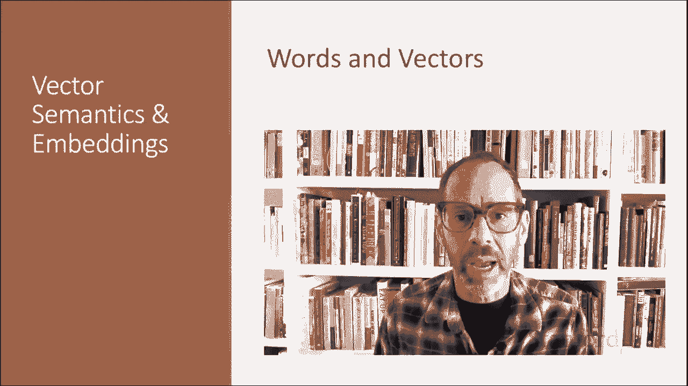
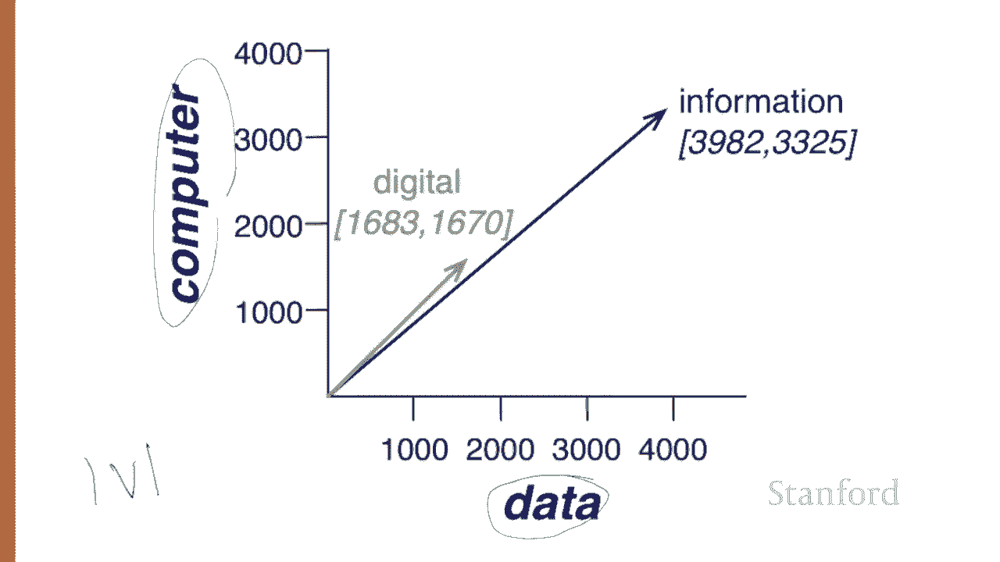
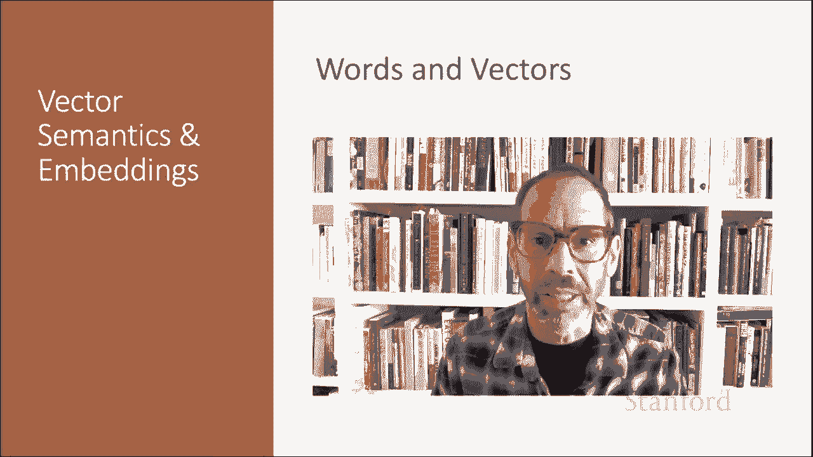

# 49：L8.3 - 词与向量 🧠📊

在本节课中，我们将学习如何将词语表示为简单的向量，特别是通过统计它们在上下文中的出现次数来实现。我们将探讨两种主要的矩阵表示方法：词-文档矩阵和词-词矩阵，并理解这些向量如何捕捉词语和文档的语义。

---

## 1. 词-文档矩阵 📄

上一节我们介绍了向量语义的基本概念。本节中，我们来看看如何用**词-文档矩阵**来表示文档。

想象我们有一个文档集合，例如莎士比亚的所有作品。我们可以用一个矩阵来表示这个集合中的文档，其中**每一行代表词汇表中的一个词**，**每一列代表集合中的一个文档**。

以下是一个简化的词-文档矩阵示例，展示了四个词语在莎士比亚四部戏剧中的出现次数：

| 词语/文档 | 《皆大欢喜》 | 《第十二夜》 | 《尤利乌斯·凯撒》 | 《亨利五世》 |
| :--- | :---: | :---: | :---: | :---: |
| battle | 1 | 0 | 7 | 13 |
| good | 114 | 80 | 62 | 89 |
| fool | 36 | 58 | 1 | 4 |
| wit | 20 | 15 | 2 | 3 |

矩阵中的每个单元格代表**特定行所定义的词**在**特定列所定义的文档**中出现的次数。例如，`fool` 在《第十二夜》中出现了 58 次。

我们可以将每一列视为一个向量，将一个文档表示为 **V 维空间中的一个点**（V是词汇表大小）。因此，上述文档就是四维空间中的点。

以下是这四部戏剧文档向量在二维空间（仅选取 `battle` 和 `fool` 两个维度）的可视化：

*   **喜剧**（如《皆大欢喜》、《第十二夜》）在 `fool` 维度上值较高，在 `battle` 维度上值较低。
*   **历史剧/悲剧**（如《尤利乌斯·凯撒》、《亨利五世》）则相反。

**两个相似的文档倾向于包含相似的词语**。如果两个文档包含相似的词语，它们的列向量也会相似。因此，喜剧《皆大欢喜》和《第十二夜》的向量彼此更相似（更多 `fool` 和 `wit`，更少 `battle`），而与《尤利乌斯·凯撒》或《亨利五世》的向量差异较大。

一个真实的词-文档矩阵当然不止四行四列。更一般地，该矩阵有 **V 行**（词汇表中每个词型一行）和 **D 列**（集合中每个文档一列）。

---

## 2. 从文档向量到词向量 🔄

上一节我们看到了如何用向量表示文档。本节中，我们将应用相同的原理来表示**词语的含义**。

我们通过将每个词与一个**词向量**（现在是行向量，而非列向量）关联起来实现这一点。例如，词语 `fool` 的向量 `[36, 58, 1, 4]` 就对应着它在四部莎士比亚戏剧中的出现次数。

对于文档，我们看到相似文档有相似向量，因为相似文档包含相似词语。**同样的原理也适用于词语**：**相似的词语具有相似的向量，因为它们倾向于出现在相似的文档中**。

因此，词-文档矩阵让我们可以通过一个词倾向于出现在哪些文档中来表示它的含义。

---

## 3. 词-词矩阵 🔗

除了使用词-文档矩阵将词表示为文档计数向量，另一种方法是使用**词-词矩阵**（也称为词-词共现矩阵或术语上下文矩阵）。

在这种矩阵中，**列标签也是词语**，而不是文档。因此，矩阵变为 **V × V** 的方阵。每个单元格记录了**目标词（行）** 和**上下文词（列）** 在某个特定上下文**中共现的次数**。

上下文可以是整个文档。此时，单元格（例如 `digital` 和 `computer`）表示这两个词在同一文档中共同出现的次数。

然而，更常见的做法是使用**更小的上下文窗口**，通常是目标词周围的一个窗口，例如**左右各四个词**。在这种情况下，单元格表示在某个训练语料库中，列词出现在行词的 **±4 词窗口内**的次数。

以下是一个基于窗口共现统计的示例表：

| 目标词/上下文词 | computer | data | pie | sugar |
| :--- | :---: | :---: | :---: | :---: |
| digital | 1670 | 1683 | 0 | 0 |
| information | 3325 | 3982 | 0 | 0 |
| strawberry | 0 | 0 | 19 | 38 |

例如，表中的 1670 表示词语 `digital` 在语料库中出现在 `computer` 周围 ±4 词的窗口内共 1670 次。

请注意，根据这种向量定义，`digital` 和 `information` 的向量彼此更相似（在 `computer` 和 `data` 维度上值高，在 `pie` 和 `sugar` 维度上值低），而它们与 `strawberry` 的向量差异较大（`strawberry` 的向量在 `pie` 和 `sugar` 上下文上值更高）。

以下是 `digital` 和 `information` 的词向量在二维空间（仅选取 `data` 和 `computer` 两个维度）的可视化，可以看到它们的位置很接近。

---

## 4. 向量维度与稀疏性 📏

当然，在实际应用中，这些向量的长度不是 2 或 4。**向量的长度通常是词汇表的大小 V**，一般在 10,000 到 50,000 个词之间（通常使用训练语料库中最频繁出现的词）。保留大约最高频的 50,000 个词之后的词通常没有帮助。

由于大多数共现次数为 0，这些向量是**稀疏向量**。存在高效的算法用于存储和计算稀疏矩阵。

---

## 总结 📝

本节课中，我们一起学习了词语向量表示的核心思想：

1.  一个词可以表示为一个**计数向量**，这是所有嵌入表示方法的基础思想。
2.  **词-文档矩阵**通过词语在文档中的出现模式来表示文档和词语。
3.  **词-词（共现）矩阵**通过目标词周围上下文窗口内其他词的共现频率来更精细地表示词语含义。
4.  相似的文档或词语会具有相似的向量。
5.  这些向量通常是高维且稀疏的，但有专门的技术进行处理。

我们看到了如何将词语和文档转化为数学空间中的点，从而为计算语义相似性奠定了基础。