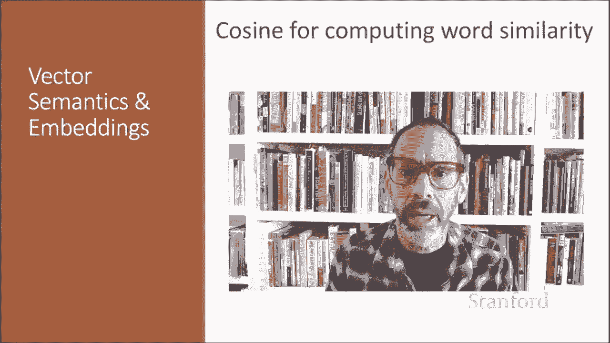
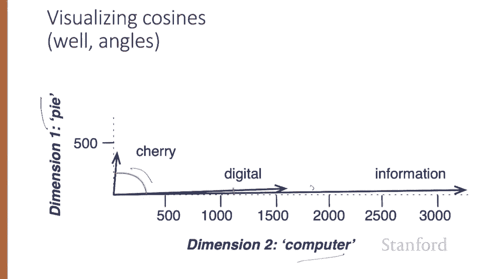
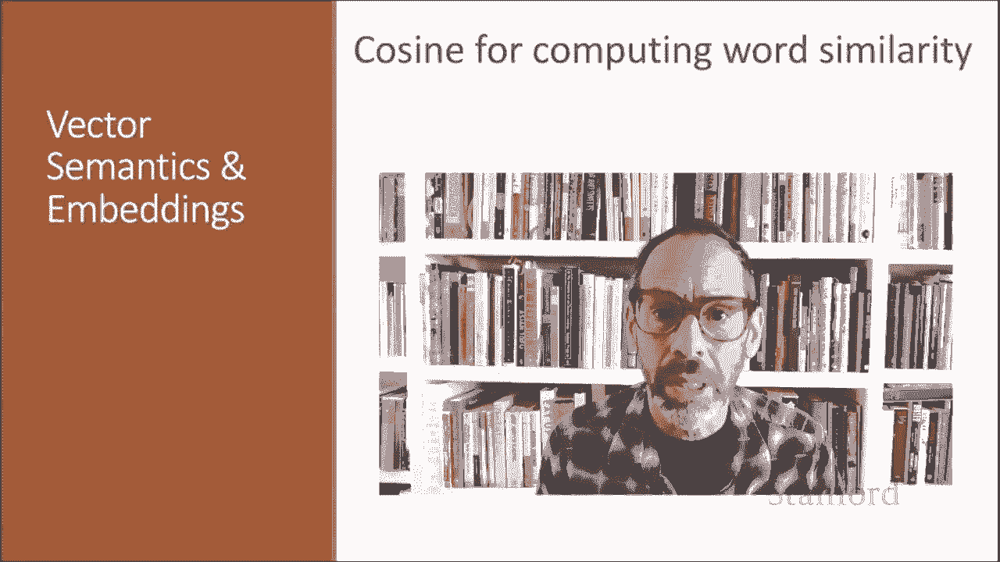

# 50：L8.4 - 基于余弦距离的相似度 📐

在本节课中，我们将学习如何衡量两个词之间的相似度。我们将重点介绍一种最常用的相似度度量方法——余弦相似度，它通过计算两个向量之间夹角的余弦值来评估它们的相似程度。

## 概述

为了衡量两个词之间的相似度，我们需要一种能够比较它们向量表示的度量方法。迄今为止，最常用的相似度度量是两个向量之间夹角的余弦值。

与自然语言处理中使用的大多数向量相似度度量方法一样，余弦相似度基于线性代数中的点积运算。

## 点积：相似度的基础

点积，也称为内积，其计算方式是将两个向量逐元素相乘，然后将所有乘积相加，得到一个标量值。

**公式**：`dot_product(A, B) = Σ (A_i * B_i)`

点积之所以能作为相似度度量，是因为当两个向量在相同维度上都有较大的值时，点积值往往会很高。相反，如果向量在不同维度上存在零值（即正交向量），它们的点积将为0，这表示它们极不相似。

## 原始点积的问题与改进

然而，原始点积作为相似度度量存在一个问题：它偏向于较长的向量。

向量长度定义为各维度值的平方和的平方根。如果一个向量更长，在每个维度上的值更高，那么点积就会更高。更频繁出现的词往往有更长的向量，因为它们倾向于与更多的词共现，并且与每个词的共现值更高。

因此，原始点积对于高频词会更高。但这是一个问题：我们希望相似度度量能告诉我们两个词有多相似，而不受它们频率的影响。

为了解决这个问题，我们通过将点积除以两个向量各自的长度来对向量长度进行归一化。

## 余弦相似度的定义

这个归一化的点积结果恰好等于两个向量之间夹角的余弦值。这是基于点积的几何定义：两个向量的欧几里得模长与它们夹角余弦值的乘积。

**公式**：`cosine_similarity(A, B) = (A · B) / (||A|| * ||B||)`

余弦值的范围从1（向量方向完全相同，夹角为0度）到-1（向量方向完全相反，夹角为180度）。但由于原始的频率值是非负的，这些值的余弦范围在0到1之间。

## 计算示例：哪个词更接近“信息”？

让我们看看如何用余弦相似度计算“cherry”（樱桃）或“digital”（数字）哪个在含义上更接近“information”（信息），这里使用一个简化计数表中的原始计数。

要计算“cherry”和“information”之间的余弦值：
1.  计算点积：`(442 * 5) + (8 * 3982) + (2 * 3325)`
2.  计算“cherry”的向量长度：`sqrt(442² + 8² + 2²)`
3.  计算“information”的向量长度：`sqrt(5² + 3982² + 3325²)`
4.  将点积除以两个长度的乘积，得到结果：`0.017`

相比之下，用同样的方法计算“digital”和“information”之间的余弦值。由于两个词在“data”（数据）和“computer”（计算机）维度上的数值都非常高，我们得到一个高得多的余弦值。

模型判定“information”与“digital”的相似度远高于与“cherry”的相似度，这个结果是合理的。

## 余弦相似度的直观理解

以下是一个简化的图形演示，展示了在由“computer”和“pie”（馅饼）附近词计数定义的微小二维空间中，“cherry”、“digital”和“information”的向量。

请注意，“digital”和“information”之间的夹角小于“cherry”和“information”之间的夹角。当两个向量更相似时，余弦值更大，但夹角更小。余弦的最大值为1，此时两个向量之间的夹角最小，所有其他角度的余弦值都小于1。

## 总结

本节课中，我们一起详细学习了向量余弦相似度，这是衡量两个词向量相似性最常用的算法。我们了解了其基础——点积运算，指出了原始点积的局限性，并通过归一化引入了余弦相似度的概念和计算公式。最后，通过一个具体示例，我们看到了余弦相似度如何有效地比较词语之间的语义接近程度。