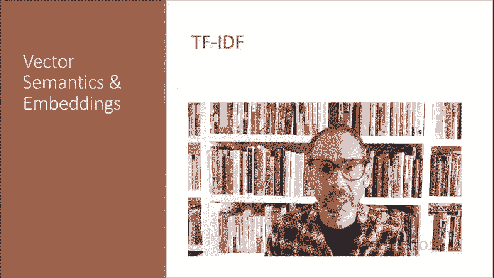
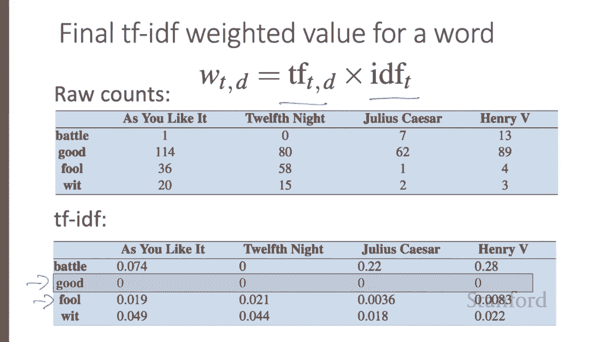
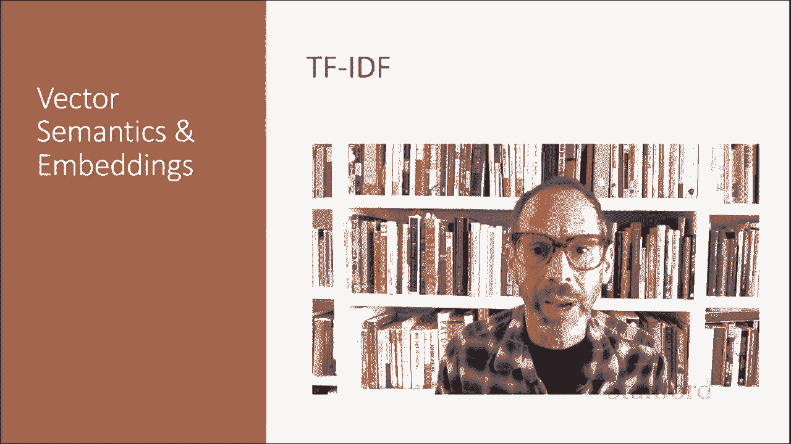

# 51：L8.5 - TF-IDF 详解 📚 

在本节课中，我们将学习一种在词-文档矩阵中重新加权词频的常用方法：TF-IDF。我们将了解其构成、计算方式以及为何它能比原始词频更有效地表示词语的重要性。

---

## 🧠 核心概念：为何需要重新加权？

上一节我们介绍了共现矩阵，它通过词语与其他词语或文档的频率来表示每个单元格。但事实证明，原始频率是一个偏差很大且区分度不高的指标。

例如，如果“sugar”在“apricot”的上下文中频繁出现，这是有用的信息。但像“the”或“it”这样的词，它们非常常见且与各种词同时出现，对于任何特定词来说，它们的信息量并不大。

这里存在一个矛盾：我们如何平衡这两种相互冲突的约束？有两种常见的解决方案：
*   **TF-IDF算法**：通常在维度是文档时使用。
*   **基于点互信息的算法**：通常在维度是词语时使用。

TF-IDF使用一种称为**逆文档频率**的特殊权重来降低“the”或“it”这类词的权重。而PMI是一种统计度量，用于比较我们观察到的概率与偶然情况下的预期概率。

---

## 🔢 TF-IDF 的构成

TF-IDF算法是两个项的乘积，每一项都捕捉了上述的一种直觉。

### 第一项：词频

第一项是**词频**，即词语 `t` 在文档 `d` 中的频率。

我们可以直接使用原始计数作为词频，但更常见的做法是使用频率的 **log₁₀** 来稍微压缩原始频率。其直觉是，一个词在文档中出现100次，并不意味着它与该文档含义的相关性就提高了100倍。

由于不能对零取对数，我们通常会在计数上加一。因此，词频的计算公式常为：
`TF(t, d) = log₁₀(count(t, d) + 1)`

### 第二项：逆文档频率

TF-IDF中的第二个因子用于给那些仅出现在少数文档中的词更高的权重。局限于少数文档的词语有助于将这些文档与集合中的其他文档区分开来。而在整个集合中频繁出现的词语则帮助不大。

一个词的**文档频率**是指它出现在多少个文档中。请注意，文档频率不同于词的**集合频率**，后者是词语在整个集合的所有文档中出现的总次数。

考虑莎士比亚37部戏剧的集合中的两个词：“Romeo”和“action”。这两个词具有相同的集合频率（都在所有戏剧中出现了113次），但文档频率却截然不同，因为“Romeo”只出现在一部戏剧中。因此，如果我们的目标是找到关于罗密欧爱情磨难的文档，“Romeo”一词应该被赋予很高的权重，而“action”则不应如此。

我们通过**逆文档频率**来强调像“Romeo”这样的区分性词语。IDF的定义使用了分数 `N / DF_t`，其中 `N` 是集合中文档的总数，`DF_t` 是出现词 `t` 的文档数量。词出现的文档越少，其权重越高。出现在所有文档中的词获得最低权重1。

由于许多集合中文档数量庞大，这个度量通常也会用对数函数进行压缩。因此，逆文档频率的最终定义是：
`IDF(t) = log₁₀(N / DF_t)`

下图右侧是莎士比亚语料库中一些词的IDF值示例，范围从仅出现在一部剧中的极高信息量词（如“Romeo”），到出现在少数剧中的词（如“salad”或“falstaff”），再到非常常见的词（如“fool”），以及因为出现在全部37部剧中而完全不具备区分度的词（如“good”或“sweet”）。

---

## 📄 如何定义“文档”？

通常，文档的界定是清晰的。在处理莎士比亚戏剧集时，文档就是一部剧；在处理像维基百科这样的百科全书文章集时，文档就是一个维基百科页面；在处理报纸文章时，文档就是单篇文章。

但很多时候，为了计算IDF，你可能需要自行将语料库分割成文档，因为“文档”可以是任何东西，它不必是原始文档。例如，我们经常将每个段落视为一个文档，这样即使我们处理的是像一本书这样的单一文档，也能计算TF-IDF值。

---

## ⚖️ 计算TF-IDF加权值

因此，词语 `t` 在文档 `d` 中的TF-IDF加权值，结合了该词在文档中的词频和该词的逆文档频率。公式为：
`TF-IDF(t, d) = TF(t, d) × IDF(t)`

以下是莎士比亚词-文档矩阵的原始计数示例，以及同一矩阵经过TF-IDF加权后的版本。请注意，对应词语“good”的维度TF-IDF值现在全部变为零，因为这个词出现在每个文档中，TF-IDF算法导致它被忽略。同样，出现在37部剧中的36部里的词语“fool”，其权重也远低于其他词语。

---

## 🎯 总结

本节课我们一起学习了TF-IDF。我们了解到，原始词频存在偏差，TF-IDF通过结合**词频**和**逆文档频率**来解决这个问题。TF-IDF能提升区分性词语的权重，降低常见词的权重，从而生成更能代表文档语义内容的加权向量表示。