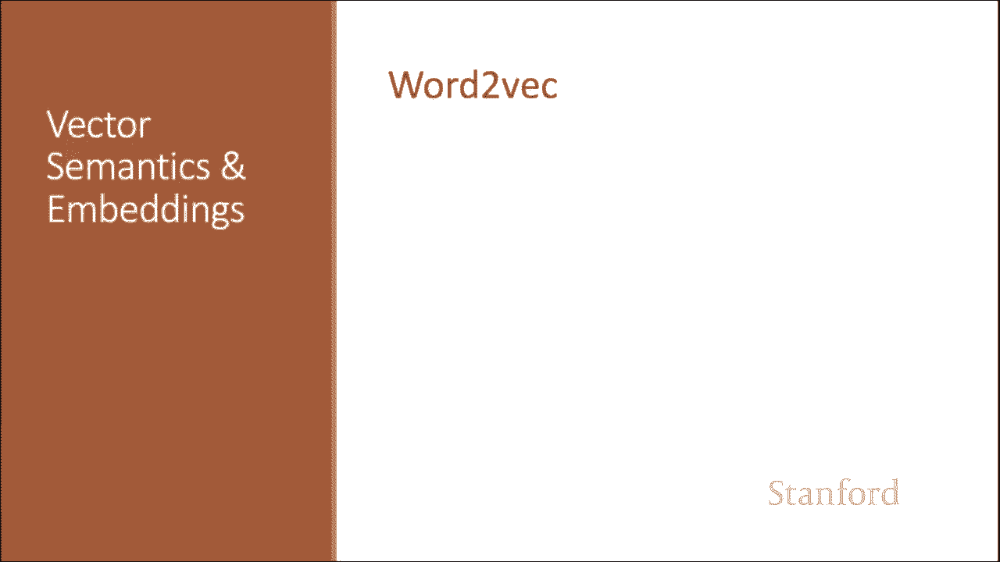
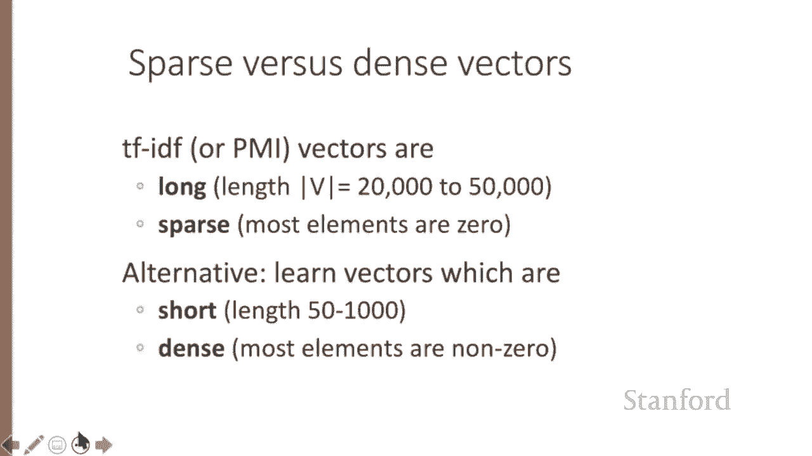
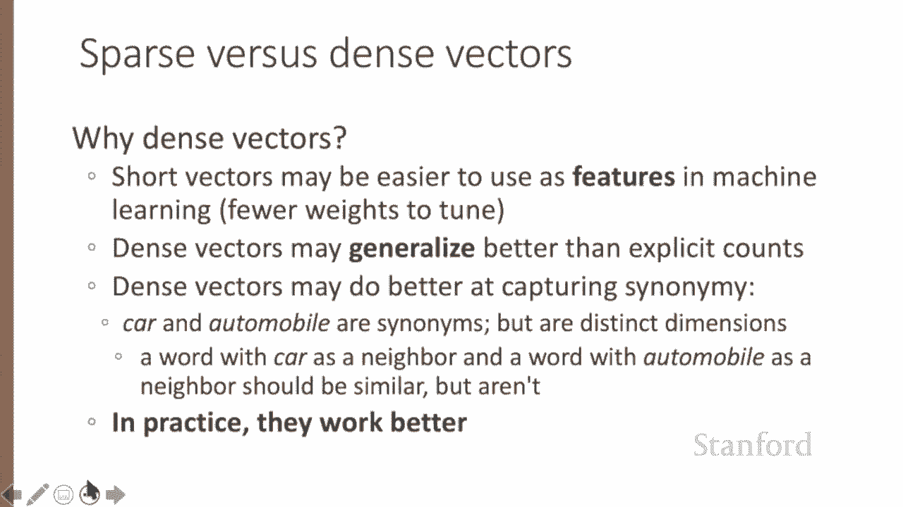
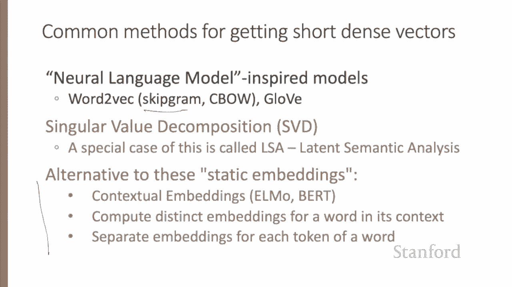
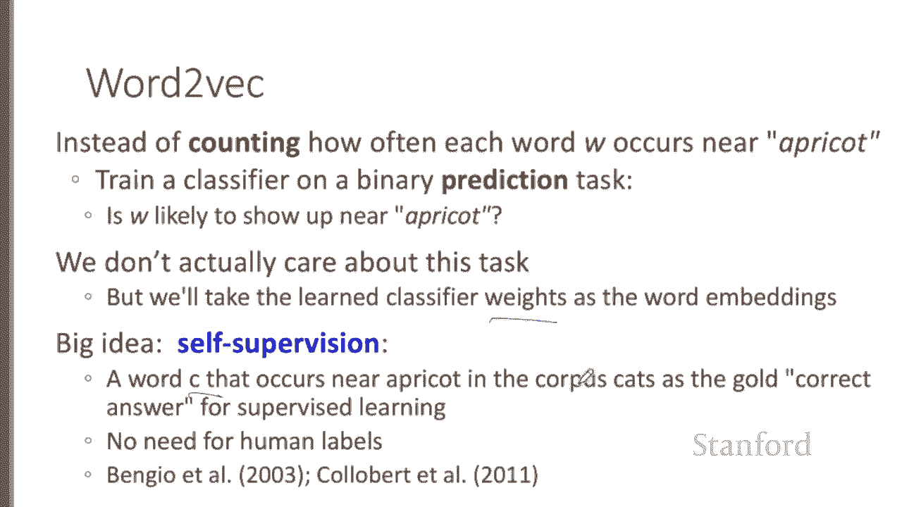
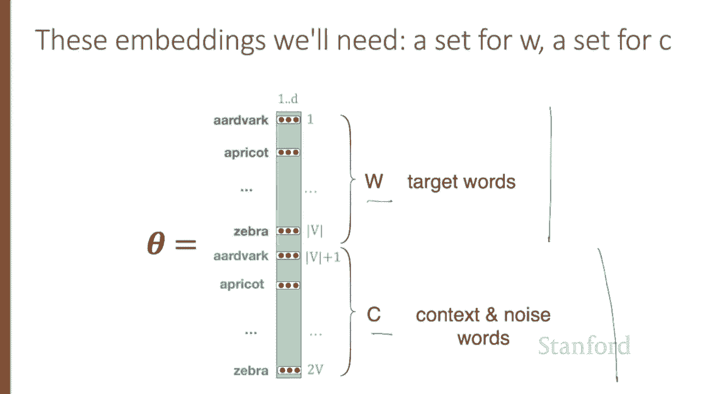
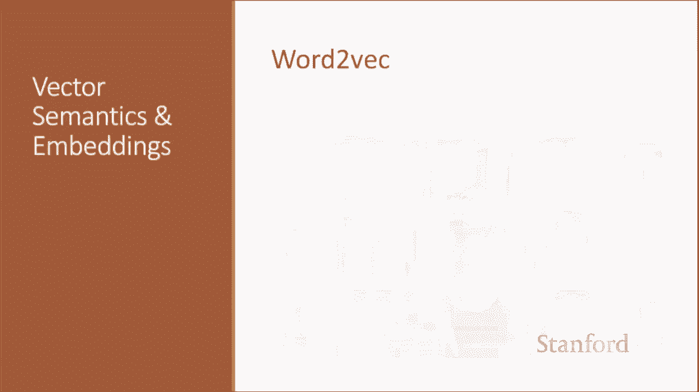
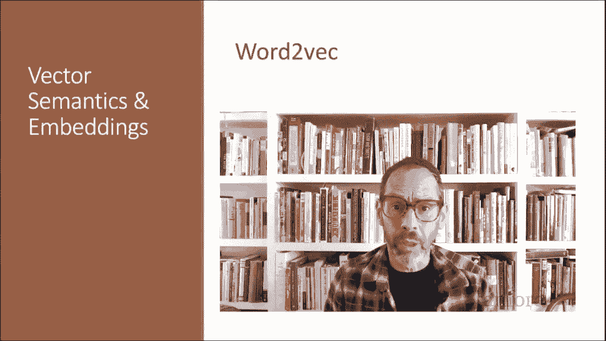

# 52：L8.6 - Word2Vec 详解 📚 

在本节课中，我们将学习一种重要的词向量表示方法——Word2Vec。我们将从词向量的基本概念入手，逐步介绍 Skip-gram 模型的原理、目标函数以及其核心思想。

---

## 🎯 词嵌入简介

在之前的课程中，我们学习了如何将单词表示为稀疏的长向量，其维度对应词汇表中的单词或文档集合中的文档。现在，我们引入一种更强大的词表示方法：词嵌入（embeddings），即短而密集的向量。

与之前见过的向量不同，词嵌入是短向量，其维度 D 通常在 50 到 1000 之间，而不是更大的词汇表大小 V（可能达到 60000）或文档数量。这些 D 维度没有明确的解释，向量是密集的，而不是稀疏的（即向量条目大多是 0 计数或计数函数）。这些值将是实数，可以是负数。

---

## 🔍 密集向量的优势

事实证明，密集向量在每一项自然语言处理任务中都优于稀疏向量。虽然我们不完全理解其中的所有原因，但有一些直观的解释。

将单词表示为 700 维的密集向量，要求我们的分类器学习的权重远少于将单词表示为 50000 维向量时的情况。较小的参数空间可能有助于泛化和避免过拟合。

密集向量也可能更好地捕捉同义词。例如，在稀疏向量表示中，像“car”和“automobile”这样的同义词的维度是独立且无关的。因此，稀疏向量可能无法捕捉到以“car”为邻居的单词和以“automobile”为邻居的单词之间的相似性。

---

## 🚀 Word2Vec 与 Skip-gram 模型

在本节中，我们介绍一种计算词嵌入的方法：带负采样的 Skip-gram 模型（SGNS）。Skip-gram 算法是名为 Word2Vec 的软件包中的两种算法之一，因此有时该算法被宽泛地称为 Word2Vec。

Word2Vec 方法训练快速、高效，并且易于在线获取。Word2Vec 词嵌入是静态嵌入，这意味着该方法为词汇表中的每个单词学习一个固定的嵌入。这些静态嵌入的替代方案是最近学习动态上下文嵌入的方法，例如流行的 BERT 表示，其中每个单词的向量在不同上下文中是不同的。

---

## 💡 Skip-gram 的核心思想

Word2Vec 的直觉是，与其计算每个单词 W 在另一个单词（例如“apricot”）附近出现的频率，不如在一个二元预测任务上训练一个分类器：单词 W 是否可能出现在“apricot”附近？我们实际上并不关心这个预测任务本身，而是将学习到的分类器权重作为词嵌入。

这里的革命性直觉是，我们可以直接使用运行文本作为此类分类器的隐式监督训练数据。出现在目标词附近的单词 C 可以作为“单词 C 是否可能出现在目标词附近？”这个问题的正确答案。这种方法通常称为自监督，避免了任何手动标记监督信号的需要。这个想法最初是在神经语言建模任务中提出的，但 Word2Vec 是一个比神经网络语言模型简单得多的模型。

---

## 🧠 Skip-gram 的训练机制

Skip-gram 的直觉是将目标词 T 和相邻的上下文词 C 视为可以彼此靠近出现的单词的正例，然后随机采样词典中的其他单词作为负例，使用逻辑回归训练一个分类器来区分这两种情况，最后使用学习到的权重作为单词的嵌入表示。

让我们从思考分类任务开始，在下一讲中，我们将转向如何训练。想象一个像下面这样的句子，目标词是“apricot”，并假设我们使用一个正负两个词的上下文窗口。

我们的目标是训练一个分类器，使得给定一个目标词与候选上下文词（如“apricot”和“jam”，或者“apricot”和“aardvark”）的元组 (W, C)，它能返回 C 是真实上下文词的概率（对“jam”为真，对“aardvark”为假）。因此，我们希望 P(+ | apricot, jam) 高，P(- | apricot, aardvark) 高。实际上，单词 C 不是 W 的真实上下文词的概率，就是 1 减去它是上下文词的概率。

Skip-gram 模型的直觉是基于嵌入相似性来计算这个概率。如果一个词的嵌入与目标嵌入相似，那么它很可能出现在目标词附近。

为了计算这些密集嵌入之间的相似性，我们依赖于这样的直觉：如果两个向量具有高的点积，那么它们是相似的。毕竟，余弦相似度只是归一化的点积。换句话说，词嵌入和上下文嵌入之间的相似性与 W·c 成正比。

我们需要将其归一化，以将这种相似性转化为概率。这是因为点积 C·W 或 W·C 不是一个概率，它只是一个范围从负无穷到正无穷的数字。由于 Word2Vec 中的元素可以是负数，点积也可以是负数。

因此，为了将点积转化为概率，我们将使用在逻辑回归中见过的逻辑或 sigmoid 函数 σ。因此，我们将单词 C 是目标词 W 的真实上下文词的概率建模为 σ(C·W)，即 1 / (1 + exp(-C·W))。

现在，为了使这成为一个概率，我们还需要两个可能事件（C 是上下文词，C 不是上下文词）的总概率和为 1。因此，我们估计单词 C 不是 W 的真实上下文词的概率为 1 - P(+)，即 1 / (1 + exp(C·W))（注意没有负号）。

我们刚刚看到的方程给出了一个单词的概率，但窗口中有许多上下文词。Skip-gram 做了一个简化的假设，即所有上下文词都是独立的，允许我们直接相乘它们的概率。因此，对于上下文窗口中的所有 L 个单词，我们只需相乘它们的概率，或者在 log 空间中，相加它们的对数概率。

总结一下，Skip-gram 训练一个概率分类器，给定一个目标词 W 及其包含 L 个单词的上下文窗口 C1 到 CL，根据上下文窗口与目标词的相似程度分配一个概率。这个概率基于将逻辑函数（sigmoid 函数）应用于目标词嵌入与每个上下文词嵌入的点积。

为了计算这个概率，我们只需要词汇表中每个目标词和上下文词的嵌入。

---

## 📊 模型参数与表示

以下是这些参数的直觉，我们将在下一讲中学习它们。Skip-gram 为每个单词存储两个嵌入：一个作为目标词的嵌入，另一个作为上下文词的嵌入。因此，我们需要学习的参数是两个矩阵：W 和 C，每个矩阵都包含词汇表中 V 个单词中每一个的嵌入。

---

## 🎓 总结

在本节课中，我们一起学习了 Word2Vec 方法，特别是 Skip-gram with Negative Sampling (SGNS) 模型。我们了解了词嵌入作为密集向量的优势，探讨了 Skip-gram 模型如何通过自监督学习，将目标词与上下文词的关系建模为一个概率分类问题，并利用词嵌入的点积与 sigmoid 函数来计算共现概率。我们还明确了模型需要学习目标词和上下文词两套嵌入参数。下一讲，我们将深入探讨如何训练这些权重。