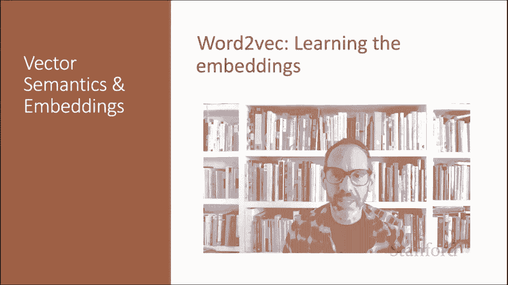

# 53：L8.7 - 通过 Word2Vec 学习词嵌入 🧠

在本节课中，我们将要学习 Word2Vec 如何利用 Sigmoid 函数和梯度下降算法来学习词嵌入向量。我们将重点讲解 Skip-gram 模型配合负采样（SGNS）的训练过程，从随机初始化向量开始，逐步调整，使每个目标词的嵌入向量与其上下文词的嵌入向量更相似，而与随机噪声词的嵌入向量更不相似。

## 训练数据构建

上一节我们介绍了 Word2Vec 的基本目标，本节中我们来看看如何构建具体的训练数据。

首先考虑一个训练样本。这个例子有一个目标词 **W**（例如 “apricot”），以及一个大小为 **L = ±2** 的窗口内的四个上下文词，从而产生四个正例训练实例。例如：“apricot” 与 “tablespoon”、“apricot” 与 “of”、“apricot” 与 “in”、“apricot” 与 “jam”。

为了训练一个二元分类器，我们还需要负例。实际上，SGNS 使用的负例数量多于正例，其比例由一个参数 **K** 控制。

以下是构建训练实例的步骤：
*   对于上述每一个正例，我们创建 **K** 个负例。
*   每个负例由目标词 **W** 和一个噪声词组成。
*   噪声词是从词典中随机抽取的，但确保它不是目标词 **W**。
*   噪声词根据加权的单字词频率进行选择。

例如，当 **K=2** 时，每个正例会对应两个负例。我们最终会得到四个正例和八个负例。

## 学习目标与损失函数

现在我们已经有了正例和负例训练实例集以及一组初始化的嵌入向量，学习算法的目标是调整这些嵌入向量。

其目标是最大化从正例中提取的（目标词，上下文词）对的相似度，同时最小化从负例中提取的（目标词，噪声词）对的相似度。

如果我们考虑一个目标词及其一个真实上下文词和 K 个噪声词，我们的目标是最大化目标词与真实上下文词的相似度，并最小化目标词与 K 个负采样噪声词的相似度。

我们可以将这两个目标表达为以下需要最小化的损失函数 **L**：

`L = -log[σ(c_pos · w)] - Σ_{i=1}^{K} log[σ(-c_neg_i · w)]`

这个公式的含义是：
*   第一项 `-log[σ(c_pos · w)]` 表示我们希望分类器为真实的上下文词 **c_pos** 分配一个较高的“是邻居”概率。
*   第二项 `- Σ log[σ(-c_neg_i · w)]` 表示我们希望为每个噪声词 **c_neg_i** 分配一个较高的“不是邻居”概率。
*   我们假设这些概率是独立的，因此使用连乘（在对数域中转化为求和）。

通过数学变换，我们可以将最大化正例对的点积、最小化负例对的点积这一目标表达得更清晰。最终，我们使用随机梯度下降来最小化这个损失函数，调整词向量的权重，使正例对更可能发生，负例对更不可能发生，并在整个训练集上重复此过程。

## 梯度下降的直观理解

让我们看看梯度下降一步的直观过程。

Skip-gram 模型试图移动嵌入向量的位置。对于目标词（例如 “apricot”）的嵌入向量，我们希望它更靠近（即具有更高的点积）其邻居词（例如 “jam”）的上下文嵌入向量。同时，我们希望 “apricot” 的嵌入向量远离噪声词（例如 “matrix” 和 “Tolstoy”）的上下文嵌入向量。

因此，在梯度下降的每一步，我们根据损失函数的梯度反方向移动权重。移动的距离由梯度值和学习率 **η** 共同决定，学习率越高，移动越快。

权重更新公式为：
`W_{t+1} = W_t - η * ∇L`

## 权重更新公式

以下是损失函数对各类嵌入向量求导后得到的非常简洁的更新公式。

对于正例上下文词向量 **c_pos** 的更新：
`c_pos^{t+1} = c_pos^t - η * [σ(c_pos · w) - 1] * w`

对于负例噪声词向量 **c_neg_i** 的更新：
`c_neg_i^{t+1} = c_neg_i^t - η * [σ(c_neg_i · w) - 0] * w`

对于目标词向量 **w** 的更新：
`w^{t+1} = w^t - η * { [σ(c_pos · w) - 1] * c_pos + Σ_{i=1}^{K} [σ(c_neg_i · w) - 0] * c_neg_i }`

在每种情况下，损失函数的导数不同，因此我们将以不同的幅度移动这些权重。

## 最终词向量的获取

正如我们所见，SGNS 模型为每个词学习两种独立的嵌入向量：目标嵌入 **W** 和上下文嵌入 **C**，分别存储在两个矩阵中。

但在我们各种 NLP 应用中，只需要一个向量来表示一个词。那么应该使用哪一个呢？最常见的做法是将它们相加。因此，我们通过将向量 **w_i** 和 **c_i** 相加来获得词 **i** 的最终表示。

## 总结

本节课中我们一起学习了如何使用负采样的 Skip-gram 模型来学习 Word2Vec 词嵌入。

总结整个流程：
1.  从维度为 **D** 的随机向量开始。
2.  基于嵌入相似性训练一个分类器。
3.  从语料库中获取共现的词对作为正例，随机组合不共现的词对作为负例。
4.  通过缓慢调整所有嵌入向量以提高分类器性能的方式来训练该分类器。
5.  训练完成后，丢弃分类器，仅保留学习到的嵌入向量。

我们看到了如何学习 Word2Vec 嵌入，这是最流行的静态嵌入方法之一。

