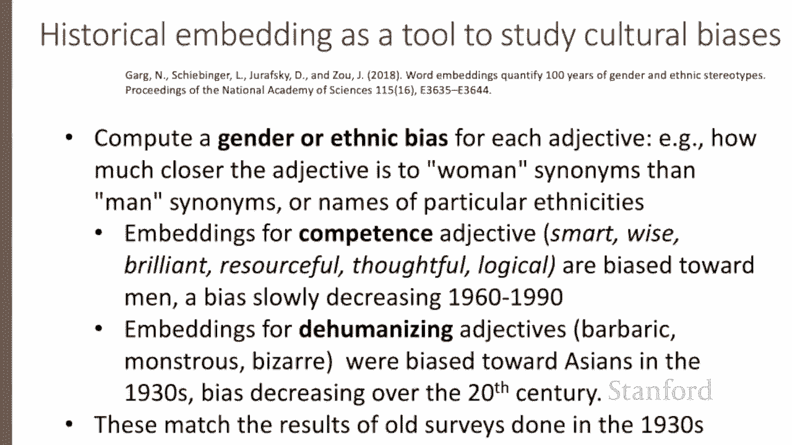

# 54：L8.8 - 词嵌入性质 🧠

在本节课中，我们将要学习词嵌入模型的各种性质与参数，包括上下文窗口大小的影响、词嵌入如何捕捉类比关系、词义随时间的演变，以及词嵌入如何反映并量化文本中存在的隐性偏见。

## 上下文窗口大小的影响

上一节我们介绍了词嵌入的基本概念，本节中我们来看看影响词嵌入性质的一个重要参数：上下文窗口的大小。这个参数对于稀疏的 TF-IDF 向量和密集的 Word2Vec 向量都适用。

上下文窗口通常指目标词左右两侧 1 到 10 个词的范围。窗口大小的选择取决于表征的目标。较短的上下文窗口倾向于产生更具句法性质的表示，因为信息主要来自紧邻的词语。

以下是不同窗口大小对词相似度的影响：

*   **小窗口（如 ±2）**：计算出的向量中，与目标词最相似的词往往是**词性相同、语义相似**的词。
*   **大窗口（如 ±5）**：计算出的向量中，与目标词余弦相似度最高的词往往是**主题相关但不一定相似**的词。

例如，使用窗口大小为 ±2 的 Skip-gram 模型，与《哈利·波特》中的词 “hogwarts” 最相似的词是其他虚构学校的名称。而使用窗口大小为 ±5 时，与 “hogwarts” 最相似的词则是与《哈利·波特》系列主题相关的其他词，如 “Dumbledore” 或 “half-blood”。

## 捕捉类比关系的能力

词嵌入的一个重要语义特性是它们捕捉关系意义的能力。在一个早期的向量空间认知模型中，Rumelhart 和 Abramson 提出了解决 “A 之于 B 犹如 C 之于 ?” 这类简单类比问题的**平行四边形模型**。

在该模型中，通过向量运算来寻找答案。例如，解决 “apple 之于 tree 犹如 grape 之于 ?” 这个问题，目标是找到 “vine”。其计算方法是：`tree - apple + grape`，得到的结果向量在空间中指向的词，我们希望就是 “vine”。

这种方法已被证明适用于稀疏和稠密嵌入。例如：

*   **公式**：`king - man + woman ≈ queen`
*   **公式**：`Paris - France + Italy ≈ Rome`

更一般地，对于问题 “A 之于 A* 犹如 B 之于 B*”，目标是找到缺失的 B*。我们计算嵌入空间中所有词到向量 `(A* - A + B)` 的距离，并返回距离最近（余弦相似度最高）的词。

在 GloVe 嵌入空间中，我们可以看到类似关于性别、家族姓氏和王室名称的类比关系。

不过，平行四边形方法有一些注意事项：它似乎只对高频词、非常小的距离以及某些特定关系（如国家与首都）有效，对其他关系则不然。理解这类类比仍然是一个开放的研究领域。

## 词义随时间的演变

词嵌入也可以作为一个有用的工具，通过计算不同历史时期文本构建的多个嵌入空间，来研究词义如何随时间变化。

例如，下图可视化了过去两个世纪中三个英语单词的词义变化。这是通过为每个十年（使用 Google Ngrams 或美国英语历史语料库等历史语料）构建独立的嵌入空间计算得出的。

在每个案例中，我们用粗体显示了一个历史时期和一个更现代时期的词义表示，并用浅灰色显示了在这些不同时期与该词义相近的词语。

以下是具体示例：

*   **broadcast**：在 1850 年代，它是一个农业词汇，意为“撒播种子”。其邻近词是 “seeds” 和 “scatter”。而现代含义则与 “radio” 或 “television” 最相似。

## 词嵌入与隐性偏见

除了从文本中学习词义的能力，词嵌入也会复现文本中潜在的隐性偏见和刻板印象。

正如我们刚才看到的，嵌入可以大致模拟关系相似性：`Japan` 是 `France - Paris + Tokyo` 最接近的词。但这些相同的嵌入类比也表现出性别刻板印象。例如：

*   嵌入模型暗示了类比：`father : doctor :: mother : nurse`。
*   在 Word2Vec 嵌入中，与 `man - computer programmer + woman` 计算结果最接近的职业是 `homemaker`。

这可能导致 Crawford 所称的**分配性危害**，即系统将工作或信贷等资源不公平地分配给不同群体。例如，使用嵌入作为招聘潜在程序员或医生搜索算法的一部分，可能会错误地降低包含女性姓名的文档的权重。

历史嵌入也被用作衡量过去偏见的工具。例如，来自历史文本的嵌入可用于衡量形容词与各种种族或性别名称之间的关联度。

以下是具体发现：

*   历史上，与能力相关的形容词（如 smart, wise, brilliant）的嵌入偏向于男性，但这种偏见自 1960 年代以来在缓慢减弱。

来自历史嵌入的证据也复制了旧时种族刻板印象调查的数据。例如，在 1930 年代，亚洲人名的嵌入偏向于非人化的形容词（如 barbaric, bizarre），这与 1930 年代美国的调查结果相符。但在整个 20 世纪，文本和调查中的这种偏见都在减少。

## 总结

本节课中我们一起学习了词嵌入的多种性质。我们探讨了上下文窗口大小如何影响词向量的句法与语义倾向，了解了词嵌入通过平行四边形模型捕捉类比关系的能力及其局限性。我们还看到了如何利用历时词嵌入研究词义演变，并重点讨论了词嵌入如何反映并量化其训练文本中所蕴含的社会文化偏见，这是应用词嵌入技术时需要谨慎对待的重要方面。