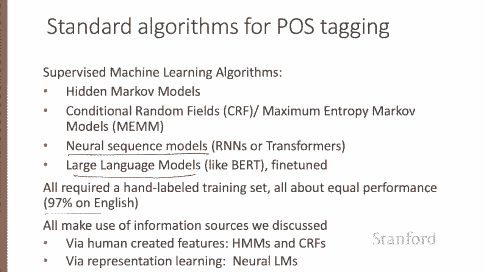
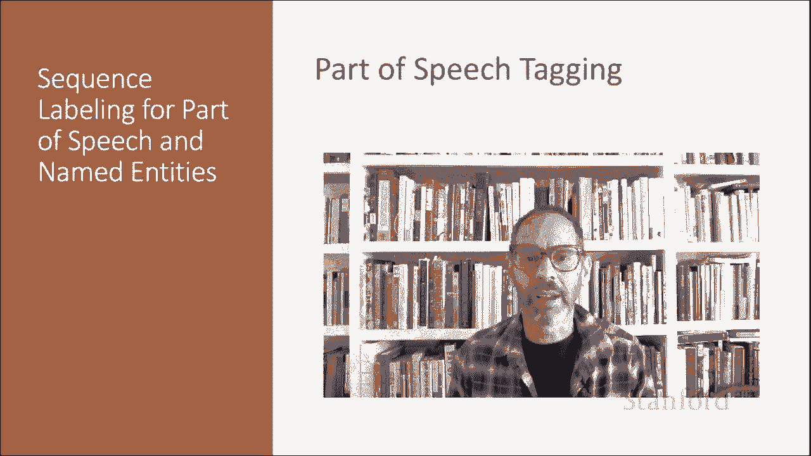

# 55：L9.1 - 词性标注 📚 

在本节课中，我们将学习自然语言处理中的一项基础任务——词性标注。我们将了解词性的概念、分类，以及如何利用算法为文本中的每个单词自动分配正确的词性标签。

## 🧠 词性标注任务介绍

让我们介绍词性标注这项任务。从最早的语言学传统开始，无论是印度的梵语语法学家Yaska和Pāṇini，还是希腊的亚里士多德和斯多葛学派，都提出了单词可以划分为不同语法类别的思想。这些类别就是我们今天所说的词性、词类，或简称为POS标签。

到公元前100年，由Dionysius Thrax提出的一套包含八个词性的体系已经非常现代，包括：名词、动词、代词、介词、副词、连词、分词和冠词。这套八词性体系成为了此后2000年欧洲语言描述的基础。这些词性类别能够沿用数千年，说明了它们在人类语言处理模型中的核心地位。

## 📖 词性类别详解

上一节我们介绍了词性标注的起源，本节中我们来看看具体的词性类别。虽然词性类别确实有语义倾向（例如，形容词常描述属性，名词常描述人物），但词性的定义主要基于单词与相邻词的语法关系或其词缀的形态学属性。

词性主要分为两大类：封闭类词和开放类词。

以下是这两类词的主要特点：

*   **封闭类词**：成员相对固定，例如介词。新的介词很少被创造出来。这类词通常是功能词，如 `of`、`it`，它们通常很短、出现频率高，在语法中起结构作用。
*   **开放类词**：成员可以不断扩充，例如名词和动词。像 `iPhone` 或 `to google` 这样的新名词和动词在不断被创造或借用。

世界上的语言中主要有四种开放类词：名词（包括专有名词）、动词、形容词和副词，以及一个较小的开放类——感叹词。英语拥有全部五种，但并非所有语言都如此。

以下是主要词性类别的定义：

*   **名词**：指代人、地点或事物的词，但也包括其他类别。普通名词包括具体术语如 `cat` 或 `mango`，以及抽象概念如 `algorithm` 或 `beauty`；专有名词如 `Janet` 或 `Italy`；以及动词化的名词，如 `his pacing to and fro became quite annoying` 中的 `pacing`。
*   **动词**：指代动作和过程的词。包括开放类的主要动词如 `eat` 或 `went`，以及封闭类的助动词如 `can` 或 `had`。助动词用于标记主要动词的语义特征，如时态或体。
*   **形容词**：描述名词属性或品质的开放类词，如颜色、年龄或价值。
*   **代词**：一种封闭类功能词，作为指代实体或事件的简写。
*   **连词**：连接两个短语或从句的功能词，如并列连词 `and`、`or`，或从属连词，如 `I thought that you might like some milk` 中的 `that`。

## 🎯 词性标注任务定义

词性标注是为文本中的每个单词分配一个词性的过程。因此，标注是一项消歧任务。单词具有歧义性，可能拥有多个可能的词性。目标是根据上下文找到正确的标签。

例如，单词 `book` 在 `book that flight` 中是动词，在 `hand me that book` 中是名词。词性标注的任务就是在上下文中为每个单词决定正确的标签。

以下是词性标注的简要描述：

*   **输入**：一个由分词后的单词组成的序列 `X1` 到 `XN`，以及一个标签集（可能的标签列表）。
*   **输出**：一个标签序列 `y1` 到 `yn`，每个输出 `yi` 恰好对应某个输入 `xi`。

这是“通用依存项目”使用的标签集，该项目为多种语言提供了句法树和词性标签数据。我们可以看到开放类标签（形容词、副词、名词、动词、专有名词、感叹词）和封闭类标签（如附置词——英语用介词，但有些语言用后置词；助词、连词等），以及标点符号和特殊符号的标签。

以下是一些带标签的例句。请注意，标注要求我们对分词做出一些决定，因此我们通常会将标点或撇号分开。例如，英语中的 `‘s` 经常被切分为一个独立的助词。还要注意，同一个单词在不同情境下可能有不同的标签，例如 `were` 在这里是主要动词，而在 `were reported` 中是助动词。

## 💡 词性标注的应用与挑战

词性标注对自然语言处理任务非常有用，最显著的是在句法分析中，它长期扮演重要角色。同时，它也用于机器翻译、情感分析，甚至文本转语音系统。例如，`lead` 作为指代金属的名词时发音为 `/lɛd/`，但作为动词时发音为 `/liːd/`。或者 `object` 作为名词时发音为 `/ˈɒbdʒɛkt/`，但作为动词时发音为 `/əbˈdʒɛkt/`。标注对于语言分析计算任务也很重要，例如研究新词的创造或测量语义相似性/差异性，不同词性的单词在这些任务中表现不同。

词性标注有多难？在英语中，只有15%的**词型**是歧义的，意味着85%的词型是明确的。例如，`Janet` 总是专有名词，`hesitantly` 总是副词。但事实证明，那15%的歧义词型往往非常常见，出现频率远高于15%。因此，实际上，在连续文本中，大约60%的**词例**是歧义的。例如，单词 `back` 可以有五种词性标签：在 `back seat` 中是形容词，在 `the back` 中是名词，在 `senators backing a bill` 中是动词，在 `buy back` 中是助词，在 `back then` 中是副词。

现代词性标注器的准确度如何？准确度通过标注器为词例分配正确标签的百分比来衡量。对于英语，准确度相当高，大约在97%左右。对于英语和其他一些拥有足够手工标注训练数据且形态学相对简单的语言，标注基本上是一个已解决的问题。不同的算法——经典的如隐马尔可夫模型或条件随机场，或神经模型如BERT——表现相对类似。事实上，人类标注的准确度也大约是97%。当然，对于英语，基线本身就很高。所谓的“最频繁类别基线”就是简单地用训练集中每个单词最频繁出现的标签来标注它。对于未知词，我们将它们标注为名词。这个基线能达到约92%的准确率，仅仅因为，正如我们所看到的，许多单词没有歧义。

## 🔍 标注器的信息来源

词性标注器通常利用三种信息来源。让我们以消歧句子 `Janet will back the bill` 中的单词为例。

以下是标注器依赖的三种关键信息：

1.  **单词拥有某个标签的先验概率**：例如，单词 `will` 通常是助动词，较少情况下是名词（如 `someone of strong will`）或动词（如 `willing something to happen`）。
2.  **相邻单词的身份**：例如，单词 `the` 通常出现在形容词和名词之前，而不是动词之前。
3.  **单词本身的构成、形态或词形**：例如，前缀 `un-` 通常表示形容词，后缀 `-ly` 几乎总是副词。大写是一个强烈的暗示，表明一个单词是专有名词。

词性标注可以通过经典的监督机器学习算法（如隐马尔可夫模型或条件随机场）完成，也可以通过神经模型（无论是从头训练的神经序列模型，还是经过微调的大语言模型）完成。所有这些都需要一个手工标注的数据集，其中人类为每个单词标记了正确的词性标签。对于拥有足够训练数据的英语，所有这些方法都能达到大致相当的性能。所有这些算法都利用了我们刚刚讨论的信息来源：隐马尔可夫模型和条件随机场通过人工创建的特征，而神经模型则通过表示学习来归纳这些特征。

## 📝 总结

本节课中，我们一起学习了词性标注。我们介绍了词性标签的概念，并从高层次概述了词性标注的思想。我们了解了开放类词和封闭类词的区别，明确了词性标注是一项为上下文中的歧义单词选择正确标签的任务。我们还探讨了标注的挑战、现代标注器的高准确度，以及标注器做出决策时所依赖的三种核心信息来源：单词本身的统计特性、上下文邻居单词以及单词的形态学特征。

