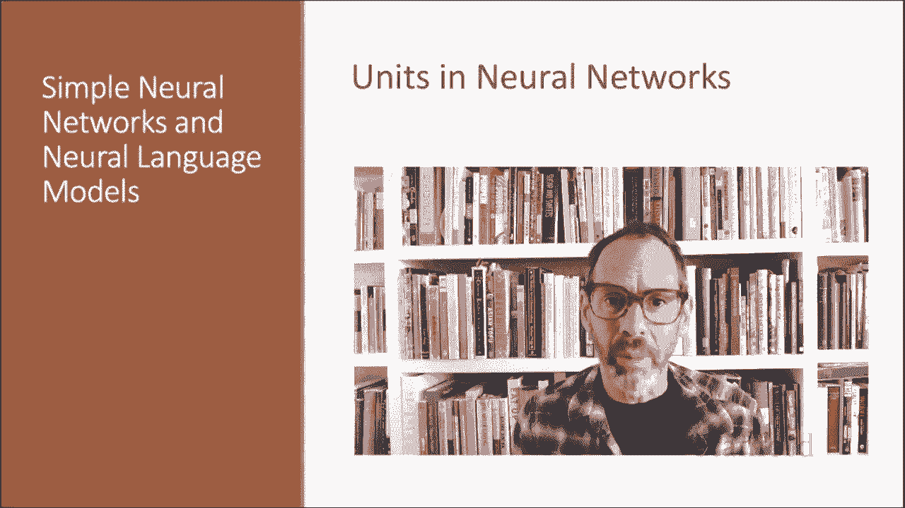

# 57：L10.1 - 神经网络单元 🧠

在本节课中，我们将学习构成神经网络的基本计算单元。我们将了解其起源、现代定义、核心计算过程，并通过一个具体例子来加深理解。最后，我们会介绍几种常见的非线性激活函数。

## 神经网络的起源与现代定义

神经网络之所以被称为“神经”，源于其起源与麦卡洛克-皮茨神经元模型有关。该模型是1943年提出的人体神经元的简化模型，被描述为一种基于命题逻辑的计算元件。

然而，现代神经网络在语言处理等领域的应用，已不再借鉴这些早期的生物学灵感。“神经”这个名称更多是一个历史遗留。

现代神经网络是由许多小型计算单元组成的网络。每个单元接收一个输入值向量，并产生一个单一的输出值。在接下来的几讲中，我们将介绍这些单元，了解它们如何连接在一起形成前馈网络。之所以称为“前馈”，是因为计算过程是从一层单元迭代地推进到下一层。

现代神经网络的应用常被称为“深度学习”，因为现代网络通常很深，意味着它们拥有很多层。但神经网络的基本构建块，是单个的计算单元。

## 神经网络单元的核心计算

一个单元接收一组实数值作为输入，对它们进行一些计算，结合权重、偏置和一个非线性变换，最终产生一个输出。

让我们更详细地看看这个过程。神经网络单元的核心是计算其输入的加权和，再加上一个称为偏置项的额外项。

给定一组输入 `x1` 到 `xN`，一个单元有一组对应的权重 `W1` 到 `WN` 和一个偏置 `B`。因此，加权和 `Z` 可以表示为：

**公式：** `Z = B + Σ (Wi * xi)`，其中 `i` 从 1 到 N。

通常，使用向量表示法来表达这个加权和更为方便。因此，标量 `Z` 由权重向量和输入向量的点积加上标量偏置 `B` 计算得出：

**公式：** `Z = W · X + B`

最后，神经网络不会直接使用 `Z`（即 `X` 的线性函数）作为输出，而是会对 `Z` 应用一个非线性函数 `F`。我们将此函数的输出称为该单元的激活值 `a`（activation）。

由于我们只模拟单个单元，这个激活值 `a` 实际上就是网络的最终输出，我们通常称之为 `y` 或 `ŷ`。

## 激活函数示例：Sigmoid

我们已经见过逻辑回归中使用的 Sigmoid 函数：`1 / (1 + e^(-Z))`。Sigmoid 函数有一些优点：它将输入映射到 (0, 1) 的范围内，这有助于将极端值压缩趋近于 0 或 1；同时它是可微的，这对于学习过程非常方便。

因此，在本讲中，我们将使用 Sigmoid 非线性激活函数作为例子，尽管我们很快会看到还有其他类型的非线性函数。

综上所述，一个使用 Sigmoid 激活函数的简单单元所计算的函数如下，它接收输入 `X`、权重向量 `W` 和偏置项 `B`：

**公式：** `y = σ(W · X + B)`，其中 `σ` 代表 Sigmoid 函数。

下图再次展示了这个单元的各个部分：输入、权重、加权和、非线性激活以及输出值。

## 计算实例

让我们通过一个例子来获得直观感受。

假设我们有一个单元，其权重向量包含三个权重值和一个偏置：
`W = [0.2, 0.3, 0.9]`, `B = 0.5`

假设输入向量为：
`X = [0.5, 0.6, 0.1]`

现在我们来计算 Sigmoid 输出。我们需要计算 `1 / (1 + exp(- (W·X + B)))`。

首先写出 `W·X + B` 的计算过程：
`0.5 * 0.2 + 0.6 * 0.3 + 0.1 * 0.9 + 0.5`

计算结果约为 0.87。因此，对于这个特定输入，Sigmoid 输出将是：
`y = 1 / (1 + exp(-0.87)) ≈ 0.7`

## 其他常见的激活函数

上一节我们通过 Sigmoid 函数进行了计算，但在实践中，Sigmoid 并不常用作激活函数。

一个非常相似但几乎总是更好的函数是 **Tanh 函数**，它是 Sigmoid 的一个变体，输出范围在 (-1, +1) 之间。

**公式：** `tanh(z) = (e^z - e^(-z)) / (e^z + e^(-z))`

Tanh 函数具有平滑可微的性质，并能将极端值映射向均值。

然而，**最简单且可能最常用的激活函数是修正线性单元，也称为 ReLU**。它的定义是：当 `Z` 为正时，输出等于 `Z`；否则输出为 0。

**公式/代码：** `ReLU(z) = max(0, z)`

与 Sigmoid 或 Tanh 函数相比，ReLU 函数具有很好的特性。对于 Sigmoid 或 Tanh，`Z` 值非常高会导致 `y` 值饱和，即极其接近 1 且导数非常接近 0。接近 0 的导数会导致学习问题，因为梯度会变得越来越小，直到小到无法用于训练，这个问题被称为“梯度消失问题”。而 ReLU 没有这个问题，因为对于较高的 `Z` 值，其导数恒为 1，而不是接近 0。

## 总结

本节课中，我们一起学习了构成现代神经网络基础的基本神经计算单元。我们了解了它的历史背景与现代定义，深入探讨了其核心计算过程——加权和与非线性激活，并通过一个具体实例演示了计算。最后，我们比较了 Sigmoid、Tanh 和 ReLU 这几种常见的激活函数及其特性，特别是 ReLU 在解决梯度消失问题上的优势。