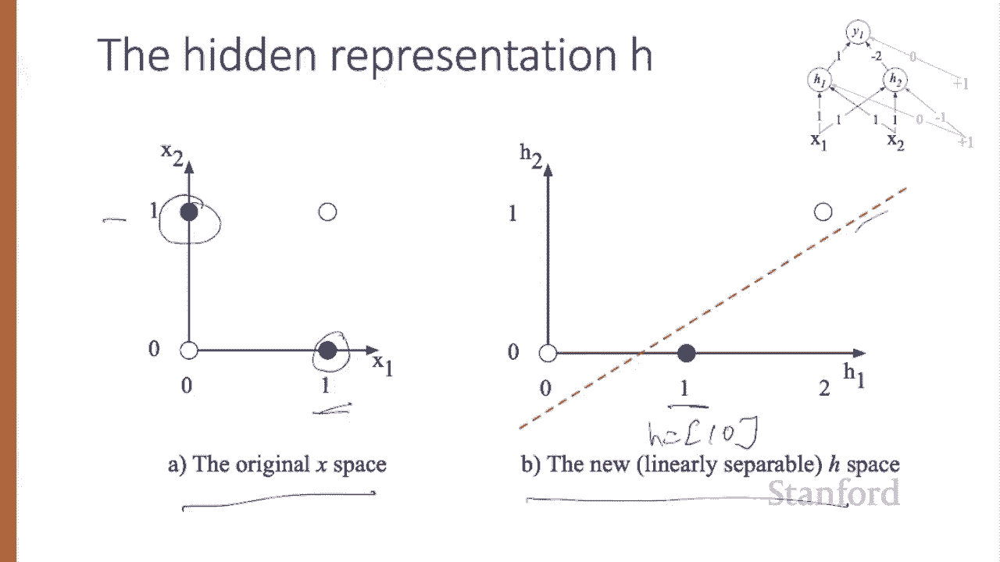
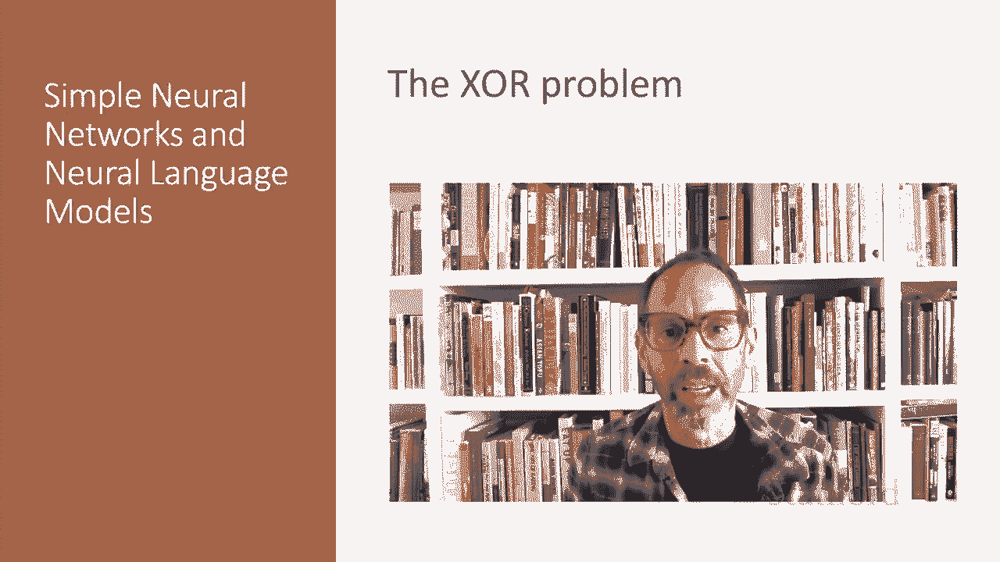

# 58：L10.2 - 异或问题 🔍

在本节课中，我们将要学习神经网络如何通过组合多个单元来解决单层网络无法处理的问题，特别是经典的“异或”逻辑函数。我们将从感知机的局限性开始，逐步展示多层网络如何通过构建有效的内部表示来解决这一问题。

---

神经网络的强大能力源于将这些基本单元组合成更大的网络。

1969年，Minsky和Papper的证明巧妙地展示了多层网络的必要性，他们证明了单一计算单元无法计算其输入的一些非常简单的函数。

考虑计算两个输入的基本逻辑函数的任务，例如“与”、“或”和“异或”。作为回顾，以下是这些函数的真值表：0与0是0，0与1是0，1与1是1，依此类推。

这个例子最初是针对感知机展示的。感知机是一种非常简单的神经单元，具有二进制输出，并且没有非线性激活函数。感知机的输出Y是0或1，计算方式如下。

使用我们刚刚见过的相同W、X和B，如果 `w·x + b <= 0`，感知机将输出0；如果 `w·x + b > 0`，它将输出1。

构建一个能够计算其二进制输入的“与”或“或”逻辑函数的感知机非常容易。

在左侧，我们有一个“逻辑与”的例子。权重W1=1，W2=1，偏置B=-1。“逻辑或”的权重略有不同。这组权重和偏置只是实现这些函数的无限多组可能权重和偏置中的一组。

让我们看看输入为1和0时会发生什么。如果x1=1，x2=0，那么我们有1*1 + 0*1 = 1，然后加上偏置B=-1，结果等于0。确实，对于“与”运算，我们得到了正确答案0。现在看看输入1和1的情况。x1=1，x2=1，所以有1*1 + 1*1 -1 = 1。对于“或”运算，输入0和1，我们有0*1 + 1*1 + 0 = 1，这正确地给出了1。

然而，使用感知机无法计算“异或”函数。你应该暂停视频，自己尝试思考一下。为什么不可能？

关键在于，感知机是一个针对二维输入X1和X2的线性分类器。感知机方程 `W1*x1 + W2*x2 + b = 0` 是一条直线的方程。我们可以通过将其转换为标准线性格式 `x2 = -(W1/W2)*x1 - b/W2` 来看到这一点，这里有一个斜率。这条直线在二维空间中充当决策边界，将直线一侧的所有输入点分配输出0，另一侧的所有输入点分配输出1。

如果我们有超过两个输入，决策边界就变成了一个超平面而不是一条直线，但思想是相同的，即将空间分成两类。让我们看一张图。

这些图展示了可能的逻辑输入点(0,0)，(0,1)，(1,0)，(1,1)，以及由一组可能的参数为“与”分类器和“或”分类器绘制的直线。

请注意，对于“异或”函数，根本不可能画出一条直线来分隔“异或”的正例(0,1)和(1,0)与负例(0,0)和(1,1)。我们说“异或”不是一个线性可分的函数。当然，我们可以用曲线或其他函数画边界，但不能用单一直线。

---

上一节我们看到了单层感知机的局限性，本节中我们来看看如何使用两层基于ReLU的单元来计算“异或”。

中间层称为H，有两个单元；输出层称为Y，有一个单元。以下这组权重和偏置将计算“异或”。

考虑输入x = (0,0)。如果我们将每个输入值乘以相应的权重，求和，然后加上偏置，我们得到：
*   H1 = ReLU(0*1 + 0*1 + 0) = ReLU(0) = 0
*   H2 = ReLU(0*1 + 0*1 + (-1)) = ReLU(-1) = 0
因此，H = (0,0)。然后，y = 0*1 + 0*(-2) + 0 = 0。

我建议你暂停视频，计算剩余可能的输入对，看看得到的y值：对于输入(0,1)和(1,0)是1，而对于(0,0)和(1,1)仍然是0。

观察那些中间结果——两个隐藏节点H1和H2的输出——也很有启发性。这是原始的x空间，其中“异或”在(0,1)或(1,0)时应返回1。现在让我们看看相同四个输入下H层的值。

请注意，现在输入点x=(0,1)和x=(1,0)（这两个“异或”输出应为1的情况）的隐藏表示被合并成了一个点。对于这两种情况，隐藏值都是(1,0)。这种合并使得线性分离“异或”的正例和负例变得容易。下图展示了一条可以实现这一点的示例直线。

换句话说，我们可以将网络的隐藏层视为形成了输入的有用表示。在这个例子中，我们只是规定了权重，但对于真实例子，神经网络的权重是使用反向传播算法自动学习的。这意味着隐藏层将学会形成有用的表示。神经网络能够自动学习输入的有用表示，这种直觉是其关键优势之一。

---

本节课中我们一起学习了为什么单个单元无法计算“异或”，以及具有非线性的多层网络如何能够学习到使解决此问题成为可能的表示。

