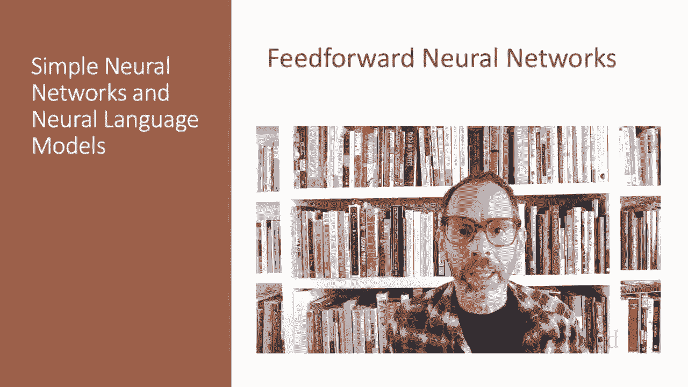
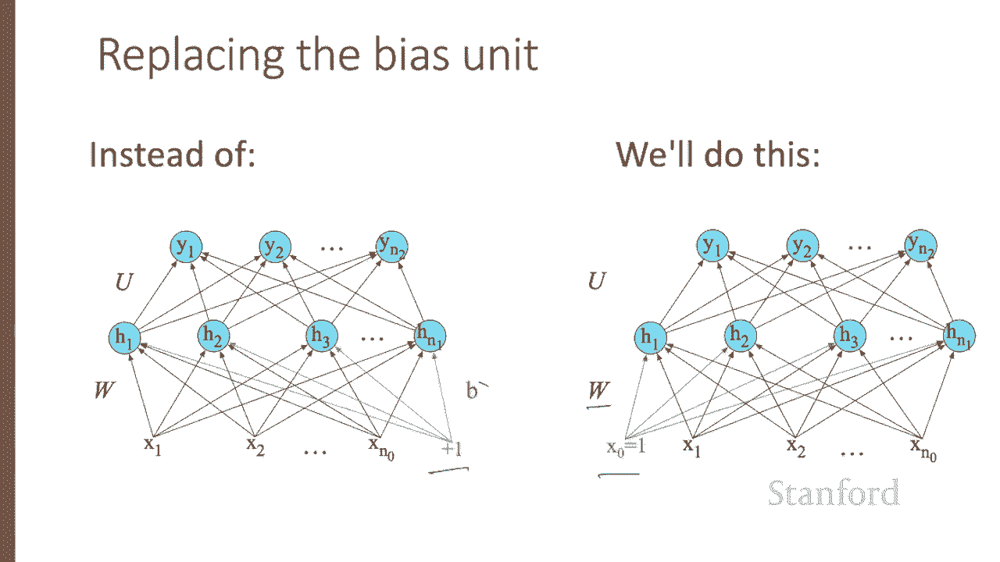

# 59：L10.3 - 前馈神经网络 🧠


在本节课中，我们将要学习前馈神经网络的基本概念。这是深度学习中最基础但至关重要的架构，也是理解更复杂模型（如循环神经网络和Transformer）的基石。



## 概述 📋

这里介绍简单的前馈神经网络。尽管自然语言处理领域使用了更多复杂的架构，例如循环神经网络、Transformer和注意力机制，但前馈神经网络仍然是一个重要的工具，并且是这些更复杂架构的基础。

一个前馈神经网络是一个多层网络，其中的单元以无环的方式连接。每一层中单元的输出被传递到下一更高层，并且没有输出被传递回更低的层。

## 网络的基本构成 🏗️

由于历史原因，前馈神经网络也可以被称为多层感知机或MLP，尽管它们在技术上不再由感知机构成。

简单的前馈神经网络有三种节点：输入单元、隐藏单元和输出单元。

### 从逻辑回归到神经网络

让我们回顾逻辑回归。我们可以将二元逻辑回归视为一个单层网络。当我们计算层数时，不计算输入层，因此我们称输入层为第0层，所以这是一个单层网络。

我们有一个输入层（可称为第0层），它由一个向量 **X** 组成。我们将 **X** 乘以一个权重矩阵 **W**，加上一个标量 **b**，然后第一层（即输出层）通过应用Sigmoid函数到 **WX + b** 来计算一个标量 **y**。

因此，简单的逻辑回归可以看作一个网络。请记住，多项逻辑回归在输出端不是一个单一的Sigmoid，而是一个将输出值转换为概率的Softmax函数。

以下是逻辑回归作为网络的表示：
*   **输入**：向量 **X**
*   **计算**：**z = WX + b**
*   **输出**：**y = σ(z)** （对于二元分类）或 **y = softmax(z)** （对于多元分类）

在多项逻辑回归中，**W** 从一个简单的向量变成了一个矩阵，**b** 从一个标量变成了一个向量。现在我们用权重矩阵 **W** 乘以输入 **X**，加上向量 **b**，以产生一个关于可能结果的向量。

请记住，Softmax是Sigmoid的推广。对于一个向量 **z**，Softmax将每个元素 `z_i` 替换为 `exp(z_i) / Σ_j exp(z_j)`。例如，如果我们有一个输入向量 **z**（只是一组分数，有正有负），通过Softmax运行它将产生一组总和为1的概率。因此，Softmax是一个非常方便的输出函数。

## 引入隐藏层 💡

逻辑回归是一个单层网络，但神经网络的威力在于我们拥有隐藏层时，即至少是两层网络。

这是一个两层网络：输入层（第0层）、隐藏层（第1层）和输出层（第2层）。

以下是具有单个隐藏层的前馈网络的方程：它接受输入 **X**，乘以权重矩阵 **W** 并加上偏置 **b**。权重矩阵 **W** 的每个元素 `W_{j,i}` 表示从第 `i` 个输入单元 `x_i` 到第 `j` 个隐藏单元 `h_j` 的连接权重。

我们在这里将激活函数表示为 **σ**，因此隐藏单元是 **σ(Wx + b)**，但激活函数也可以是ReLU或tanh，正如我们之前讨论过的。注意，**h** 是一个向量，我们将 **σ** 应用于一个向量（**Wx** 是一个向量）。因此，我们可以将像 **σ** 这样的函数应用于单个值或按元素应用于向量。

正如我们在关于表示的讲座中所看到的，得到的隐藏值 **h** 形成了输入的一种表示。现在，输出层的作用是获取这个新的表示 **h** 并计算最终输出。这个输出可以是一个实数值。但在许多情况下，网络的目标是做出某种分类决策，因此我们将专注于分类的情况。

## 输出层与分类 🎯

如果我们正在进行二元任务（如情感分类），我们可能只有一个输出节点。值 **y** 是例如积极与消极情感的概率。

因此，输出层有另一个权重矩阵 **U**。许多模型在输出层不包括偏置向量 **b**，因此我们通过消除偏置项来简化示例。权重矩阵 **U** 乘以其输入向量（即向量 **h**）以产生中间输出 **z**。然后我们使用Sigmoid将其转换为概率。

如果你有超过两个输出类别怎么办？例如，我们正在进行多项分类，如分配词性标签。我们只需添加更多的输出单元，每个类别一个。因此，我们可能为每个潜在的词性设置一个输出单元，输出值将是该词性的概率。所以输出层给出了跨输出节点的概率分布，我们使用Softmax来计算这个分布，就像多项逻辑回归一样。

这意味着我们可以将具有一个隐藏层的神经网络分类器视为构建一个向量 **h**（这是输入的隐藏层表示），然后在该网络在 **h** 中开发的特征上运行标准的逻辑回归。相比之下，当我们介绍逻辑回归时，特征主要是通过特征模板手工设计的。

因此，神经网络就像逻辑回归，但具有许多层，因为深度神经网络就像一层又一层的逻辑回归分类器。并且，不是通过手写的特征模板形成特征，而是网络的前几层自己诱导出特征表示。

## 通用符号与深层网络 📝

现在让我们建立一些符号，以便更容易地讨论深度超过两层的更深网络。

我们将使用方括号中的上标来表示层号，从输入层的0开始。因此，**W^[1]** 将表示第一个隐藏层的权重矩阵，**b^[1]** 将表示第一个隐藏层的偏置向量。我们将使用 **g** 代表激活函数，中间层倾向于使用ReLU，输出层使用Softmax。

我们将使用 **a^[i]** 表示第 `i` 层的输出，**z^[i]** 表示权重和偏置的组合。输入将更一般地称为 **a^[0]**。

因此，我们可以用右边的方程重写我们的两层网络。以下是它们一起写出来的形式：

```
z^[1] = W^[1] * a^[0] + b^[1]
a^[1] = g^[1](z^[1])
z^[2] = W^[2] * a^[1] + b^[2]
a^[2] = g^[2](z^[2]) = y_hat
```

注意，在这种符号下，每一层（第1层和第2层）的计算方程是相同的。

因此，在给定输入向量 **a^[0]** 的情况下，计算n层前馈网络中前向传播步骤的算法很简单：遍历各层，计算 **z = W * a_prev + b**（其中 `a_prev` 是前一层的输入），然后当前层的输出是 **a = g(z)**，最后，我们的估计值 **y_hat** 是最后一层的输出。

## 简化符号（含偏置节点）⚙️

在描述网络时，我们经常使用一个稍微简化的符号，它表示完全相同的函数，但不引用显式的偏置节点 **b**。我们将通过向每一层添加一个虚拟节点 `a_0` 来实现这一点，其值始终为1。因此，第0层（输入层）将有一个虚拟节点 `a_0^[0]`，值为1；第1层将有一个 `a_0^[1]`，值为1，依此类推。与这个虚拟节点相关的权重代表了偏置值 **b**。

因此，我们的输入不再是 `x_1` 到 `x_{n0}`（`n0` 是第0层的单元数），而是会添加一个额外的单元 `x_0`。我们不再讨论 **σ(Wx + b)**，而是讨论 **σ(Wx)**。但如果我们分解这个计算，**Wx** 将是从0到 `n0` 的权重乘以输入值的和（因为有了这个额外的偏置值），而不是从1开始。

因此，我们不再有一个额外的偏置项 **b**，而是简单地添加我们的值 `x_0`，并将 **b** 纳入权重矩阵 **W** 中。在接下来的几节课中，我们将继续在示例中展示偏置 **b**，但之后我们将切换到没有显式偏置项的简化符号。

## 总结 ✨



本节课中，我们一起学习了前馈神经网络，这是最基本的神经网络架构。我们了解了其基本构成，包括输入层、隐藏层和输出层，并学习了如何从逻辑回归的角度理解它。我们探讨了激活函数（如Sigmoid、Softmax和ReLU）的作用，以及网络如何通过隐藏层自动学习特征表示。最后，我们介绍了描述深层网络的通用符号和一种包含偏置的简化表示方法。掌握这些基础知识是理解更复杂深度学习模型的关键。