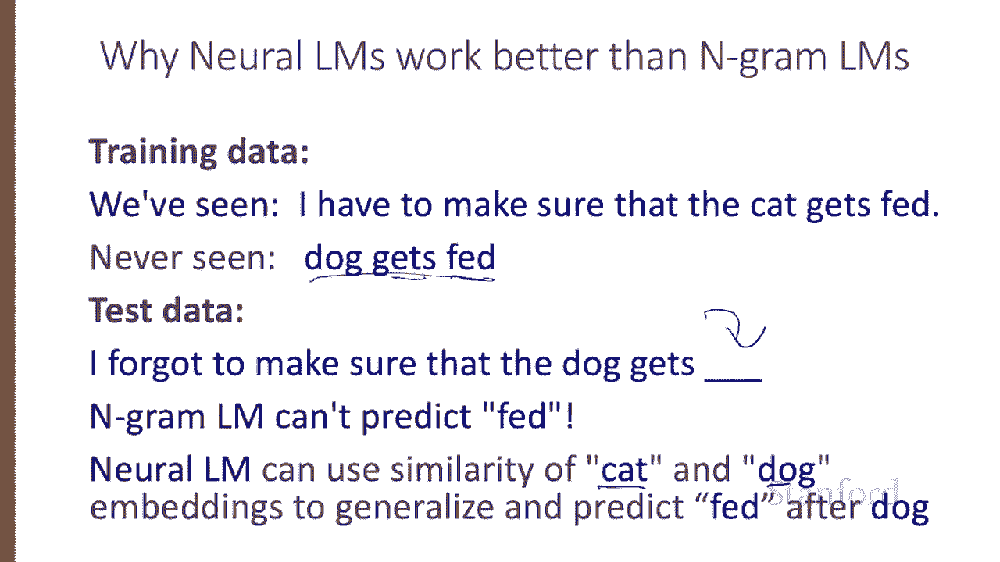
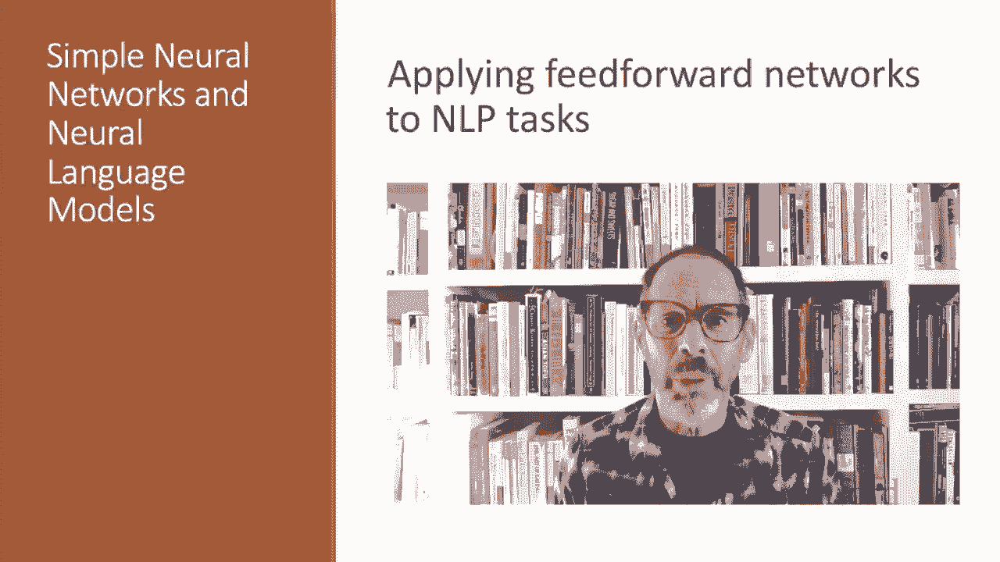

# 60：L10.4 - 基于前馈神经网络的 NLP 问题方案 📚 

在本节课中，我们将学习如何将简单的前馈神经网络应用于自然语言处理任务。我们将探讨两个简化的示例任务：文本分类（如情感分类）和语言建模。虽然目前最先进的神经网络系统使用更强大的架构，但今天我们将要了解的简单前馈网络模型，对于理解基础概念非常有用。

## 🧠 情感分析：从逻辑回归到神经网络

上一节我们介绍了前馈神经网络的基本概念，本节中我们来看看如何将其应用于情感分析任务。

我们可以构建一个神经网络，其功能与逻辑回归完全相同。输入层可以采用与逻辑回归相同的二元特征。输出层通过一个 Sigmoid 函数输出一个 0 或 1 的值。唯一的区别在于中间增加了一个额外的隐藏层。

以下是我们可以使用的一些特征示例：
*   词典中积极词的计数。
*   词典中消极词的计数。
*   文档中是否包含“不”这个词。

从架构上看，我们的逻辑回归模型包含一组特征、一个 Sigmoid 函数和权重。我们讨论的是增加一个额外的隐藏层。因此，我们现在有两组权重矩阵 **W** 和 **U**，但使用相同的 Sigmoid 函数和相同的特征。

仅仅在逻辑回归中添加这个隐藏层，就允许网络对特征之间的交互进行建模。特征 X1 和特征 X2 在这个节点中的组合方式，可以与在另一个节点中的组合方式不同，从而以多种方式相互作用。

这赋予了网络更强的能力，可能会提升性能。

## 🔍 深度学习的真正力量：从数据中学习特征

然而，深度学习的真正力量来自于从数据中学习特征的能力。因此，我们将不再使用人工构建的特征进行分类，而是使用学习到的表示，例如我们在之前课程中见过的词嵌入。

以下是具体思路：假设我们有三个输入单词“the dessert is”。我们查找每个单词的嵌入向量。例如，单词“the”的索引是 534，我们查找其嵌入向量。同样地，我们查找“dessert”和“is”的嵌入向量。现在，这三个嵌入向量就构成了我们的输入层。

接着，我们有一个权重矩阵 **W**。我们将嵌入向量值与 **W** 矩阵相乘，得到隐藏层的值。然后，我们通过另一个权重矩阵 **U** 进行线性变换，最后通过 Sigmoid 函数输出，估计出从这三个单词“the dessert is”中得出积极情感的概率。

## ⚠️ 处理可变长度输入的问题

这看起来很好，但存在一个大问题：它假设输入总是三个单词，这不太现实。我们将在后续课程中看到这个问题的完整解决方案，但这里有一些简单的解决方法。

以下是两种简单的解决方案：
*   **固定长度输入**：我们可以将输入长度固定为最长评论的长度。如果评论较短，我们就用零向量进行填充。如果在测试时遇到更长的评论，我们直接将其截断。
*   **创建句子嵌入**：我们可以创建一个单一维度的句子嵌入向量来表示评论中的所有单词。这可以通过两种常见方式实现：
    *   **取平均值**：简单地取所有词嵌入向量的质心（均值），创建一个类似于所有单词平均值的句子嵌入。
    *   **取最大值**：通过取所有词嵌入向量在每个维度上的最大值，来创建这个单一的句子嵌入向量。

## 📊 扩展到多类别分类

如果我们希望输出类别超过两个怎么办？正如我们在逻辑回归中看到的，我们可以简单地添加更多的输出单元，每个类别一个，并使用一个 Softmax 层。这样，我们就可以输出积极、消极或中性情感，甚至是五种情感值。

## 🔄 转向语言建模任务

现在，让我们转向语言建模任务。回想一下，语言建模的任务是计算给定一段历史序列后，下一个单词出现的概率。我们已经见过基于 N-gram 的语言模型。事实证明，神经网络语言模型的表现远超 N-gram 语言模型。

目前最先进的神经语言模型基于更强大的技术，如 Transformer。但简单的前馈语言模型也能做得几乎一样好，让我们看看是如何实现的。

## 🪟 滑动窗口方法

回想一下，语言模型的任务是预测下一个单词 **w_t**，给定前面的单词 **w_{t-1}**, **w_{t-2}**, **w_{t-3}** 等等。这当然会导致一个问题：我们处理的是任意长度的序列。

对于前馈语言模型，一个简单的解决方案是使用固定长度的滑动窗口。通过这样做，我们做出了与 N-gram 语言模型中相同的简化：用给定有限、固定数量的前序单词的概率，来近似给定整个前序单词序列的概率。

这是一个简化的前馈神经语言模型示意图（n=3）。在时间 t，我们有一个移动窗口，其中包含代表前三个单词的嵌入向量，就像我们在情感分析中看到的那样。这些单词是 **w_{t-3}**, **w_{t-2}** 和 **w_{t-1}**。它们被连接在一起以产生输入层 **x**。

在网络的输出端，我们有一个 Softmax 层，它给出了一个关于所有单词的概率分布。例如，y_42，即输出节点 42 的值，就是下一个单词 **w_t** 是词汇表中索引为 42 的单词（恰好是单词“fish”）的概率。

因此，给定前三个单词，这个网络将给出所有可能的下一个单词的概率分布。然后，我们只需将窗口移动一个标记，并以同样的方式预测下一个单词。

## 🐱 为何神经语言模型更优：泛化能力

神经语言模型比简单的 N-gram 语言模型效果好得多，这里有一个例子可以说明原因。假设我们在训练数据中见过句子“I have to make sure the cat gets fed”。而碰巧我们从未见过三元组“dog gets fed”。

现在假设测试数据是“I forgot to make sure the dog gets”。我们需要预测下一个单词。

一个 N-gram 语言模型不会在“gets”之后预测“fed”，因为它从未见过“fed”出现在“gets”之后。即使我们使用某种平滑技术，“fed”在“gets”之后也不会是一个特别可能的单词。

但是，神经语言模型可以利用“cat”和“dog”的相似性。这些单词是相似的，它们的嵌入向量也是相似的。因此，模型可以将训练中见过的“cat”之后出现“fed”的模式，泛化到预测“dog”之后出现“fed”。

## 📝 总结

本节课中，我们一起学习了简单的前馈神经网络如何应用于各种 NLP 任务。我们探讨了其在情感分析中的应用，包括如何处理可变长度输入和扩展到多类别分类。接着，我们了解了如何利用滑动窗口方法构建前馈神经语言模型，并理解了其通过词嵌入的相似性实现强大泛化能力的优势。这些基础模型为我们理解更复杂的神经网络架构奠定了重要的基础。