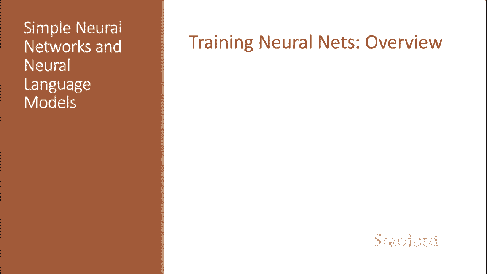
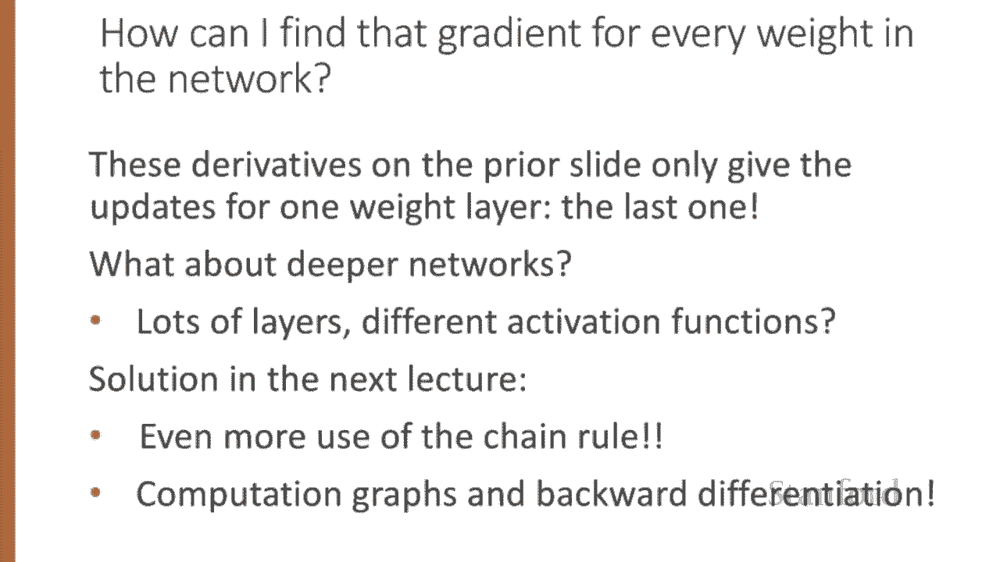
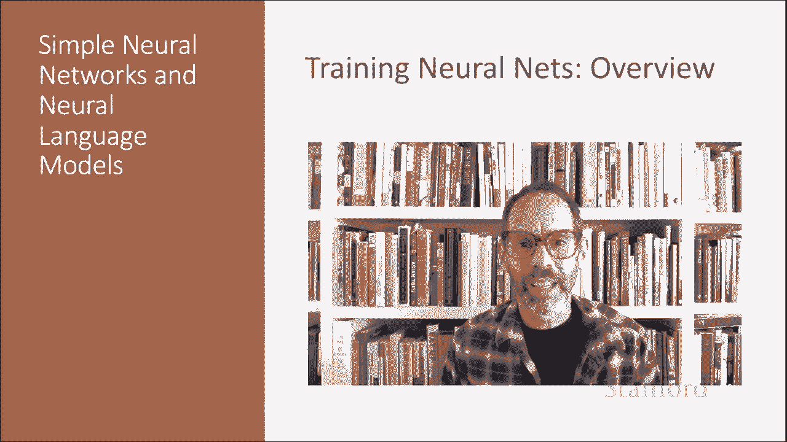

# 61：L10.5 - 训练神经网络 🧠

在本节课中，我们将要学习如何训练神经网络。我们将从概述开始，然后深入探讨前向传播计算损失与反向传播更新权重的核心过程，并回顾逻辑回归中的梯度下降原理，为理解更复杂的多层网络训练打下基础。

## 神经网络训练概述

神经网络训练的直观理解包含两个核心步骤：前向计算损失和反向计算权重更新。

给定一个输入 **X**，我们通过网络进行一次前向传播，计算出系统的输出 **Ŷ**。

然后，我们将 **Ŷ** 与真实答案 **Y** 进行比较，得到该样本的损失值。

接着，我们将通过网络进行一次反向传播，计算更新权重所需的梯度。

## 训练过程的正式描述

上一节我们介绍了训练的直观概念，本节中我们来看看更正式的训练步骤描述。对于每一个训练样本（输入 **X**， 正确答案 **y**），我们将执行以下操作：

1.  运行前向计算，找出网络认为的估计值 **Ŷ**。
2.  运行反向计算来更新权重。

我们以一个两层网络为例进行思考。以下是具体的更新步骤：

首先，对于每一个输出节点，我们将计算真实值 **y** 与估计值 **Ŷ** 之间的损失，并根据该损失更新从隐藏层到输出层的所有权重。

接下来，我们将处理隐藏层节点。我们将找到一种方法来评估该节点对最终答案应承担多少“责任”，然后对于从输入层到隐藏层的每一个权重，我们都将进行更新。我们将在后续以更正式的方式看到如何实现这一点。

## 从逻辑回归中获取直觉

在深入神经网络之前，让我们回顾一下逻辑回归的做法，这有助于我们理解梯度下降的基本原理。

逻辑回归的损失函数旨在学习能够最大化正确标签对数概率的权重，即 **P(y|x)**。

为了将其转化为最小化的损失函数，我们需要改变符号。

然后，我们可以代入由权重 sigmoid 函数计算出的概率估计值。

让我们回顾一下逻辑回归讲座中梯度下降如何进行权重更新。

梯度下降中移动的幅度，是损失函数相对于权重的梯度值，乘以一个学习率 **η**。

因此，我们有旧的权重 **W^T**，为了计算新的权重，我们将旧权重移动一个由学习率加权的损失梯度。更高的学习率意味着在每一步中我们应该更多地移动 **W**。

对于逻辑回归，我们看到损失函数相对于一个权重 **w_j** 的导数是：**σ(w·x + b) - y**，即 **ŷ - y** 乘以 **x_j**。

## 链式法则与导数来源

这个导数从何而来？它使用了链式法则。

链式法则指出，如果我们有一个复合函数 **F(x) = u(v(x))**，那么 **F(x)** 的导数是 **u** 相对于 **v** 的导数乘以 **v** 相对于 **x** 的导数。

我们可以从这个神经单元（它与逻辑回归相同）看到其直觉：它计算作为 **y** 函数的损失，而 **y** 又是权重乘以值的和的 sigmoid 函数。

因此，如果我们想计算整个损失函数相对于一个权重 **w_i** 的导数，我们可以使用链式法则来计算：

**∂L/∂w_i = (∂L/∂ŷ) * (∂ŷ/∂z) * (∂z/∂w_i)**

其中：
*   **∂L/∂ŷ** 是损失函数的导数。
*   **∂ŷ/∂z** 是激活函数（如 sigmoid）的导数。
*   **∂z/∂w_i** 是加权和相对于该权重的导数。

## 扩展到深度网络

上一节基于逻辑回归的导数只给出了最后一层权重的更新规则。逻辑回归只有一层权重，但对于具有许多层的更深网络，并且激活函数不仅仅是 sigmoid 时，我们该怎么办？

我们将在下一讲中看到解决方案，届时我们将更多地使用链式法则，并引入计算图和反向微分的重要思想。

本节课我们一起学习了神经网络训练的概述和基本数学原理。我们已经看到了神经网络训练的概述，在下一讲中，我们将看到具体的细节。

