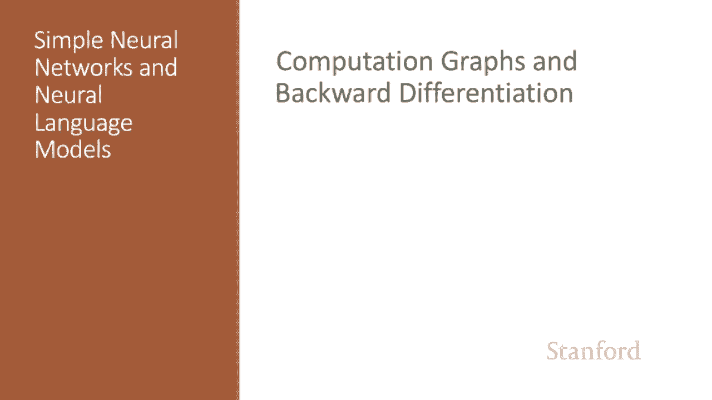
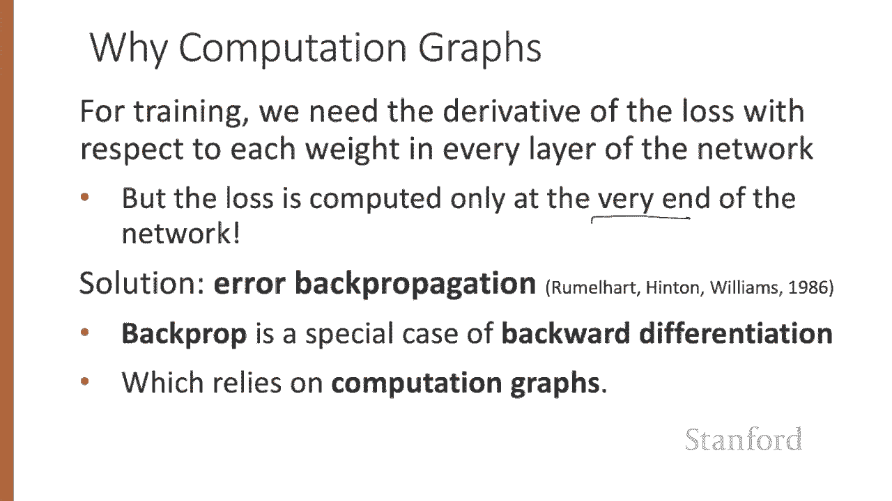
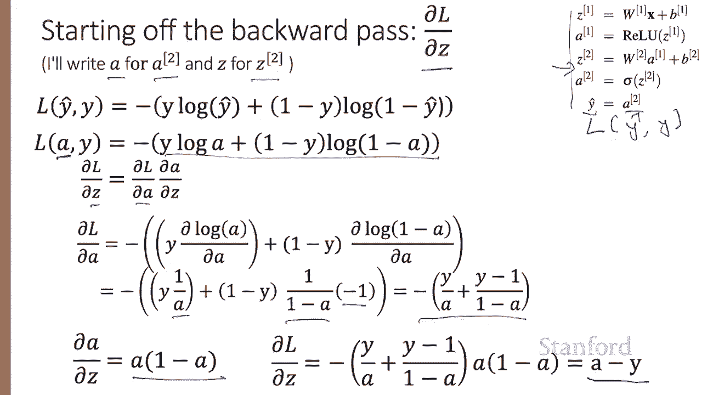
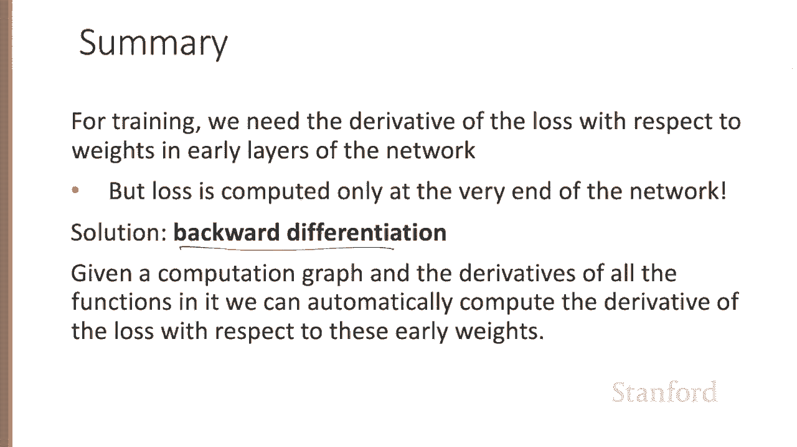

# 62：L10.6 - 计算图与反向传播 🧠

在本节课中，我们将学习神经网络训练中的核心算法——反向传播。我们将了解如何通过计算图这一工具，高效地计算网络中所有权重的梯度，从而利用梯度下降法来更新权重。

## 概述：为什么需要反向传播？

为了使用梯度下降法训练神经网络，我们需要知道损失函数相对于网络中每一层每一个权重的梯度。然而，损失函数只在网络的最终输出端被计算。那么，我们如何找到网络中较早层权重的梯度呢？解决方案是一种称为误差反向传播的方法，在神经网络领域常简称为“反向传播”。实际上，反向传播是反向微分方法的一个特例，而反向微分依赖于计算图这一概念。

## 什么是计算图？📊

计算图是一种表示任何数学表达式计算过程的工具。它将复杂的计算分解为一系列独立的操作，每个操作被建模为图中的一个节点。

考虑计算一个简单的函数：`L(a, b, c) = c * (a + 2b)`。如果我们把其中的加法和乘法操作显式地分解出来，并为中间输出命名，计算过程如下：
*   `d = 2 * b`
*   `e = a + d`
*   `L = c * e`

我们可以用一个图来表示这个过程，其中每个操作是一个节点，有向边表示一个操作的输出作为下一个操作的输入。

计算图最简单的用途是，在给定输入的情况下计算函数值。假设输入为 `a=3`, `b=1`, `c=-2`。我们可以进行前向计算：
*   `d = 2 * 1 = 2`
*   `e = 3 + 2 = 5`
*   `L = 5 * (-2) = -10`

然而，计算图的重要性在于其至关重要的**反向传播过程**。反向传播用于计算权重更新所需的导数。

## 反向传播与链式法则 ⛓️

在这个例子中，我们的目标是计算输出函数 `L` 相对于每个输入变量（`a`, `b`, `c`）的导数。例如，`∂L/∂a` 告诉我们，在保持其他变量不变的情况下，`a` 的微小变化会对最终输出 `L` 产生多大影响。

反向微分从根本上依赖于链式法则的大量应用。让我们回顾一下链式法则：
*   假设有一个复合函数 `f(x) = u(v(x))`。链式法则告诉我们：`f‘(x) = u’(v(x)) * v‘(x)`。
*   链式法则可以扩展到更多函数。对于 `F(x) = u(v(w(x)))`，其导数为：`F’(x) = u‘(v) * v’(w) * w‘(x)`。

现在，让我们使用链式法则来计算我们需要的导数。在计算图中，`L = c * e`，我们可以直接计算 `∂L/∂c = e`。对于另外两个导数，我们需要链式法则：
*   `∂L/∂a = (∂L/∂e) * (∂e/∂a)`
*   `∂L/∂b = (∂L/∂e) * (∂e/∂d) * (∂d/∂b)`

这些等式需要五个中间导数：`∂L/∂e`, `∂e/∂a`, `∂e/∂d`, `∂d/∂b`, `∂L/∂c`。我们可以计算如下：
*   `∂L/∂e = c`
*   `∂L/∂c = e`
*   `∂e/∂a = 1` （和的导数等于导数的和）
*   `∂e/∂d = 1`
*   `∂d/∂b = 2`

在反向传播过程中，我们从右向左沿着图的每条边计算这些偏导数，并将必要的偏导数相乘，得到我们最终需要的导数。

## 反向传播过程演示 🔄

我们从标注最后一个节点开始，`∂L/∂L = 1`。然后向左移动：
1.  计算 `∂L/∂c`。根据前向计算，`e=5`，所以 `∂L/∂c = e = 5`。
2.  计算 `∂L/∂e`。`∂L/∂e = c = -2`。
3.  计算 `∂e/∂d = 1`。
4.  计算 `∂L/∂d = (∂L/∂e) * (∂e/∂d) = (-2) * 1 = -2`。
5.  计算 `∂d/∂b = 2`。
6.  计算 `∂L/∂b = (∂L/∂d) * (∂d/∂b) = (-2) * 2 = -4`。

我们可以对图中的其余部分进行类似的计算。下图清晰地展示了整个反向传播过程。

当然，真实神经网络的计算图要复杂得多。

## 神经网络中的计算图示例 🧩

这是一个具有两个输入单元、两个隐藏单元和一个输出单元的两层神经网络的计算图示例。中间使用 ReLU 激活函数，输出层使用 Sigmoid 激活函数。

以下是其方程：
*   第一层：`z1 = W1 * x + b1`, `a1 = ReLU(z1)`
*   第二层：`z2 = W2 * a1 + b2`, `a2 = σ(z2)` （σ 表示 Sigmoid 函数）
*   最终输出：`ŷ = a2`

为了在这个计算图上进行反向传播，我们需要知道图中所有函数的导数。例如：
*   Sigmoid 函数的导数：`σ‘(z) = σ(z) * (1 - σ(z))`
*   ReLU 函数的导数：当 `z > 0` 时为 `1`，否则为 `0`。

图中需要更新的权重（即我们需要知道损失函数对其偏导数的权重）用橙色标出。对于一个特定的观测样本 `(x1, x2)`，我们会先运行前向传播，为所有节点赋值，然后从最后面的节点开始运行反向传播。

## 反向传播起步示例 🚶‍♂️

让我们展示如何开始反向传播，通过计算前几个步骤来求损失函数相对于最后一个 `z`（即 `z2`）的导数。

我们使用标准的交叉熵损失函数：`L = -[y * log(ŷ) + (1-y) * log(1-ŷ)]`。这里用 `a` 表示 `ŷ`。

我们想计算 `∂L/∂z`。根据链式法则：`∂L/∂z = (∂L/∂a) * (∂a/∂z)`。

1.  计算 `∂L/∂a`：
    *   对损失函数 `L` 关于 `a` 求导：`∂L/∂a = -[y * (1/a) + (1-y) * (1/(1-a)) * (-1)]`
    *   简化后得到：`∂L/∂a = -[y/a - (1-y)/(1-a)] = (a - y) / [a(1-a)]`

2.  计算 `∂a/∂z`（Sigmoid 导数）：`∂a/∂z = a * (1 - a)`

3.  将两者相乘：
    *   `∂L/∂z = [(a - y) / (a(1-a))] * [a(1-a)] = a - y`

这个结果非常简洁：对于使用交叉熵损失和 Sigmoid 激活的输出层，损失对未激活值 `z` 的梯度就是预测值 `a` 与真实标签 `y` 的差。

## 总结 📝

本节课中我们一起学习了反向传播这一重要算法。为了训练神经网络，我们需要损失函数相对于网络早期层权重的导数，但损失只在网络末端计算。解决方案是反向微分：我们构建一个计算图，在已知图中所有函数导数的情况下，可以自动计算出损失相对于这些早期权重的导数。

我们了解了计算图的思想和反向微分的过程，这是理解和实现神经网络训练的基础。