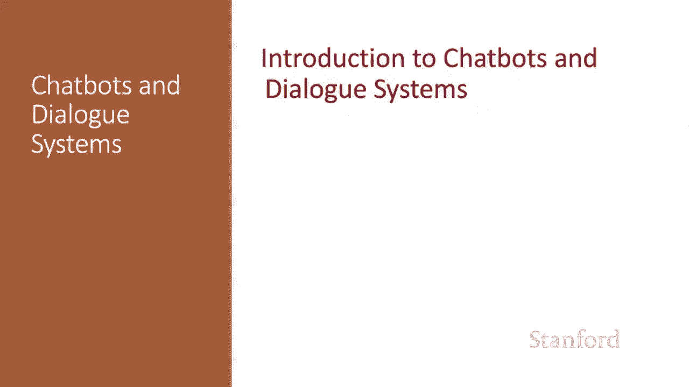
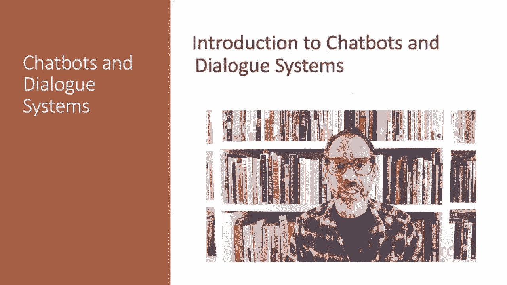
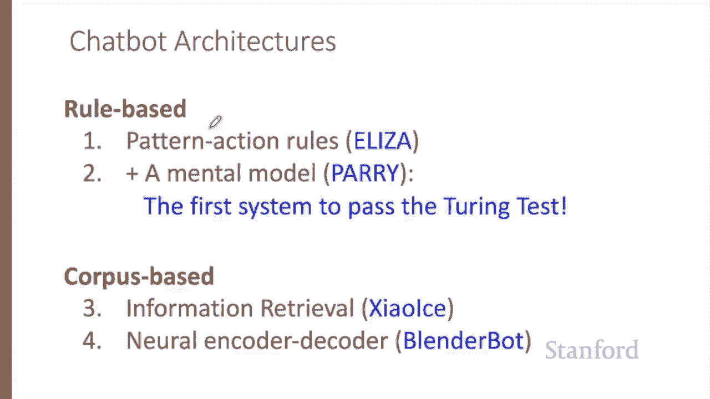
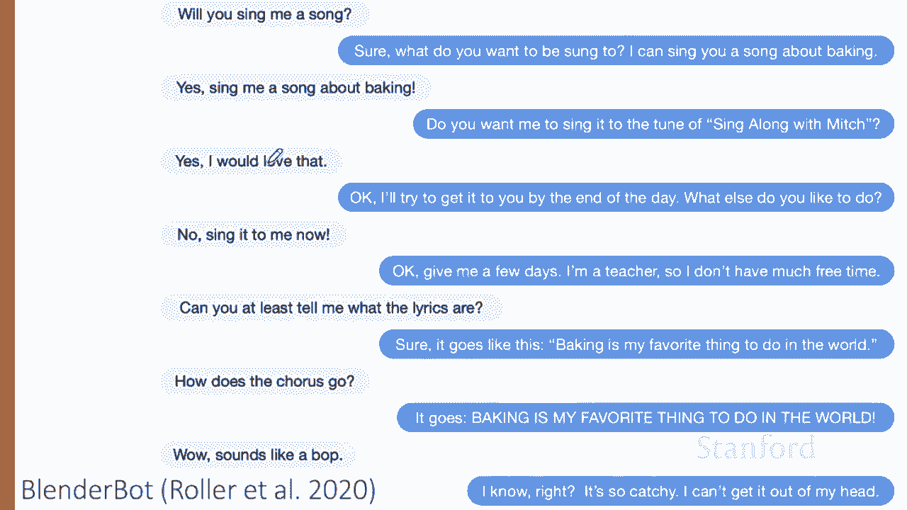
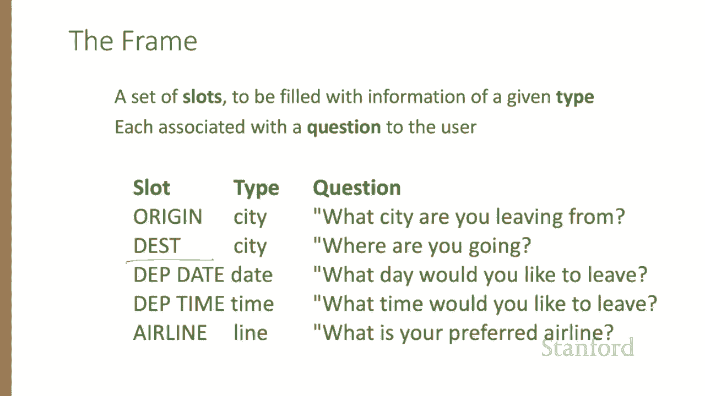

# 63：L11.1 - 聊天机器人与对话系统介绍 🤖






在本系列课程中，我们将探讨聊天机器人与对话系统。

## 概述

在本节课中，我们将学习对话系统的基本概念、主要类别及其应用场景。对话系统旨在通过文本或语音与人类进行交互，其应用范围广泛，从简单的个人助手到复杂的任务处理系统。

## 对话系统简介


对话代理，也称为对话系统、对话代理或聊天机器人，是设计用于通过对话（文本或语音）与人类交互的系统。这些系统包括手机或其他设备上的个人助手，如 Siri、Alexa、Cortana 或 Google Assistant，以及用于简单、相对短暂交互的工具，例如播放音乐、设置计时器、时钟或管理购物清单。它们也延伸到更长的对话，可能只是为了娱乐，或用于实际应用，如预订旅行，甚至在心理健康临床中使用。

在这些讲座中，我们将讨论两大类对话代理。

## 聊天机器人

聊天机器人是旨在进行长时间对话的系统，其目标是模仿非正式人际互动中特有的无结构聊天或对话。这些系统大多设计用于娱乐。然而，从最早的 Weizenbaum 的 Eliza 系统开始，聊天机器人也被用于实际目的，包括心理咨询。

## 任务型对话代理

第二种系统是基于目标的对话代理，用于解决某些任务，如预订航班或维护购物清单。有时“聊天机器人”一词会用于这两种类型的系统，但在这些讲座中，我们将尝试区分它们。

与语言处理中的几乎所有其他内容一样，聊天机器人架构分为两类：基于规则的系统与基于语料库的系统。基于规则的系统包括早期有影响力的 Eliza 和 Perry 系统。基于语料库的系统则挖掘大量的人-人对话数据集，这可以通过使用信息检索从先前的对话中复制人类响应，或使用编码器-解码器系统根据用户话语生成响应来实现。

## 聊天机器人示例




这些聊天机器人系统通常具有娱乐价值，例如 Facebook 的 BlenderBot，这是一个进行此类对话的神经聊天机器人。用户说：“你能给我唱首歌吗？”聊天机器人回答：“当然，你想听什么歌？我可以给你发一首关于烘焙的歌。”用户说：“好的，给我唱一首关于烘焙的歌。”等等。😊



或者微软的 XiaoIce 系统，它在短信平台上用中文与人聊天，主要通过提取过去对话中人类说过的话来回应。


## 任务型对话代理架构

其他对话代理则构建用于解决任务，如设置计时器、预订旅行、播放歌曲。这些系统倾向于围绕一种称为“框架”的知识结构构建。

一个框架代表用户对任务的意图，由一组“槽位”组成，每个槽位可以取一组可能的值。因此，一个航班预订代理可能具有诸如目的地城市或出发时间等槽位。

**框架示例：航班预订**
```python
flight_booking_frame = {
    "intent": "book_flight",
    "slots": {
        "destination_city": None,
        "departure_time": None,
        "airline": None,
        # ... 其他槽位
    }
}
```

## 总结




本节课中，我们一起快速预览了两类对话代理：聊天机器人和任务型对话系统。我们了解了它们的基本定义、典型应用以及核心的构建方法，为后续深入学习奠定了基础。