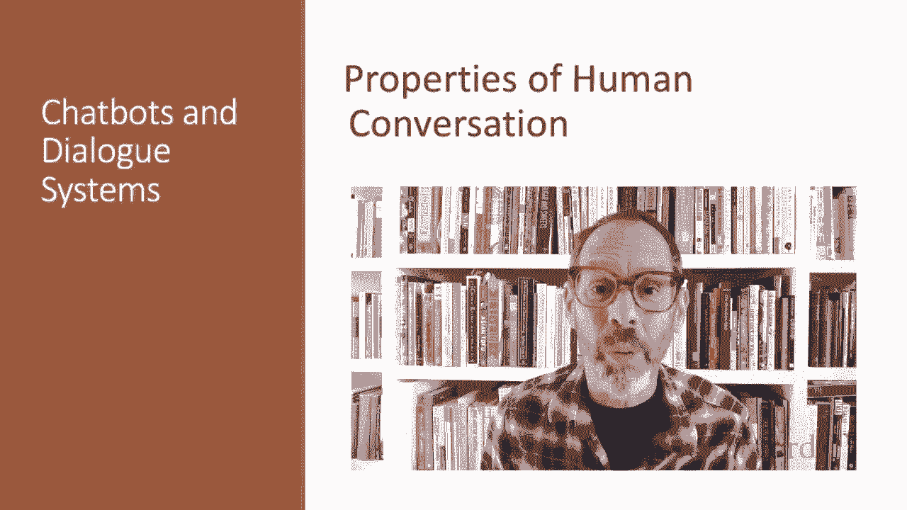
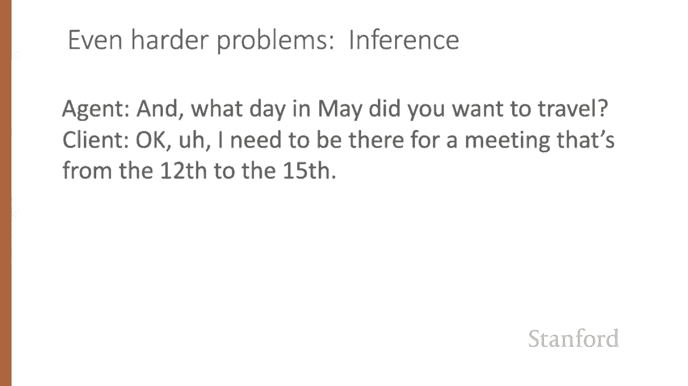
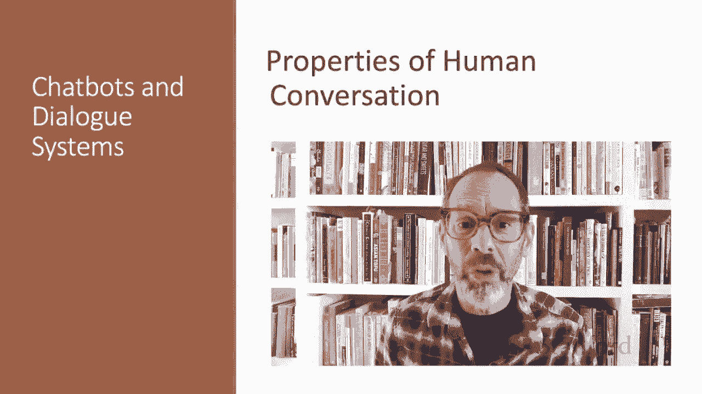

# 64：L11.2 - 人类对话的属性 🗣️

在本节课中，我们将学习人类对话的基本属性。理解这些属性对于设计能够与人类自然交流的对话系统至关重要。

## 概述

在开始设计能与人类对话的智能体之前，我们必须先理解人类之间是如何进行对话的。本节将分析一段真实的人类对话，并从中提炼出对话的关键特征。

## 对话的基本单位：话轮

首先，我们来看一段人类旅行代理与客户之间的对话节选。对话中的每一次发言被称为一个“话轮”。话轮可以是一个完整的句子，也可以短至一个单词，或长至多个句子。

以下是对话中的一些话轮示例：
*   **C1**： 我需要在五月出行。
*   **C13**： 西雅图。
*   **A10**： （代理的一段较长回复）。

## 话轮转换与打断

对话涉及两个或更多人，因此参与者需要协商“话轮转换”，即决定谁在何时发言。有时，双方可能同时试图发言，导致“打断”。

例如，在对话中，代理说“哦，有两个直飞航班”，而客户同时打断说“实际上，15号是星期几？”。这种重叠用“#”符号标记。人类代理知道此时应停止发言，并理解客户可能在进行更正或提出新问题。

对于对话系统而言，允许用户打断系统发言（这被称为“打断”或“barge-in”）并知道何时开始发言，是非常重要的功能。

## 言语行为：对话中的动作

哲学家维特根斯坦和奥斯汀指出，对话中的每一句话都是说话者执行的一种“动作”，这被称为“言语行为”或“对话行为”。

以下是巴赫与哈尼什提出的一种言语行为分类：
*   **断言**： 说话者承诺某事为真。例如，陈述“我需要在五月出行”。
*   **指令**： 说话者试图让听者做某事。例如，命令“把音乐调大”或提问“你想在五月的哪一天出行？”（可视为一种礼貌的命令）。
*   **承诺**： 说话者承诺未来的某个行动。例如，许诺。
*   **表态**： 表达说话者对听者或某种社会行为的态度。例如，感谢。

言语行为表达了说话者说这句话的意图。

## 共同立场与确认

对话不是一系列独立的言语行为，而是说话者和听者共同完成的集体行为。因此，参与者建立双方都认同的“共同立场”非常重要。

说话者通过“确认”彼此的话语来做到这一点。“确认”意味着听者表明自己理解了说话者的话。在人类对话中，确认可以很明确，比如直接说“好的”；也可以通过重复对方的话来实现，例如代理重复“在11号”，以向客户表明自己听懂了。

这种确认机制对人机交互同样重要。例如，电梯按钮在按下后会亮起，就是一种非语言的确认，表明你的指令已被接收。

## 对话结构：相邻对与旁侧序列

对话具有结构。例如，在会话分析领域研究的言语行为之间的局部结构：
*   **提问**会引发对**回答**的期待。
*   **提议**后通常会跟随**接受**或**拒绝**。
*   **恭维**（如“外套真好看”）常引发**谦辞**（如“哦，这件旧衣服”）。

这种成对的结构（如“提问-回答”）被称为“相邻对”，由“第一部分”和“第二部分”组成。这些预期可以帮助系统决定采取何种行动。

然而，言语行为并不总是立即被其第二部分跟随。两个部分之间可能被“旁侧序列”或“子对话”隔开。例如，在我们的对话节选中，客户提问“15号是星期几？”就中断了代理正在寻找5月15日返程航班的进程，形成了一个“更正子对话”。代理必须先回答这个问题，然后意识到客户可能想改变计划，再回到寻找周日返程航班的任务上。

另一种常见的旁侧序列是“澄清问题”，它可以在请求和响应之间形成一个子对话。这在语音识别出错的对话系统中尤其常见。

## 对话主动权

有时，对话完全由一方控制。例如，记者采访厨师时，记者提问，厨师回答。我们说在这种情况下，记者拥有“对话主动权”。

然而，在正常的人类对话中，主动权更常见的是在参与者之间来回切换，双方时而回答问题，时而提出问题，引导对话走向新的方向。这种“混合主动权”是人类对话的常态，但对对话系统来说却很难实现。

相比之下，设计被动响应的系统要容易得多：
*   在搜索引擎或简单的问答系统中，主动权完全在**用户**手中（用户主动系统）。
*   在一些糟糕的对话系统中，系统提出问题后，在你回答之前不提供任何其他操作机会，这种纯粹的**系统主动**架构会让人非常沮丧。

## 对话中的推理

推理在对话理解中也很重要。考虑这个节选：代理问“你想在五月的哪一天出行？”，客户回答“哦，我需要参加一个12号到15号的会议”。

请注意，客户并没有直接回答代理的问题，而只是提到了一个会议的时间。是什么让代理能够推断出客户提及这个会议是为了告知出行日期呢？说话者似乎期望听者能做出某些推断，即说话者传达的信息比字面上看起来的更多。

哲学家格赖斯将这类例子归入他的“会话含义”理论中。“含义”指的是一类特定的、被许可的推理。这类推理对对话系统来说尤其具有挑战性。

## 总结

本节课我们一起学习了人类对话的几个关键属性，包括话轮、话轮转换、言语行为、共同立场与确认、对话结构（相邻对与旁侧序列）、对话主动权以及对话中的推理。在设计对话系统时，我们必须将这些属性牢记于心。