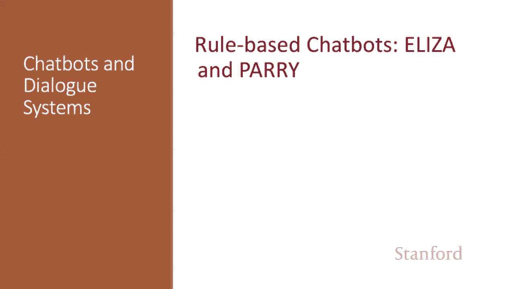
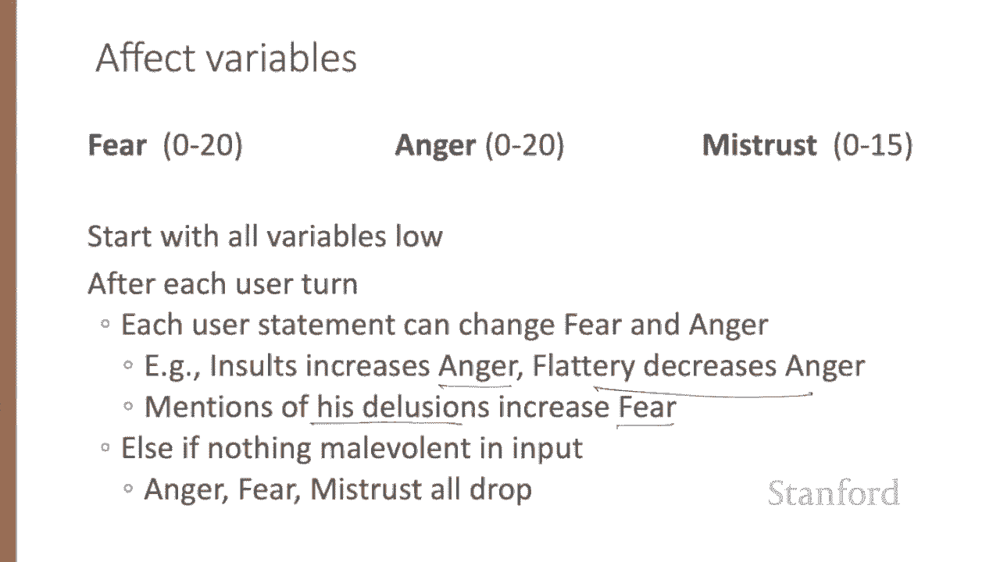
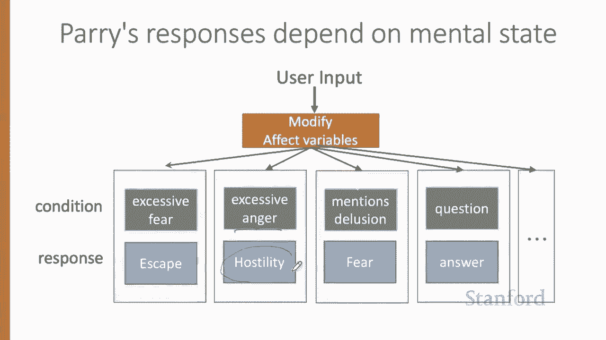
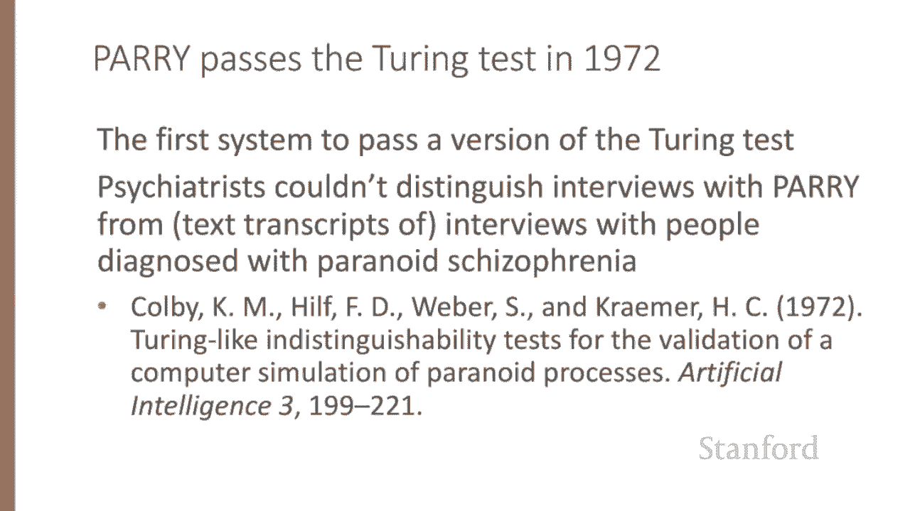
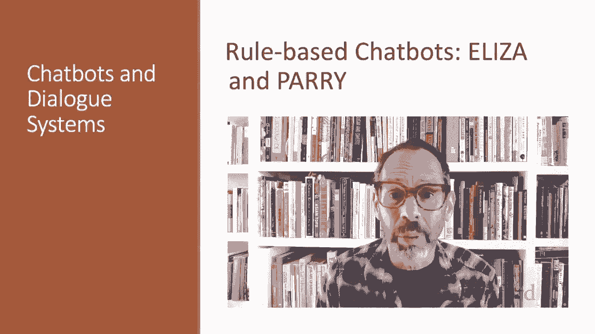

# 65：L11.3 - 基于规则的聊天机器人 🤖 




在本节课中，我们将要学习聊天机器人领域的早期重要代表——Eliza。我们将了解它的工作原理、核心算法，并探讨其背后的伦理思考。同时，我们也会介绍另一个基于规则的聊天机器人PARRY，看看它在架构上的创新。

Eliza是一个模拟罗杰斯派心理治疗师的聊天机器人，是该领域历史上最早且最重要的聊天机器人之一。

让我们通过一段在1966年介绍Eliza的论文中发表的示例对话来了解它。这里摘录了原始论文中完整互动的一部分。

请注意，Eliza给出的回应在语言上似乎非常连贯。

> 男人在哪些方面都一样？
> 他们总是为某些事情烦我们。
> 你能想到一个具体的例子吗？

Eliza甚至似乎能记住对话中很早之前提到的内容。比如最后这句：“这和你男朋友让你来这里的事实有关吗？” 它引用了很久之前提到的事情。

Eliza是如何做到这一点的？

Eliza被设计用来模拟一位罗杰斯派心理学家，该临床心理学分支的方法涉及通过将患者的陈述反射回给患者来引导他们。正如魏泽鲍姆指出的，罗杰斯疗法是一种罕见的对话类型，在这种对话中，可以假定对话者对现实世界几乎一无所知。如果患者说：“我进行了一次长时间的乘船旅行”，而心理学家说：“跟我讲讲船吧。” 你不会认为她不知道船是什么，而是会假设她有一些与你的治疗相关的对话目标。大多数试图通过图灵测试的聊天机器人都会尝试寻找具有类似属性的领域。

Eliza通过**模式转换规则**工作，如下所示：

```
(0 YOU 0 ME)
```

在Eliza的模式中，`0` 表示任意字符串，在转换规则中，数字是模式中成分的索引。所以这里的数字 `3` 指的是这个模式中的第三个元素，即第二个 `0`。

因此，这条规则 `(0 YOU 0 ME)` 会转换为 `(WHAT MAKES YOU THINK I 3 YOU)`。这将把 “you hate me” 翻译成 “what makes you think I hate you”，其中第一个 `0` 匹配空字符串，第二个 `0` 匹配 “hate”。

每条Eliza模式转换规则都与一个可能出现在用户句子中的**关键词**相关联。每个关键词都有一个模式列表，每个模式又有一个转换列表。所以，你刚才看到的模式 `(0 YOU 0 ME)` 可能被组织在关键词 `YOU` 下。然后，我展示了两种可能的转换：一种是我们刚看到的，另一种是其他的。

对于历史爱好者，这是原始论文中Eliza知识的Lisp结构：

```
(KEYWORD (RANK) (PATTERN1 (TRANSFORM11) (TRANSFORM12) ...) (PATTERN2 ...) ...)
```

关键词与一个**等级**相关联，特定单词的等级更高，更通用的单词等级较低。

考虑以下句子：“我知道。每个人都嘲笑我。” 因为它包含单词 `I`，这个句子可以匹配以下规则，其关键词是 `I`。这里的规则是：如果你看到 `I` 后面跟着任何内容，就说 “you say you ...”。这里我用了 `0` 来表示任意字符串。所以这会将句子 “I know everybody laughed at me” 转换为 “you say you know everybody laughed at you”。Eliza有单独的规则来转换所有这些代词。但 `I` 是一个非常通用的词，它的关键词会导致非常通用、模糊的回应。

关键词 `EVERYBODY` 则有趣得多。因为正如魏泽鲍姆指出的，使用像 `everybody` 或 `always` 这样的泛指词的人，很可能是在指代某个特定的事件或人。因此，如果我们使用用户句子中的关键词 `EVERYBODY` 来选择模式，我们会选择将 `(0 EVERYBODY 0)` 转换为 `(WHO IN PARTICULAR ARE YOU THINKING OF)` 的模式。Eliza就会给出那个回应。这是一个有趣得多的回应。

Eliza通过为每个关键词存储一个等级来实现这个想法。所以 `EVERYBODY` 与等级 `5` 一起存储，然后是其可能的转换规则列表，比如这里的这个。而 `I` 与等级 `0` 一起存储，以及它的转换规则列表。因此，当Eliza选择转换规则时，如果句子中包含 `everybody`，它更可能选择与 `everybody` 相关的转换规则。

以下是Eliza的生成器算法，给定一个用户句子并返回一个回应：

1.  首先，在句子中找到具有最高关键词等级的单词。
2.  然后，为该单词选择最高等级的规则（如果它与句子文本匹配）。
3.  应用转换规则。
4.  我们还会做一件额外的小事：如果句子中有 `my`，我们对该句子应用一个特殊的转换，并将其放入一个栈中。我们稍后会回到这一点。
5.  否则，我们给出“无匹配”回应。我们会准备一些“无匹配”回应，用于处理我们不太理解用户所说内容的情况。
6.  或者，我们会回到这个记忆栈，并随机说点什么。

那么，“无匹配”回应是什么意思呢？如果没有关键词匹配，Eliza会选择一个非常不置可否的回应，比如“请继续”或“我明白了”。

最后，Eliza有一个巧妙的记忆技巧，这解释了我们看到的对话中的最后一句。每当单词 `my` 是最高等级的关键词时，Eliza会随机选择记忆列表上的一个转换规则（`MEMORY` 是一个特殊的列表），将其应用于句子，并将其存储在一个队列中。转换规则例如：将 `my ...` 转换为 `let's discuss further why your ...`，或者 `earlier you said your ...`，或者 `does it have anything to do with the fact that your ...`。

所以现在我们将这些存储在一个队列（先进先出队列）中，然后稍后，如果没有关键词匹配句子并且我们不知道说什么，我们只需从记忆队列的顶部弹出一些内容并说出来。

---

上一节我们介绍了Eliza的工作原理和算法，本节中我们来看看其背后的伦理影响。

人们与Eliza产生了深刻的情感联系。魏泽鲍姆讲述了他的一个员工的故事，这位员工在与Eliza交谈时会要求魏泽鲍姆离开房间。当魏泽鲍姆建议他可能想存储Eliza的对话以供日后分析时，人们立即指出了隐私问题，这表明尽管知道它只是软件，他们仍在与Eliza进行相当私密的对话。魏泽鲍姆担心人们向Eliza倾诉，而人们被误导了计算机对自然语言的理解程度。魏泽鲍姆担心社会正在犯一个错误，即将人类从决策和选择中移除。

魏泽鲍姆在麻省理工学院的同事雪莉·特克尔教授，在几十年间研究了Eliza和其他计算系统的用户。她更细致的观点是，虽然人与人面对面的互动对人类体验至关重要（她的很多研究都表明了这一点），但人类也会继续与人工制品发展关系。例如，她研究的一些用户表示，他们使用Eliza更像是一种日记，一种私下探索自己想法的方式。得出的启示是，进行**价值敏感设计**很重要，即在设计过程中考虑你所设计系统的益处、危害和可能的利益相关者。

---

在Eliza出现几年后，我们看到了另一个专注于临床心理学的聊天机器人PARRY的发展。但这里的目标与Eliza非常不同。作者试图通过建立一个患有精神分裂症的人的心理过程和语言反应的形式化计算模型来研究精神分裂症。因此，Eliza是对可能构建的语言能力的探索，而PARRY则展示了NLP系统作为认知模型的用途。

PARRY与我们这里的讨论相关，是因为它在聊天机器人架构上的创新。最重要的是，除了类似Eliza的正则表达式和更强大的控制能力外，PARRY系统还包括一个自身心理状态的模型，其中包含诸如代理的恐惧或愤怒水平等**情感变量**，以及连接这种心理状态与语言输入和输出的复杂规则。

某些类型的陈述或对话主题可能导致PARRY变得更加愤怒、多疑或减少愤怒。例如，提及PARRY的妄想会增加恐惧变量。



然后，PARRY的输出取决于情感变量。例如，如果愤怒值很高，PARRY会从一组敌意的输出中选择。



PARRY是1972年已知的第一个通过图灵测试变体的系统。精神科医生无法区分与PARRY访谈的文本记录与被诊断为偏执型精神分裂症患者访谈的记录。




虽然像Eliza和PARRY这样的基于规则的方法非常简单，但它们具有重大的意义，并且基于规则的方法在现代聊天机器人中仍然被用作组件。





---


本节课中我们一起学习了基于规则的聊天机器人Eliza和PARRY。我们探讨了Eliza如何通过关键词、等级和模式转换规则来生成看似连贯的回应，并了解了其巧妙的记忆机制。我们还讨论了这类技术带来的伦理影响，以及进行价值敏感设计的重要性。最后，我们看到了PARRY如何通过引入情感变量和心理状态模型，在架构上进行了创新，并展示了基于规则的方法在现代聊天机器人中仍然占有一席之地。