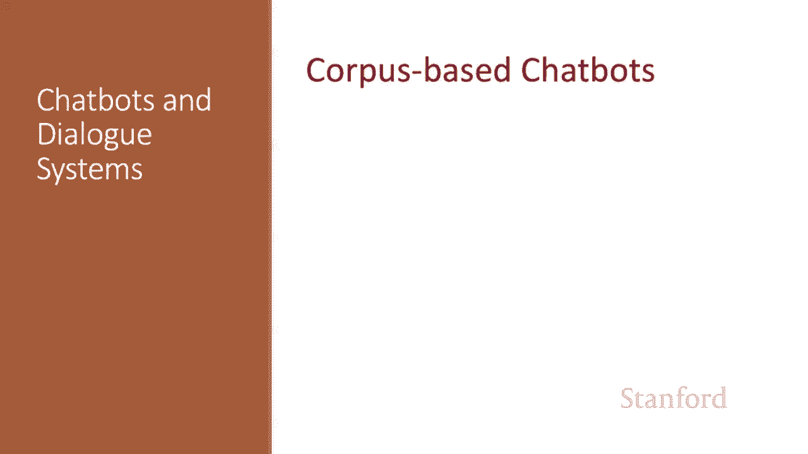
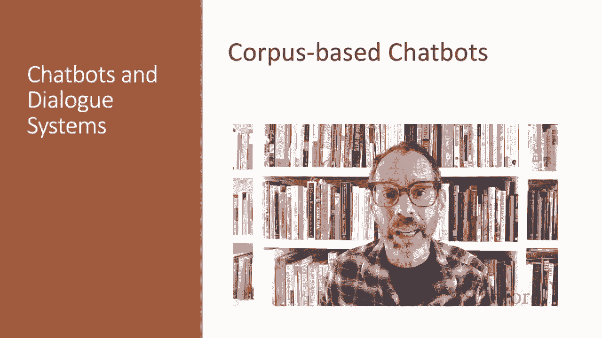
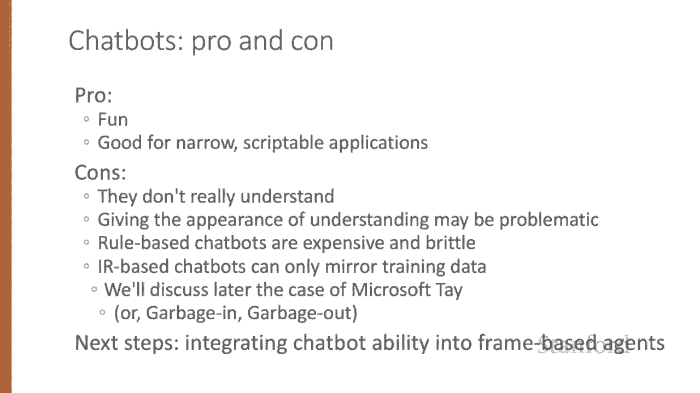

# 66：L11.4 - 基于语料库的聊天机器人 🤖

在本节课中，我们将要学习如何构建不依赖于人工编写规则，而是通过自动挖掘大量人类对话语料库来决定如何回复的聊天机器人。

## 概述 📋

基于语料库的聊天机器人主要通过在上下文中生成对用户话语的回复来实现。其核心方法有两种：**检索式**和**生成式**。无论采用哪种方法，系统通常都是根据迄今为止的整个对话（前提是对话长度在模型处理窗口内）来生成一个合适的单轮回复，因此它们也常被称为**响应生成系统**。

## 语料库与数据 📊

现代基于语料库的聊天机器人是数据密集型的，通常需要数亿甚至数十亿单词的训练数据。

以下是几种常用的数据集类型：

*   **志愿者对话转录**：例如包含美式英语电话对话的Switchboard语料库。
*   **电影对话**：在许多方面与自然对话相似。
*   **众包对话**：专门为训练对话系统而创建，例如让众包工作者扮演特定角色或基于给定知识进行交谈。
    *   Topical Chat数据集包含11,000个对话，涵盖八个广泛主题。
    *   Empathetic Dialogues数据集包含25,000个对话，基于说话者处于特定情感状态的情景。

尽管这些数据集规模庞大，但仍未达到数十亿单词的级别。因此，许多系统会首先在从Twitter、Reddit等社交媒体平台提取的**伪对话**大型数据集上进行预训练。处理数据时，必须移除其中可能出现的个人身份信息。

## 检索式响应方法 🔍

检索式方法将用户的当前话语视为一个查询（Query），我们的任务是从对话语料库C中检索并复述一个合适的回复R。

通常，C是系统的训练集。我们为C中的每一个可能的回复R进行评分，选择得分最高的一个。评分方法基于**相似度**，即使用任何信息检索方法（例如TF-IDF余弦相似度）选择与查询Q最相似的R。

如果我们将Q和R表示为TF-IDF向量，那么可以在整个语料库中找到与查询具有最高余弦归一化点积的回复。响应公式可以表示为：

**R_response = argmax_{R ∈ C} similarity(Q, R)**

我们也可以使用神经IR技术。其中最简单的是**双编码器模型**，我们训练两个独立的编码器：一个用于编码用户查询，另一个用于编码每个候选回复。然后使用查询向量和候选回复向量之间的点积作为评分。

例如，使用BERT实现时，我们会有两个编码器：`BERT_Q` 和 `BERT_R`。查询和候选回复分别表示为各自编码器的 `[CLS]` 标记向量。然后，我们同样选择语料库中与查询点积最高的那个话语作为回复。

基于IR的方法可以通过多种方式扩展，例如使用更复杂的神经架构，或者使用比用户最后一句话更长的上下文（直至整个前面的对话）作为查询。

## 生成式响应方法 🧠

使用语料库生成对话的另一种方法是将响应生成视为一个**编码器-解码器**任务，将用户的先前话语转换为系统的回复。

这可以看作是Eliza的机器学习版本：系统从语料库中学习如何将问题转译为答案。

编码器-解码器模型通过基于整个查询的编码以及已生成的部分回复，来生成响应中的每一个词元 `R_t`。因此，响应词元 `R_1` 到 `R_{t-1}` 会帮助我们生成响应词元 `R_t`。

生成下一个词元时，我们在词汇表中对所有可能的词元取以下概率的argmax：

**P(R_t | Query, R_1, ..., R_{t-1})**

下图直观展示了两种范式：**检索式响应**（从训练集中选择与查询点积最高的句子）和**生成式响应**（构建编码器-解码器模型，读入查询并逐词生成响应）。

在生成器架构中，我们通常包含更长的上下文，不仅将用户的当前话语，还将迄今为止的整个对话作为查询输入。

另一种方法是直接在对话数据集上**微调一个大型语言模型**，并直接使用该语言模型作为响应生成器。例如，在Chirpy Cardinal系统中，神经聊天组件就是由在Empathetic Dialogues数据集上微调过的GPT-2生成响应。

## 提升生成质量 🚀

基本的编码器-解码器模型倾向于产生可预测但重复、乏味的响应（如“我很好”、“我不知道”），这会导致对话终止。

为了适应响应生成任务，通常需要对基本模型进行一些修改。例如，我们可以使用**增强多样性的波束搜索**或**聚焦多样性的训练目标**，而不是贪婪地选择最可能、最可预测的响应。

如果聊天机器人能够从对话以外的文本知识源（如新闻、文章）生成响应，它们会变得更有趣、信息更丰富。例如，聊天机器人Shao I会从公开讲座和新闻文章中收集信息，并基于用户话语进行查询扩展，使用IR技术来搜索并回应诸如“告诉我一些关于北京的事情”这样的请求。

一种增强编码器-解码器架构的方法是加入**检索-精炼**步骤：使用IR从维基百科等来源检索可能有用的段落，然后将每个检索到的句子与对话上下文（用分隔符标记连接）拼接，形成多个候选输入。编码器-解码器模型学习将维基百科句子中的文本整合到其生成的响应中。

## 混合架构与总结 🎯

聊天机器人也可以构建成**基于规则和神经语料库架构的混合体**，甚至可以融入我们将在未来课程中描述的基于框架的结构元素。

例如，Chirpy Cardinal系统对输入应用NLP流水线，然后使用一组不同的响应生成器来生成回复。有些生成器使用微调的语言模型（如学习转述维基百科内容的GPT-2），而其他生成器则更接近基于规则的方法（例如，电影或音乐生成器使用规则和情感分类器来分类用户响应，并使用手写模板生成机器人话语）。

本节课中我们一起学习了基于语料库的聊天机器人的两种核心范式：检索式响应和生成式响应。聊天机器人在特定应用领域可以很有趣且有用，尤其是在可以进行脚本编写的情况下。但另一方面，它们并非真正理解对话，这种看似理解的表现可能会带来问题。基于规则的聊天机器人成本高且脆弱，而基于IR的聊天机器人只能反映其训练数据，这可能导致一些问题（我们将在下节课讨论）。研究的一个重要下一步是找出将聊天机器人类型的能力整合到基于框架的智能体中的方法。

我们已经了解了基于语料库的聊天机器人的两种范式：检索式响应和生成式响应。