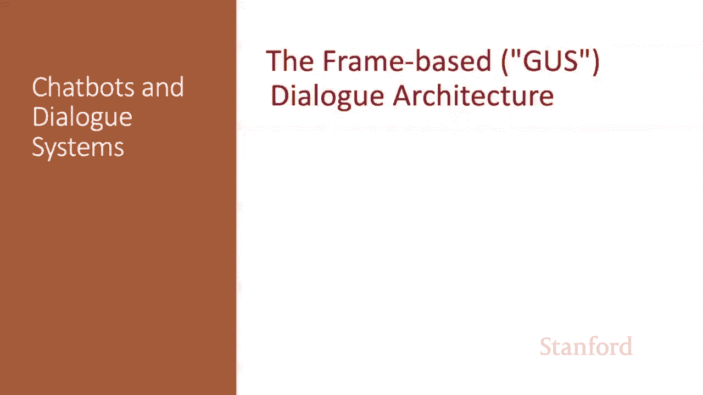
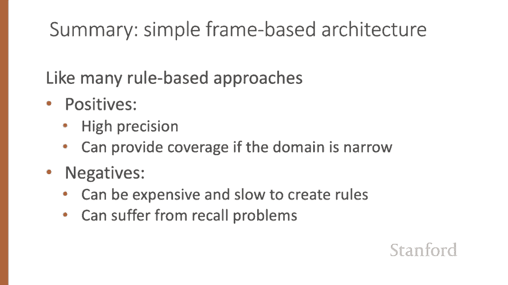
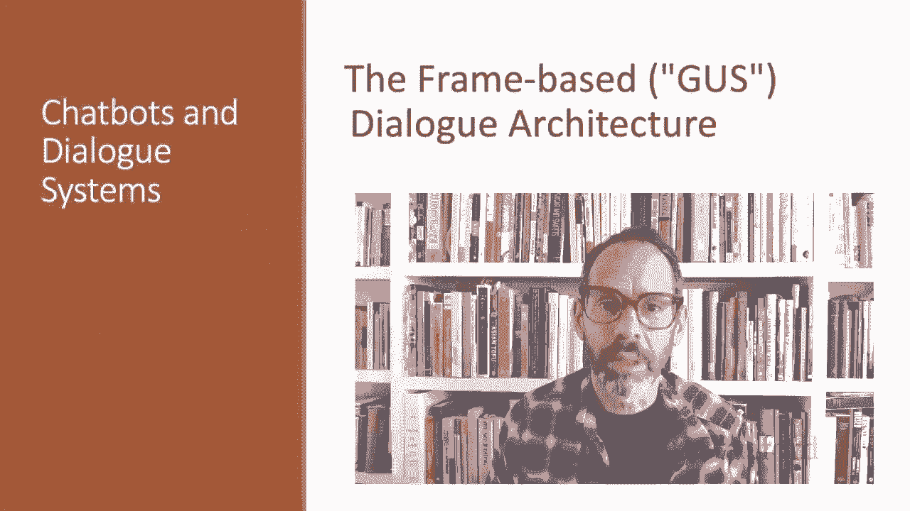

# 67：L11.5 - 基于帧的对话系统架构 🏗️

在本节课中，我们将介绍面向任务的对话系统中，基于帧或GUS的架构。

在面向任务的对话中，对话系统的目标是帮助用户完成某项任务，例如预订机票或购买商品。

此类系统的核心是一种称为“帧”的知识结构，它最早于1977年在具有影响力的GUS系统中被提出。

一个帧代表了系统可以从用户语句中提取的、关于用户意图的部分信息。

它由一组“槽”组成，每个槽可以填入一组可能的值。

这组帧有时被称为领域本体。

一个帧的槽集合规定了系统需要知道哪些信息，以完成该帧所代表的那部分任务。

因此，在预订机票时，我们需要知道航班的出发地、目的地、时间或航空公司。

每个槽的填充值受特定语义类型的约束。例如，一个槽的类型可能是“城市”，因此可以填入“旧金山”或“香港”等值；也可能是“日期”、“航空公司”或“时间”类型。

基于帧的任务对话系统通常有两种基本架构。

最简单的一种经典架构我们称之为“GUS架构”，它得名于提出它的论文。该架构侧重于使用一组手工构建的产生式规则来填充帧和执行动作。它已有40多年历史，但至今仍被大多数工业界的任务型对话代理所使用。

GUS架构的一个扩展，有时被称为“对话状态架构”，在研究系统中更为常见，并且其某些方面正逐渐进入工业系统。

以下是1977年与一个真实GUS系统的对话记录。

PSA和Air California是那个时期的航空公司。

GUS拥有许多复杂的能力，这些能力并非所有基于帧的系统都具备。例如，它处理了指代消解，即像“第一个”这样的表达指代的是“102号航班”。或者，它知道“周五晚上”指的是下一个周五，即可能是5月30日。

在这个例子中，它甚至处理了一个复杂的、隐含的约束：“我必须在上午10点前到达圣地亚哥”。

GUS的控制架构，以某种形式应用于所有现代基于帧的对话系统，如苹果Siri、亚马逊Alexa或谷歌助手，其设计围绕帧展开。

系统的目标是用用户意图的填充值来填满帧中的槽，然后为用户执行相关动作，例如回答问题或预订航班。

为了实现这个目标，系统会向用户提问。系统会为每个帧的每个槽预先指定问题模板，然后根据用户的回答填充槽。

例如，填充出发城市槽的问题可能是：“您想从哪里起飞？”，而用户可能回答：“我想要一张从旧金山到丹佛的单程票，下午5点后出发。”

我们可以从这些信息中填充各种槽。

如果有任何槽未被填满，我们可以继续向用户提问。

一旦帧被填满，我们就可以进行数据库查询，寻找满足用户约束的航班或其他信息。

GUS架构还有附加在模板上的条件-动作规则。例如，一旦用户指定了目的地，附加在机票预订帧的“目的地”槽上的规则可能会自动将该城市作为酒店预订帧的默认入住地点。

或者，如果用户为短途旅行指定了出发日期，系统可以自动填入抵达日期。

许多领域需要多个帧。除了汽车或酒店预订的帧，我们可能还需要包含一般路线信息的帧，用于回答诸如“哪些航空公司从波士顿飞往旧金山”的问题；或者需要包含机票价格惯例信息的帧，用于回答诸如“我必须停留特定天数吗”的问题。

系统必须能够消歧，确定给定的用户输入应该填充哪个帧的哪个槽，然后将对话控制切换到该帧。

在基于帧的架构中，自然语言理解组件的目标是从用户的话语中提取三样东西。

第一个任务是领域分类。例如，用户是在谈论航空、设置闹钟还是在处理日历。当然，对于专注于单一领域的系统，这个分类任务是不必要的，但多领域对话系统是现代标准。

第二个任务是意图确定。用户在该领域中试图完成什么一般性任务或目标。例如，任务可能是“找一部电影”、“显示航班”或“删除日历约会”。

最后，我们需要进行槽填充，从用户的话语中提取特定的槽和填充值，这些是系统根据用户意图需要理解的信息。

因此，从用户的话语“**给我看看周二从波士顿到旧金山的早班航班**”中，系统可能希望构建如下表示：领域是航空旅行，意图是显示航班，并且我们所有的其他槽都已填充。

从“**明天六点叫醒我**”这样的话语中，我们可能判定领域是闹钟，意图是设置闹钟，而时间则给出了实际的槽填充值。

接下来，我们看看如何在GUS架构中进行槽填充。

原始系统中使用的槽填充方法，在工业应用中仍然相当常见，即使用手写规则。这些规则通常作为附加在槽或概念上的条件-动作规则的一部分。例如，我们可以手动定义一个正则表达式来识别“设置闹钟”意图，匹配像“叫醒我”、“设置闹钟”、“叫我起床”这样的短语。

对于生成响应，基于帧的系统倾向于使用基于模板的生成，即向用户说出的句子中的所有或大部分词语都由对话设计者预先指定。

由这些模板创建的句子有时被称为“提示”。

模板可以是完全固定的，例如“**你好，我能帮你什么？**”；也可以包含一些由生成器填充的变量，例如“**您想从`出发城市`什么时间出发？**”或“**您会从`目的地`返回`出发城市`吗？**”。

基于规则的GUS方法在工业应用中非常普遍。与基于规则的信息提取方法一样，它具有高精度的优点。如果领域足够狭窄且有专家可用，也能提供足够的覆盖率。另一方面，手写规则或语法训练起来可能既昂贵又缓慢，并且手写规则可能存在召回率问题。

因此，现代系统倾向于用机器学习来替代许多组件，我们将在下一讲中看到。

基于帧或GUS的架构是大多数现代任务型对话系统的核心。

---

**本节课总结**

在本节课中，我们一起学习了面向任务对话的基于帧（或GUS）的架构。我们了解了“帧”作为核心知识结构，它由一系列“槽”组成，用于捕捉用户意图。我们探讨了经典的GUS架构及其扩展——对话状态架构，并介绍了系统如何通过领域分类、意图确定和槽填充来理解用户输入。最后，我们讨论了基于规则方法的优缺点，并提及了现代系统向机器学习演进的趋势。