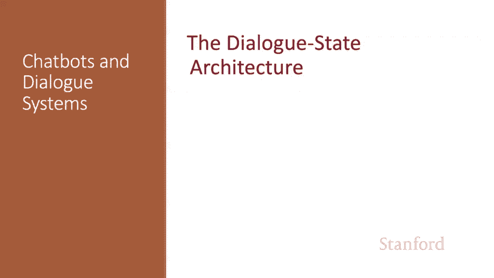
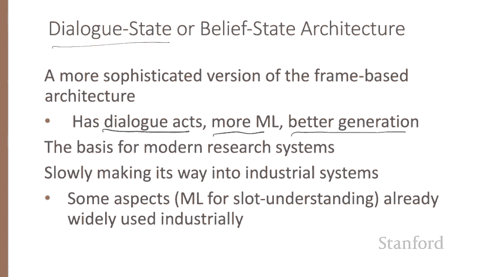
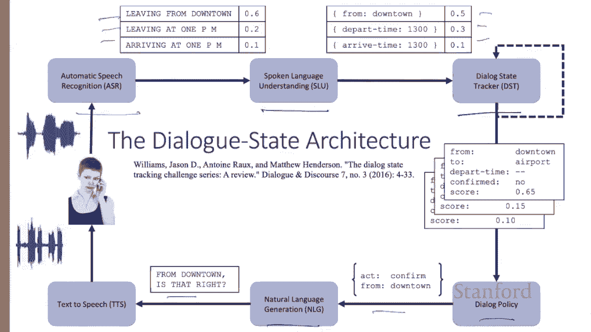
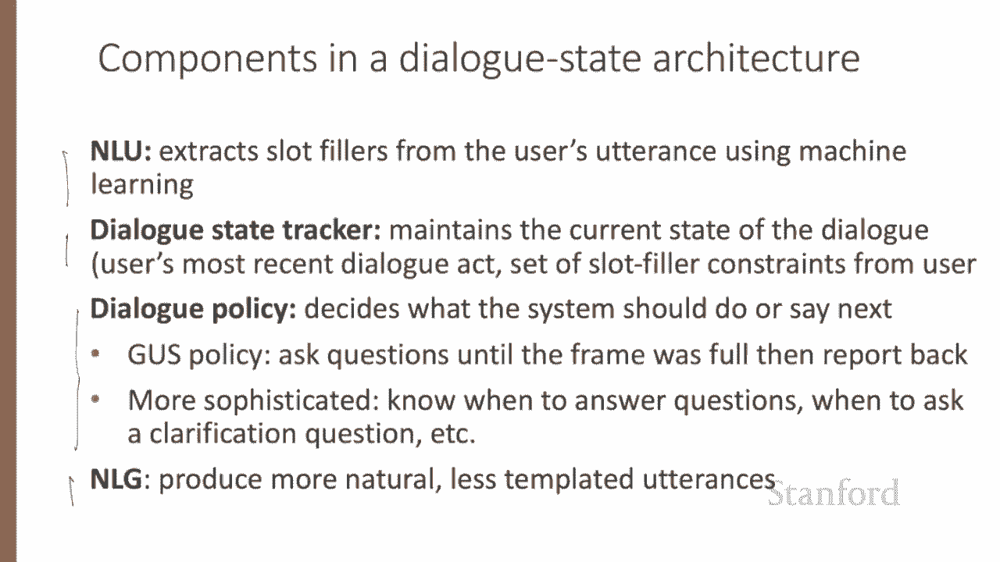
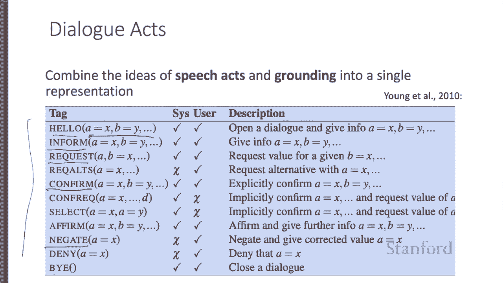
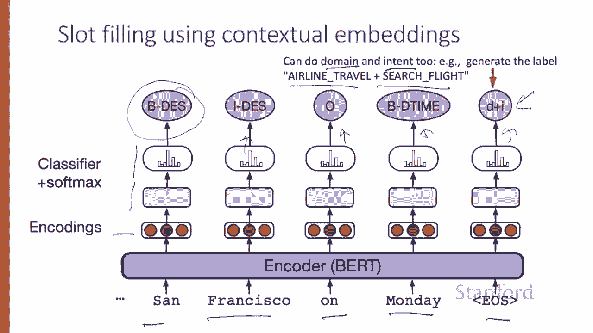
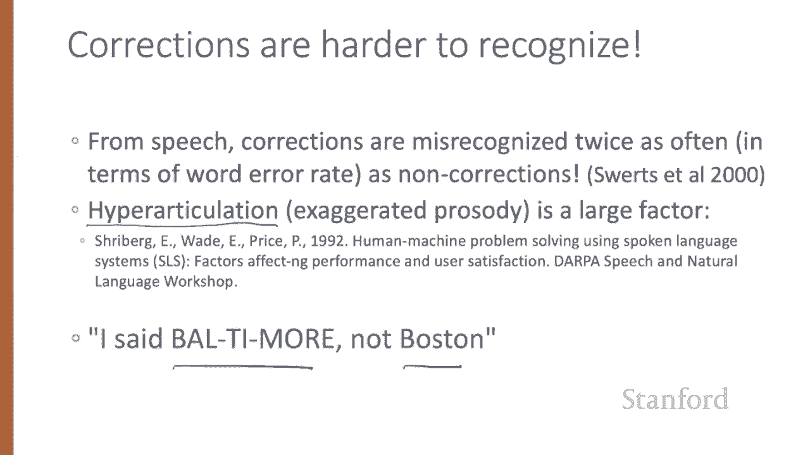
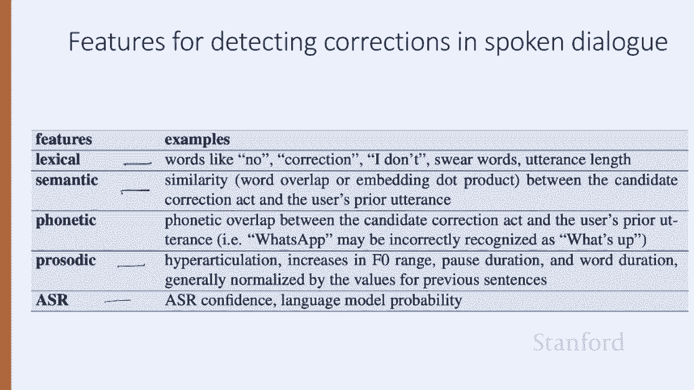
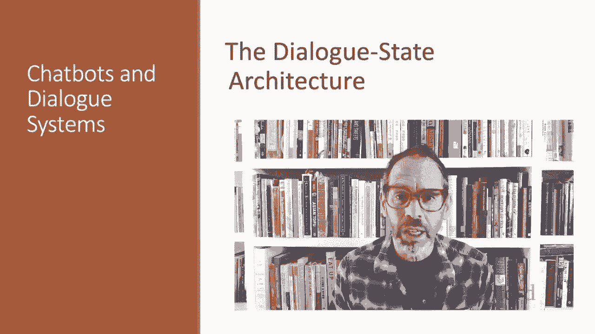

# 68：L11.6 - 对话状态架构 📚 

在本节课中，我们将学习一种基于框架架构的扩展形式，称为对话状态（或信念状态）架构。这是现代面向任务的对话研究系统的基础，它比之前介绍的简单框架架构更为复杂和先进。

## 🏗️ 对话状态架构概述

上一节我们介绍了基础的框架架构，本节中我们来看看其更复杂的演进版本——对话状态架构。

对话状态架构增加了对话行为的概念。与之前介绍的框架架构相比，它倾向于使用更多机器学习方法，并减少了模板化生成。它是大多数现代研究系统的基础，其中像使用机器学习进行语义理解等方面已在工业界得到广泛应用。

## 🔧 典型对话状态系统的组件

以下是典型对话状态系统的六个组件。我们以语音输入为例进行说明。

*   **语音识别**：作为输入，生成一组句子。
*   **理解模块**：接收句子，生成槽位填充信息。
*   **对话状态跟踪器**：存储随时间变化的框架槽位及其填充状态。
*   **对话策略模块**：决定接下来要说什么。
*   **自然语言生成模块**：决定如何措辞。
*   **文本转语音**：如果我们处理的是语音。

## 📝 聚焦文本处理的四个核心组件

本节课我们将聚焦于文本而非语音，重点探讨其中四个核心组件。这些组件比简单的GUS系统更为复杂。

与GUS系统类似，对话状态架构也有一个自然语言理解组件来提取槽位填充信息，但通常使用机器学习而非手写规则。

以下是这四个核心组件的详细说明：

*   **对话状态跟踪器**：维护对话的当前状态，包括用户最近的对话行为以及用户迄今为止表达的所有槽位填充约束。
*   **对话策略**：决定系统下一步应该说什么或做什么。在GUS中，策略很简单：不断提问直到框架填满，然后报告数据库查询结果。但更复杂的对话策略可以帮助系统决定何时回答用户问题、何时提出澄清问题、何时提出建议等。
*   **自然语言生成**：对话状态系统拥有真正的自然语言生成组件。在GUS中，生成器产生的句子都是预先写好的模板。但更复杂的组件可以根据具体上下文生成看起来更自然的对话轮次。

## 💬 对话行为的作用

对话状态系统利用了对话行为。对话行为代表了对话轮次的交互功能，将言语行为和基础共识的概念结合到一个单一的表示中。

不同类型的对话系统需要对不同种类的行为进行标注。因此，定义对话行为具体是什么的标签集往往是为特定任务设计的。

以下是一个餐厅推荐系统的标签集示例：

*   **inform**：告诉别人某事。
*   **request**：提出问题。
*   **confirm**：确认回应。
*   **negate**：表示否定。
*   **hello**：打招呼。
*   **bye**：道别。

每个对话行为都由一组变量进行参数化。

## 🧩 对话行为与槽位填充示例

让我们看一个例子。这里使用相同的标签为HIS系统中的一段示例对话进行标注。

这个例子还展示了每个对话行为的内容，即正在传达的槽位填充信息。用户可能**inform**系统他们想要博物馆附近的意大利菜，或者**request**系统确认价格范围是中等。

同样，系统可以使用对话行为，例如**affirm**向用户确认名为“Roma”的餐厅价格范围是中等。

## 🤖 槽位填充的机器学习方法

槽位填充以及更简单的领域和意图分类任务，通常通过监督式语义解析来解决。我们有一个训练集，将每个句子与其正确的含义关联起来。

输入可能由“I want to fly to San Francisco on Monday, please”这样的句子组成，输出则是带有填充值的两个槽位：`destination=SF` 和 `departure_time=Monday`。给定大量此类带标签的句子，我们可以构建一个分类器来进行映射。

构建此类分类器的一个标准范式是**BIO标注**。在BIO标注中，我们为每个槽位标签的开始和内部引入一个标签，并为所有不在任何槽位标签内的词元引入一个“外部”标签。

我们的训练数据现在将是句子与BIO标签序列的配对。例如，“outside, outside, B-destination, I-destination, B-departure_time, I-departure_time”等。

## 🧠 槽位填充的模型架构

给定这个训练数据，以下是一个简单的槽位填充架构：

1.  输入是一系列词 `W1` 到 `WN`。
2.  通过上下文嵌入模型传递，以获得上下文词表示。
3.  接着是一个前馈层。
4.  然后在每个词元位置上对可能的BIO标签进行softmax操作。

因此，输出将是每个输入词元的一系列BIO标签。

我们还可以通过将领域分类和意图提取任务与槽位填充结合起来，只需将领域与意图拼接起来，作为最终EOS（句子结束）标记的期望输出。因此，这个架构将使用BIO标注范式完成槽位填充、领域和意图分类。

## 📊 对话状态跟踪器的任务

一旦我们训练好BIO标注器，就可以在输入句子上运行它，然后为每个槽位提取填充字符串。例如，对于目的地槽位，我们有开始和内部标签，所以得到“San Francisco”，然后我们可以将其规范化为某种正确形式（例如，通过同义词词典将“San Francisco”等同于“SFO”）。

对话状态跟踪器的任务是确定框架的当前状态（即每个槽位的填充值）以及用户最近的对话行为。

因此，对话状态不仅包括当前句子中的槽位填充信息，还包括此时框架的整个状态，总结了用户的所有约束。例如，用户说“I‘m looking for a cheaper restaurant”，我们得到用户inform了`price=cheap`。然后用户额外告诉我们他们想要“Thai food near downtown”，但我们的状态包含了之前已知的他们想要便宜的信息。在用户问“where is it?”之后，当前状态是：用户发布了这些特定约束，并且进一步请求了地址。

## 🔗 对话行为检测与槽位填充的联合任务

由于对话行为对槽位和值施加了一些约束，对话行为检测和槽位填充的任务通常是联合执行的。

考虑确定“I‘d like Cantonese food near the mission district”具有结构`food=Cantonese`和`area=mission`的任务。在这种情况下，对话行为解释（从任务对话行为集中选择`inform`）是通过在手动标注的对话行为上训练的监督分类来完成的，基于当前句子和先前对话行为的嵌入来预测对话行为标签。

因此，最简单的对话状态跟踪器可能只是在每个句子之后，将此与槽位填充序列模型的输出结合起来。

## 🛠️ 处理用户纠正行为

一些对话行为因其对对话控制的影响而显得重要。如果对话系统错误识别或误解了话语，用户通常会通过重复或重新表述来纠正错误。因此，检测这些用户纠正行为非常重要。

具有讽刺意味的是，在口语对话中，纠正实际上比正常句子更难识别。事实上，在一个早期的对话系统中，纠正的词语错误率是非纠正句子的两倍。

造成这种情况的一个原因是，说话者有时会使用一种特定的韵律风格进行纠正，称为**超清晰发音**，其中话语具有夸张的能量、时长或音高轮廓（例如，“I said Baltimore, not Boston”）。

## 🎯 检测纠正行为的特征

用户纠正往往是精确重复或省略一个或多个词的重复，尽管它们也可能是原始句子的释义。

检测这些重新表述或纠正行为可以是通用对话行为检测分类器的一部分，也可以利用一些额外特征：

*   如果我们有语音，可以使用来自语音识别器的置信度值。
*   可以使用来自韵律的超清晰发音测量。
*   可以使用词汇特征，如“no”、“negative”和表示愤怒的词语。
*   可以查看每个句子之间的意义重叠。

## 📖 本节课总结

本节课我们一起学习了对话状态架构的理解组件，包括槽位填充、对话行为以及对话状态跟踪。我们了解了如何使用BIO标注和机器学习模型来实现语义解析，并探讨了处理用户纠正的重要性。

在下一讲中，我们将继续讨论对话状态架构中的策略和生成组件。