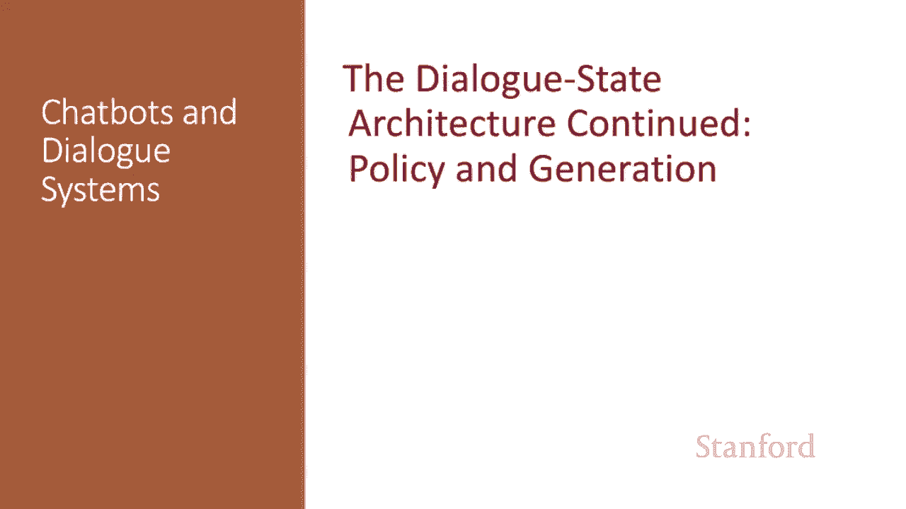
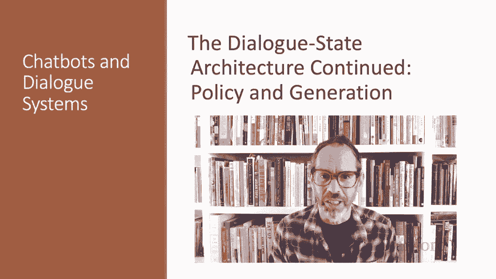
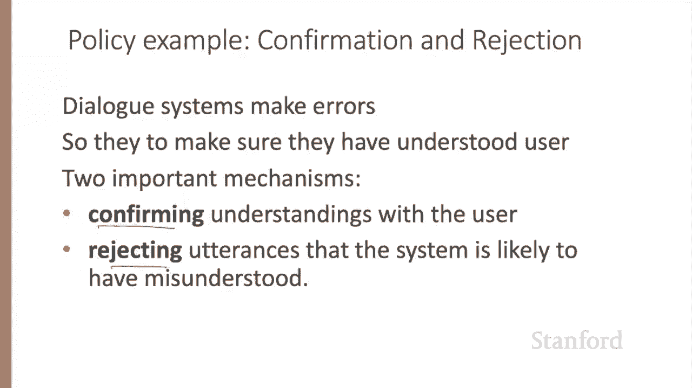
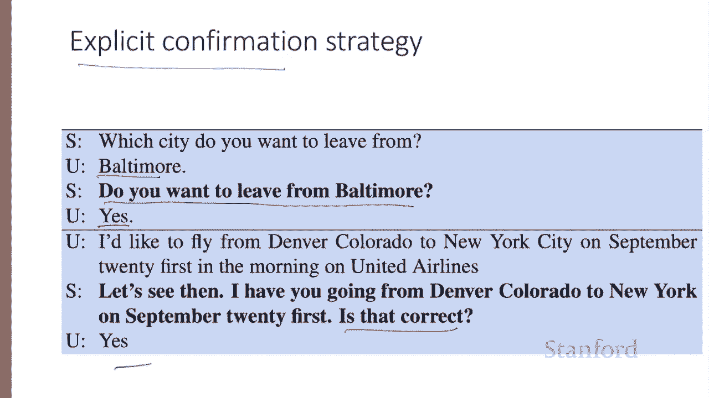
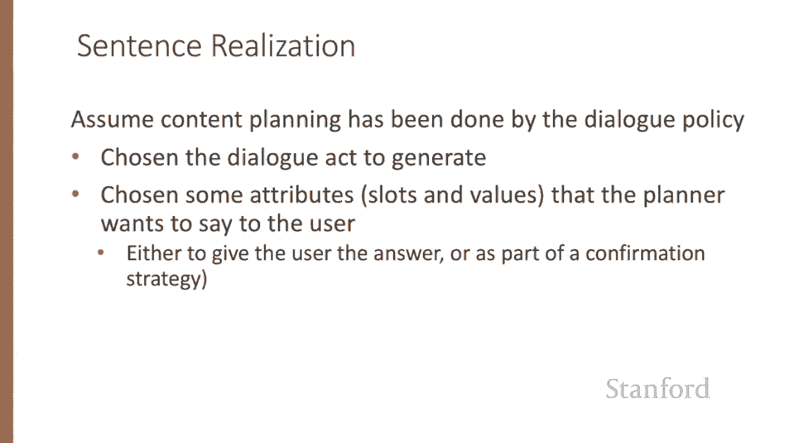
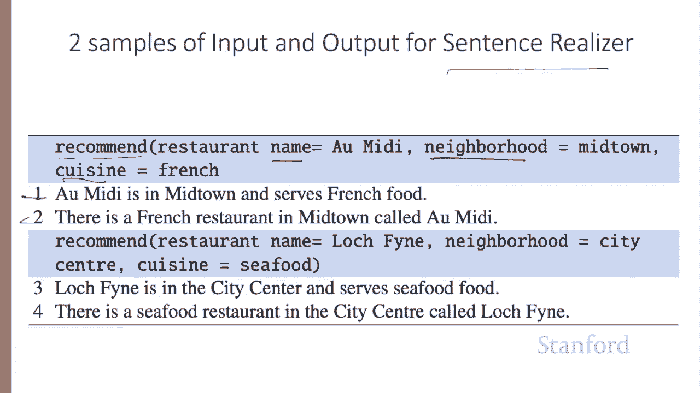
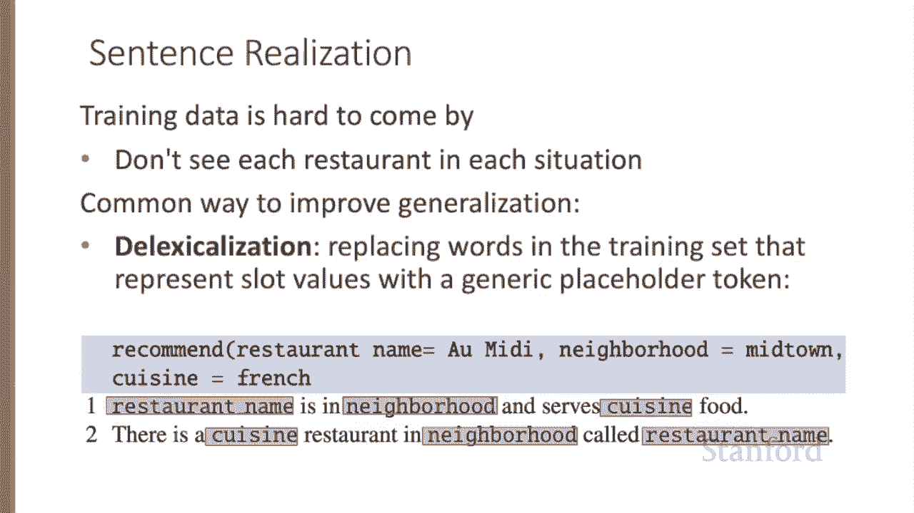
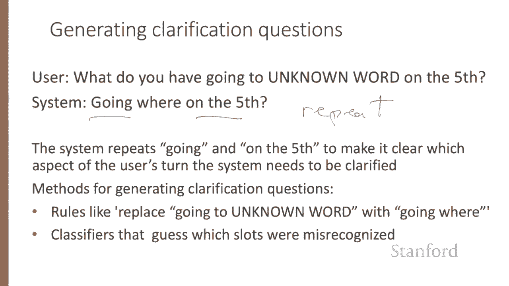
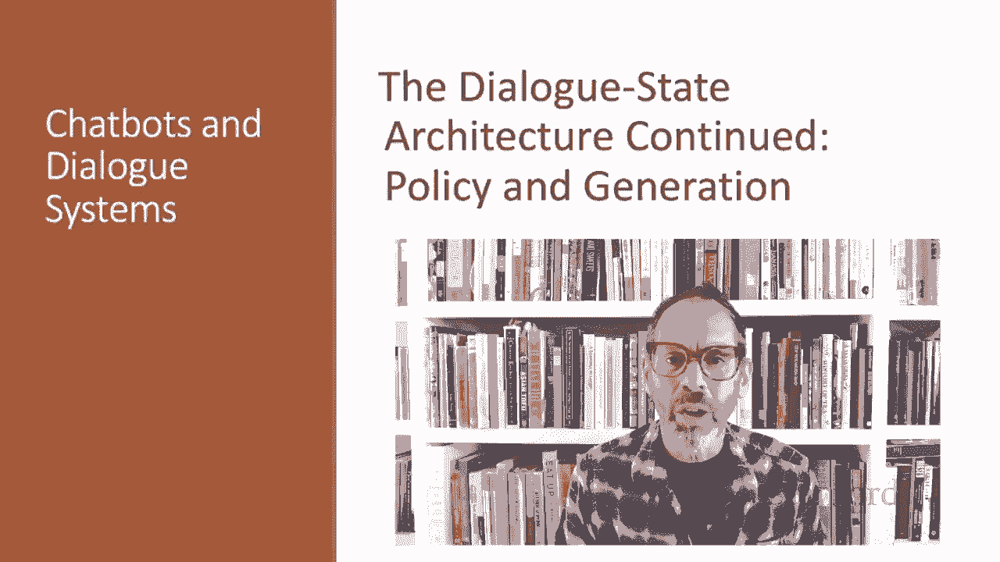

# 69：L11.7 - 对话状态架构：规则与泛化 🗣️➡️🤖





在本节课中，我们将要学习对话系统中的两个核心组件：**对话策略**（决定说什么）和**自然语言生成**（决定怎么说）。我们将探讨如何基于对话状态做出决策，以及如何将抽象的对话动作转化为用户能理解的自然语言句子。

---

## 对话策略：决定下一步行动 🎯

上一节我们介绍了对话状态的概念，本节中我们来看看如何利用它来决定系统的下一步行动。

对话策略的目标是决定系统下一步应该采取什么行动。更正式地说，在对话的第 `I` 轮，我们希望基于整个对话状态来预测系统应采取的动作 `a_sub_I`。

这里的“状态”可以指代系统和用户之间所有对话动作的完整序列。任务就是计算所有可能的下一个动作中，概率最高的那个动作的 `arg max`。

**公式**：`a_I = argmax_a P(a | 对话历史状态)`

我们可以通过维护一个简化的**对话状态**来简化这个问题，这个状态主要指用户已表达的**槽位填充信息集合**。这样，我们就不需要基于整个历史状态，而只需基于当前框架状态、系统上一轮说的话和用户上一轮说的话来做决策。



**公式**：`a_I = argmax_a P(a | 当前槽位状态, 上一轮系统动作, 上一轮用户动作)`

这些概率可以通过一个神经网络分类器来估计，该分类器使用槽位填充信息的神经表示（例如，话语中词跨度的表示或上下文嵌入计算的句子嵌入）。

---



## 确认与拒绝：确保正确理解 ✅❌

现代对话系统经常出错，因此确保系统获得正确理解至关重要。这通常通过两种方法实现：向用户确认理解，以及拒绝系统可能误解的话语。

以下是两种主要的确认策略：

*   **显式确认**：系统直接向用户提问以确认理解。
    *   用户说：“Baltimore。”
    *   系统说：“Do you want to leave from Baltimore?”（你想从巴尔的摩出发吗？）
    *   用户说：“Yes.”
*   **隐式确认**：系统通过复述其理解来作为“接地”策略的一部分，通常是在问下一个问题时。
    *   用户说：“I want to travel to Berlin.”（我想去柏林旅行。）
    *   系统说：“When do you want to travel to Berlin?”（你什么时候想去柏林？）

显式和隐式确认各有优缺点。显式确认更容易纠正系统的错误识别，但会使对话显得不自然且冗长。隐式确认则更符合自然的对话习惯。

除了确认，另一种表达不理解的方式是**拒绝**。系统会提示用户，例如：“I‘m sorry. I didn’t understand that.”（抱歉，我没听懂。）

当话语被多次拒绝时，可能意味着用户使用了系统无法理解的语言。因此，系统通常会采用**渐进式提示**或**升级细节**的策略。例如，系统没有理解用户的长句，它不会只是重复问题，而是会给出更具体的指导，告诉用户如何组织系统能理解的话语。

---

## 利用丰富特征优化策略决策 🔧

除了对话状态表示，系统还常利用其他丰富特征来制定策略决策。

例如，自动语音识别系统为话语分配的**置信度**可以用来决定是否进行显式确认。系统可以设定多个置信度阈值。

**伪代码示例**：
```python
if asr_confidence < alpha:
    reject()
elif asr_confidence < beta:
    confirm_explicitly()
elif asr_confidence < gamma:
    confirm_implicitly()
else:
    # 高度确信，无需确认
    proceed()
```

另一个常见特征是**错误成本**。例如，在预订航班或转账等关键操作前，通常会进行显式确认。

---

## 自然语言生成：从动作到句子 ✍️

一旦策略决定了要生成什么对话动作，自然语言生成组件就需要生成回应用户的文本。



在信息状态架构中，自然语言生成通常被建模为两个阶段：**内容规划**（说什么）和**句子实现**（怎么说）。这里，我们假设内容规划已由对话策略完成，它选择了要生成的对话动作以及一些属性（如槽位和值）。

以下是句子实现阶段的输入输出示例。内容规划器选择了对话动作 `recommend` 以及特定的槽位（餐厅名、街区、菜系），句子实现器的目标是生成像示例1或2那样的句子。



---

## 提升泛化能力：去词汇化 🧩

然而，训练数据很难获取，我们不太可能在大量标注对话中看到每个可能的餐厅及其所有属性以不同措辞表达的句子。

因此，在句子实现中，常通过**去词汇化**来增加训练样本的泛化能力。去词汇化是将训练集中代表槽位值的特定词语，替换为代表该槽位的通用占位符标记的过程。



我们可以将上述两个句子去词汇化，把 “Omidi”、“midtown” 和 “French” 替换为占位符。

现在，从框架到去词汇化句子的映射可以通过在大型手工标注的任务型对话语料库上训练的**编码器-解码器模型**来完成。编码器的输入是代表对话动作及其参数的标记序列。解码器输出去词汇化的英语句子。然后，我们可以使用来自内容规划器的输入框架进行**再词汇化**，将占位符替换回具体的值。

---

## 针对特定动作的生成算法 🎯

也可以设计针对特定对话动作的自然语言生成算法。例如，考虑在语音识别未能理解用户话语的某些部分时，生成澄清问题的任务。

虽然可以使用通用的拒绝对话动作，如“请重复”或“我不理解”，但我们也可以采取更有针对性的方法。例如，系统可以复述“going”和“on the fifth”这两个词，以明确需要澄清用户话语的哪个方面。这种有针对性的澄清问题可以通过规则（例如，将“going to [未知词]”替换为“going where?”）或通过构建分类器来猜测句子中哪个槽位可能被误识别来创建。

---

## 总结 📚





本节课中，我们一起学习了对话状态架构的核心部分。我们探讨了**对话策略**如何基于简化状态和丰富特征（如ASR置信度）来决定下一步行动。我们了解了通过**显式/隐式确认**和**拒绝**策略来确保理解正确性。最后，我们学习了**自然语言生成**如何将抽象的对话动作转化为自然语言，并通过**去词汇化**和**编码器-解码器模型**来提升生成句子的泛化能力和流畅性。这些组件共同构成了一个能够进行有效、鲁棒对话的系统基础。