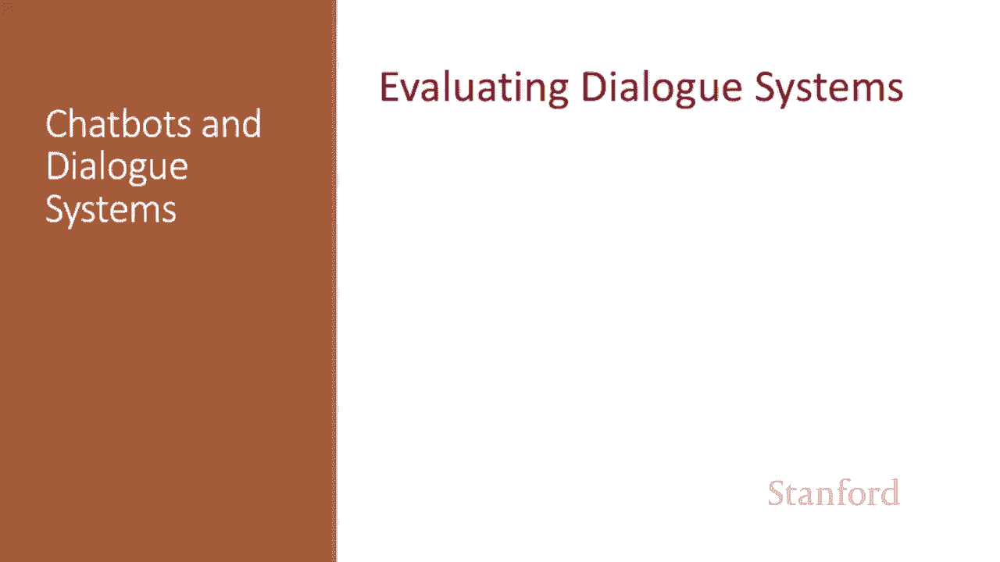
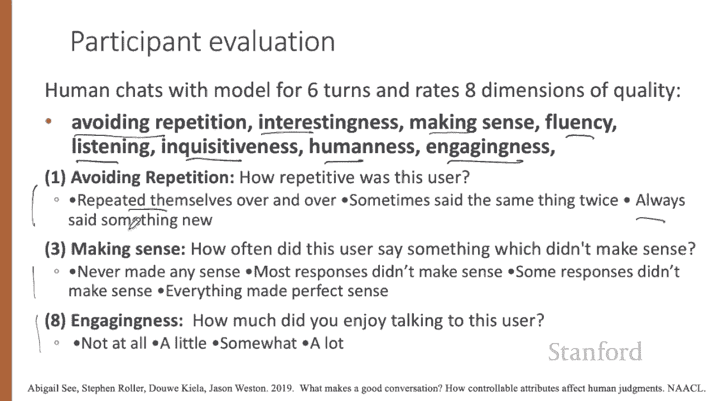
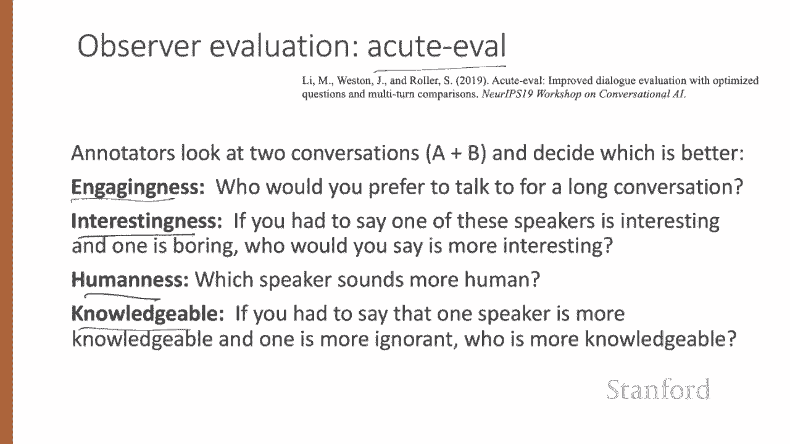
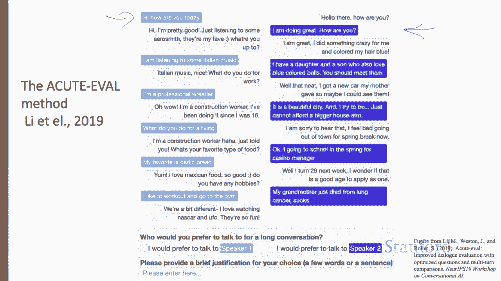
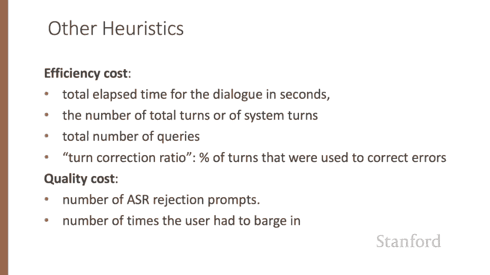

# 70：L11.8 - 评估对话系统 📊

在本节课中，我们将学习如何评估对话系统。我们将探讨如何判断一个对话系统是否成功实现了其目标，并分别介绍聊天机器人和任务型对话系统的评估方法。

## 聊天机器人的评估方法 🤖

上一节我们介绍了对话系统评估的总体目标，本节中我们来看看如何具体评估聊天机器人。聊天机器人的主要目标是让人感到愉悦，因此其评估主要依赖人工进行。

以下是两种主要的人工评估方法：

**参与者评估**：由与聊天机器人直接对话的用户进行评分。

**观察者评估**：由第三方评估员阅读人机对话的文本记录后进行评分。

在C等人使用的参与者评估中，人类评估者与模型进行六轮对话，并在八个维度上使用李克特量表对聊天机器人进行评分。这些维度包括对话质量、避免重复、趣味性、合理性、流畅性、倾听能力、好奇度、拟人度和吸引力。

下图展示了其中三个维度的李克特量表示例，例如评估对话的重复程度。

观察者评估使用第三方标注员查看完整对话的文本。有时我们关注让评估员为系统的每一轮回复打分，例如评估每一轮对话的连贯性。然而，更多时候我们只需要一个高层次的总分来比较系统A和系统B的优劣。

“急性评估指标”就是这样一种观察者评估方法。标注员查看两段独立的人机对话，然后选择其中对话系统表现更好的一段，并回答关于四个属性的问题：吸引力、趣味性、拟人度和知识性。

下图展示了急性评估标注任务的示例，比较两个对话并选择表现更好的系统。

像BLEU分数这类用于评估机器翻译的自动评估指标，通常不用于聊天机器人，因为BLEU分数与人类对聊天机器人的判断相关性很差。开发可能的自动评估指标是一个开放的研究问题。

一种新颖的范式称为“对抗性评估”，其灵感来源于图灵测试。其思想是训练一个类似图灵测试的评估分类器，以区分人类生成的回复和机器生成的回复。一个回复生成系统越能成功“欺骗”评估器，该系统就越好。

## 任务型对话系统的评估方法 🎯

了解了聊天机器人的评估后，我们来看看任务型对话系统如何评估。如果任务目标明确，我们可以简单地衡量绝对任务成功率。例如，系统是否预订了正确的航班或在日历上添加了正确的事件？

更细粒度一点，我们可以测量**槽位错误率**，即填充了错误值的槽位百分比。其计算公式为错误槽位数除以总槽位数。

考虑一个系统处理以下句子：“在Gates 104与Chris预约10:30的会议”，并提取出以下候选槽位结构：`person: Chris, time: 11:30, room: gates 104`。这里，槽位错误率是三分之一，因为时间错了。

除了错误率，也可以使用槽位精确率、召回率和F1分数。槽位错误率有时也被称为概念错误率。

我们既可以衡量任务成功率，也可以计算槽位错误率。

为了更细致地了解用户满意度，我们还可以计算用户满意度评分。即让用户与对话系统交互完成任务，然后填写问卷。

以下是一些示例问题。可以将回答映射到相同范围，然后对所有问题的得分取平均，得到总的用户满意度评分。

我们还可以测量其他因素，例如通过对话总耗时（秒）、总对话轮数或系统对话轮数来衡量效率。

质量成本衡量影响用户对系统感知的其他交互方面。其中一个衡量指标是系统未能返回任何句子的次数，或系统发出拒绝提示的次数。

类似的指标还包括用户不得不打断系统的次数。

## 总结 📝

本节课中，我们一起学习了评估对话系统的标准方法。我们介绍了聊天机器人主要依赖人工评估（参与者评估和观察者评估），而任务型对话系统则可以通过任务成功率、槽位错误率、用户满意度问卷以及效率和质量成本等指标进行更量化的评估。

