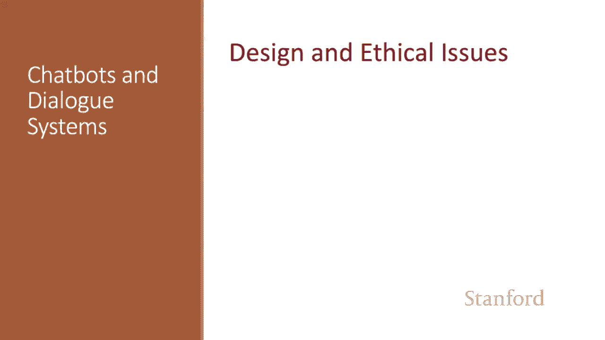
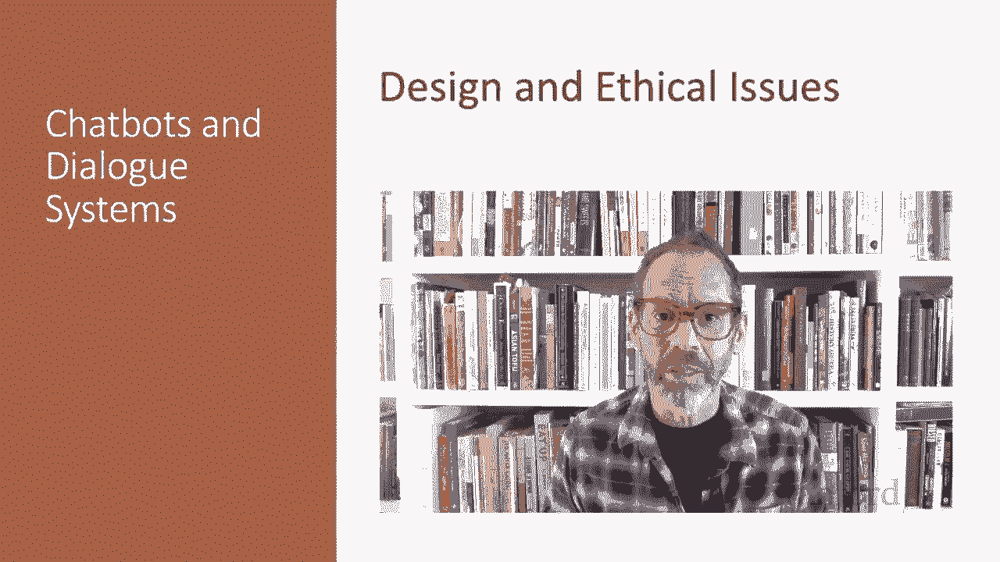
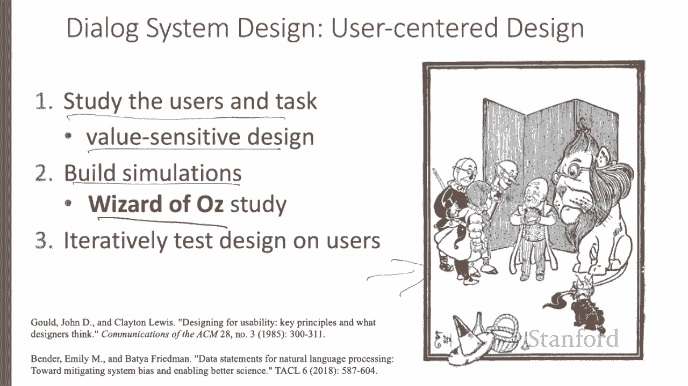
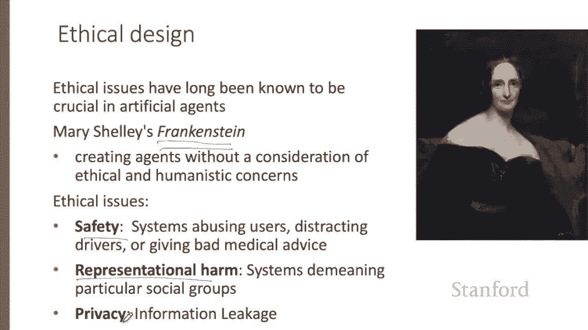
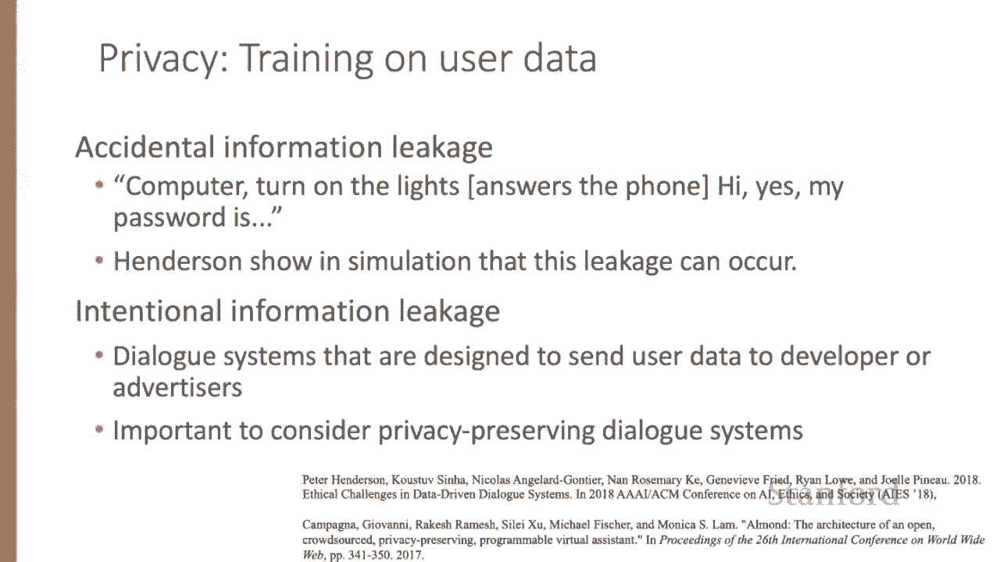
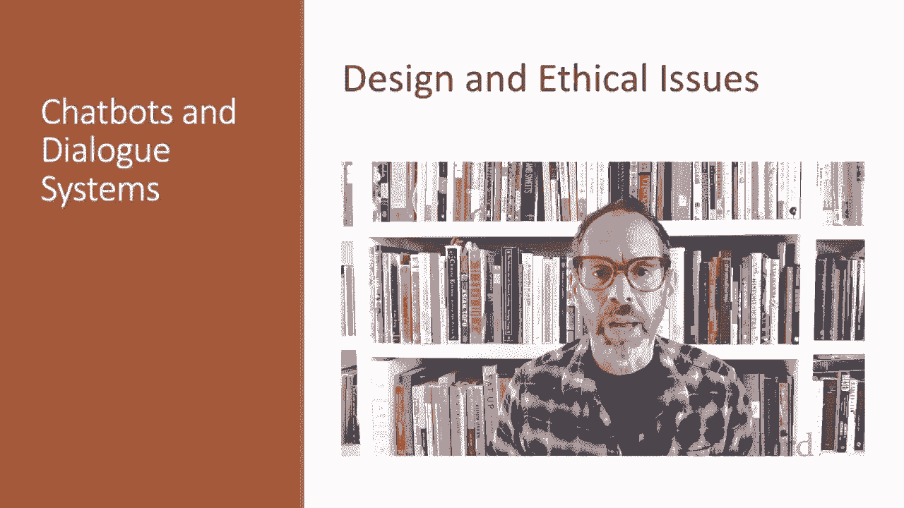

# 71：L11.9 - 对话系统设计方式与道德问题 👥⚖️

在本节课中，我们将要学习对话系统的设计流程，并探讨与之相关的关键道德问题。对话系统的设计不仅关乎技术实现，更与用户体验、社会影响和伦理责任紧密相连。

## 用户中心设计原则 🎯

上一节我们介绍了对话系统的重要性，本节中我们来看看其核心设计方法。与语音和语言处理的大多数其他领域相比，用户在对话系统中扮演着更重要的角色。对话设计与**人机交互**领域密切相关。

对话系统的设计遵循用户中心设计原则。以下是其核心步骤：

首先，研究用户及其任务。这包括通过用户访谈或调查类似系统，来理解潜在用户和任务本质。在此过程中，融入**价值敏感设计**至关重要，即在设计过程中仔细考虑最终系统可能带来的益处、危害以及相关利益方。

其次，构建模拟和原型。以下是关键工具：
*   **Wizard of Oz 系统**：在这种系统中，用户以为自己正在与一个软件代理交互，但实际上是由隐藏在软件界面后的人类“巫师”操控的。该名称来源于童话故事《绿野仙踪》，其中的巫师最终被发现只是幕后之人控制的模拟。

最后，我们需要在用户身上迭代测试设计。

## 对话系统中的道德问题 ⚖️

了解了设计流程后，我们转向一个同样重要的维度：道德考量。道德问题在人工智能代理中一直至关重要。玛丽·雪莱在200多年前的《弗兰肯斯坦》中首次提出了这些问题，引发了在不考虑伦理和人文关怀的情况下创造代理的思考。

在众多具有道德维度的问题中，以下三点尤为关键：
*   **安全性**：我们不希望驾驶员因为与聊天机器人交谈而分心导致车祸。
*   **代表性伤害**：我们不希望系统贬低特定的社会群体。
*   **隐私性**：我们不希望系统泄露私人信息。

## 具体道德挑战与案例 🔍

现在，让我们具体看看这些道德挑战在实际中如何体现。

安全性在对话系统进入现实世界时变得非常重要。如果我们为心理健康构建聊天机器人，避免说错话是极其重要的。如果我们构建用于与车内人员交谈的聊天机器人，它必须能感知环境和驾驶员的注意力水平。

一个广为人知的滥用和代表性伤害案例是微软2016年的Tay聊天机器人。该机器人被设定为一个非正式交流的年轻女性人格，并设计为通过互动向用户学习。结果，Tay开始发布带有种族歧视言论、阴谋论和人身攻击用户的信息，并在16小时后被下线。这个案例表明，通过原型设计来建模用户响应至关重要。

这类滥用问题也存在于训练大多数对话系统的数据集中。Henderson等人发现，许多标准对话训练集以及基于它们训练的对话模型中，都存在仇恨言论的偏见。

最后，隐私性非常重要，尤其是对于无处不在的对话系统。Henderson等人表明，任何对话系统都可能意外泄露密码等信息。许多对话系统还存在有意向企业开发者或广告商发送信息的有意泄露。Compan等人表明，设计保护隐私的对话系统是可能的。

## 总结 📝

本节课中我们一起学习了对话系统的设计流程与核心道德问题。设计对话系统时，遵循用户中心原则，通过研究用户、构建原型和迭代测试来优化体验。同时，必须时刻将用户和潜在危害放在心上，严肃对待安全性、代表性伤害和隐私性等伦理挑战，以确保技术发展与社会责任并重。