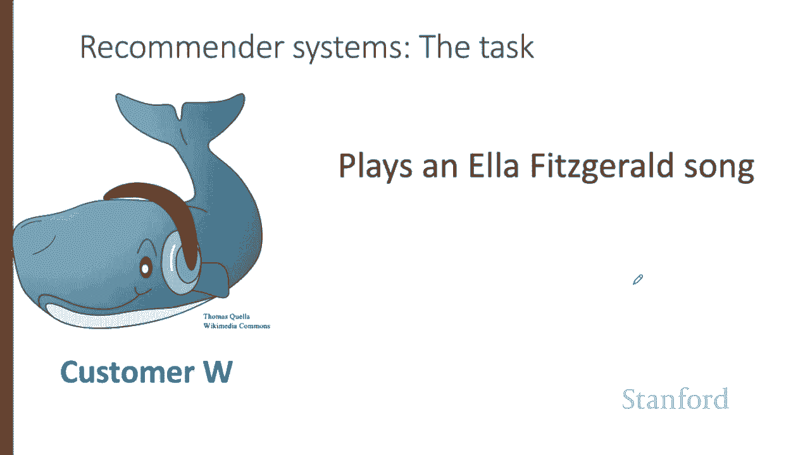
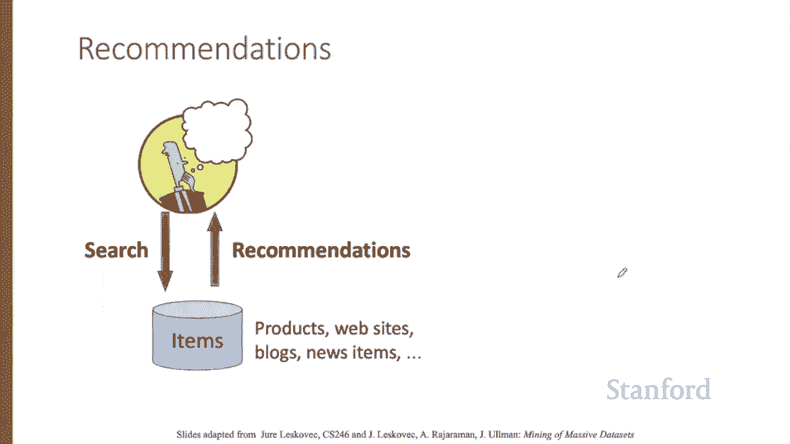
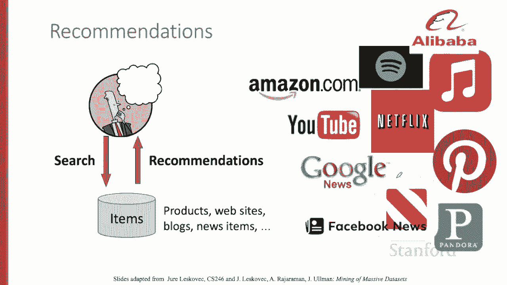
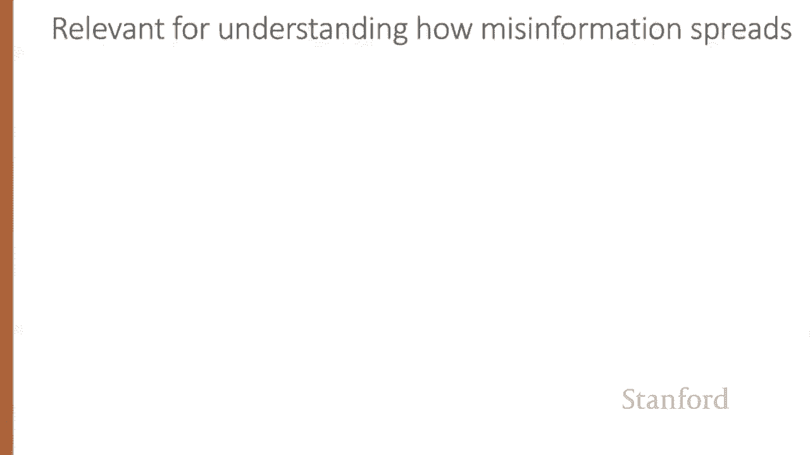
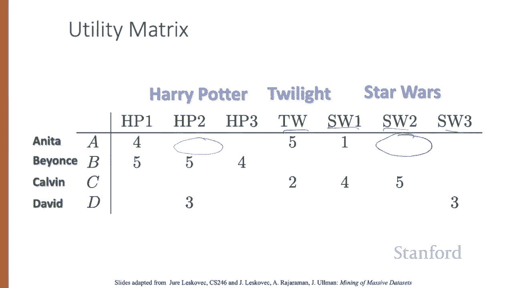
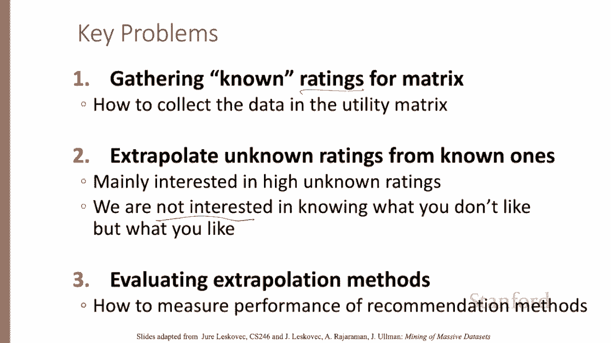
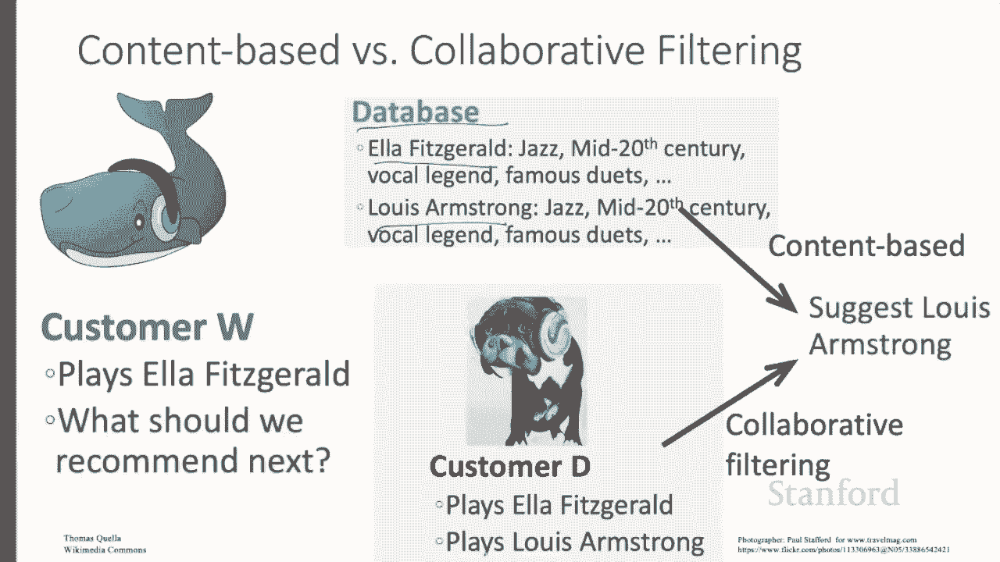

# 72：L12.1 - 推荐系统介绍 🎯

在本节课中，我们将介绍推荐系统任务及其核心算法——协同过滤。我们将从推荐系统的应用场景开始，逐步深入到其形式化模型和主要方法。

## 推荐系统任务示例

上一段我们提到了推荐系统，现在来看一个具体例子。顾客 W 正在播放 Ella Fitzgerald 的歌曲。

我们应该接下来为他推荐什么？推荐系统任务的常见设定是：用户正在搜索某物（可能是一件产品、一条新闻或一个网站），而系统返回推荐结果。

事实证明，这是一个巨大的应用领域，每天有数十亿人使用。例如，亚马逊或阿里巴巴等产品销售商，苹果、Facebook、谷歌等新闻聚合网站，YouTube 或 Bilibili 等视频网站，以及 Netflix、Spotify、Apple Music 等提供点播电影或音乐的服务商。

## 推荐方式概览

当然，推荐可以通过多种方式实现。以下是几种常见方式：

*   有人可以策划一份喜爱列表，或某个平台可以发布一份必备物品列表。
*   我们可以依赖用户数据，但通过简单的聚合方式，如前十名列表或最受欢迎列表。
*   然而，我们今天将重点关注的，是这里的第三种方法：为个体用户量身定制推荐。

了解这些个性化推荐系统的工作原理，对于构建实用的新闻或产品推荐器至关重要。同时，这些系统也涉及伦理层面，推荐系统可能传播错误信息和极端观点。

要解决这个问题，需要理解它们的工作原理。

## 形式化模型

现在，让我们来看一个形式化模型。我们将有用户和物品。

用户对某些物品有偏好，这用一个效用矩阵来表示。该矩阵为每个用户-物品对提供一个值，代表我们已知的该用户对该物品的偏好程度。

值来自一个有序集合。例如，1到5的整数，代表用户为该物品给出的星级评分。

该矩阵是稀疏的，意味着大多数条目是未知的。我们对该用户对该物品的偏好没有明确信息。

以下是一个效用矩阵示例，代表用户 Anita、Beyonce、Calvin 和 David 对电影的评分，范围为1到5，5为最高分。空白处代表用户未对该电影评分的情况。

电影名称是《哈利波特》1、2、3，《暮光之城》和《星球大战》1、2、3。

推荐系统的目标是预测效用矩阵中的空白。例如，Anita 会喜欢《星球大战2》吗？

在这些课程中，我们将讨论该领域的三个关键问题。首先，我们需要获取评分。

其次，今天的主要问题是预测未知评分。

请注意，我们不需要预测效用矩阵中的每一个空白条目。我们只需要找到每一行中可能较高的某些条目。换句话说，我们不关心推荐用户可能讨厌的东西。

最后，我们需要某种评估方式。

## 如何获取评分？

我们如何获取评分？我们可以直接明确地询问人们（自愿或付费），这在某些任务中可能有帮助。

但更多时候，我们依赖隐式信号，从用户行为中学习评分。如果有人购买了一本书、选择了一首歌或看完了一个 YouTube 视频，那就暗示它应该有一个高评分。

这不是一个完美的解决方案。也许你看了视频但讨厌它，或者你买了东西但讨厌它。尽管如此，这是一个合理的启发式方法。

请注意，这种评分系统实际上只有一个值。1 表示用户喜欢该物品，仅此而已。因此，我们经常会看到带有此类数据的效用矩阵，用零而不是空白表示，但重要的是要记住，零并不比一的评分低，它根本就是没有评分。

效用矩阵非常非常稀疏，大多数人没有对大多数物品进行评分。

我们将看到所谓的冷启动问题：新物品没有评分，新用户没有历史记录。

有时，如果你注册一个音乐网站，他们会问你一些问题，比如你喜欢什么流派，以帮助缓解冷启动问题。这增加了用户留存率，但风险是让用户做额外的事情。

## 推荐系统的主要方法

推荐系统主要有三种方法。我们将讨论基于内容的系统和协同过滤系统。我们将非常简要地提及更现代的第三种架构：基于神经嵌入的潜在系统。

让我们直观地看看基于内容的推荐和协同过滤推荐之间的区别。

这是顾客 W，正在播放 Ella Fitzgerald 的歌曲。接下来应该为他播放什么？这里有一个信息来源：一个歌曲或音乐家具有内容特征的数据库。我们知道 Ella Fitzgerald 是 20 世纪中期的爵士乐传奇歌手，录制了许多著名的二重唱。

嗯，这些内容特征告诉我们 Louis Armstrong 也是 20 世纪中期的爵士乐传奇歌手，录制了许多著名的二重唱。让我们推荐 Louis Armstrong。这被称为基于内容的推荐。

另一个信息来源来自顾客 D，他也播放了 Ella Fitzgerald 的歌曲，但也播放了 Louis Armstrong。因此，我们可能也会向顾客 W 推荐 Louis Armstrong。

依赖其他用户选择信息的系统被称为协同过滤推荐系统。

我们已经介绍了推荐系统的概念，现在让我们看一些细节。

## 总结

本节课中，我们一起学习了推荐系统的基本概念。我们了解了推荐系统的广泛应用场景，学习了其形式化模型——以用户和物品构成的稀疏效用矩阵。我们还探讨了获取评分的不同方式（显式与隐式），并简要对比了基于内容的推荐与协同过滤推荐这两种核心方法的原理。在接下来的课程中，我们将深入探讨协同过滤算法的具体实现。