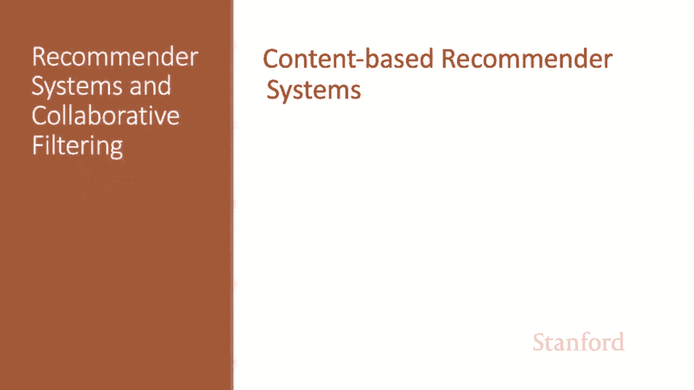
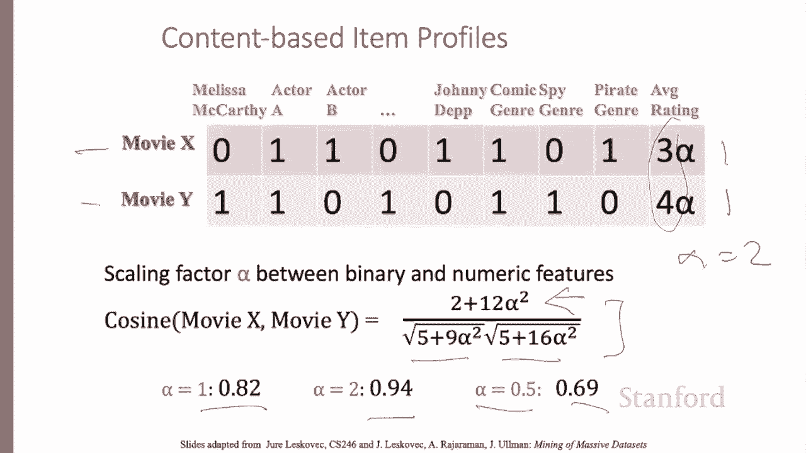
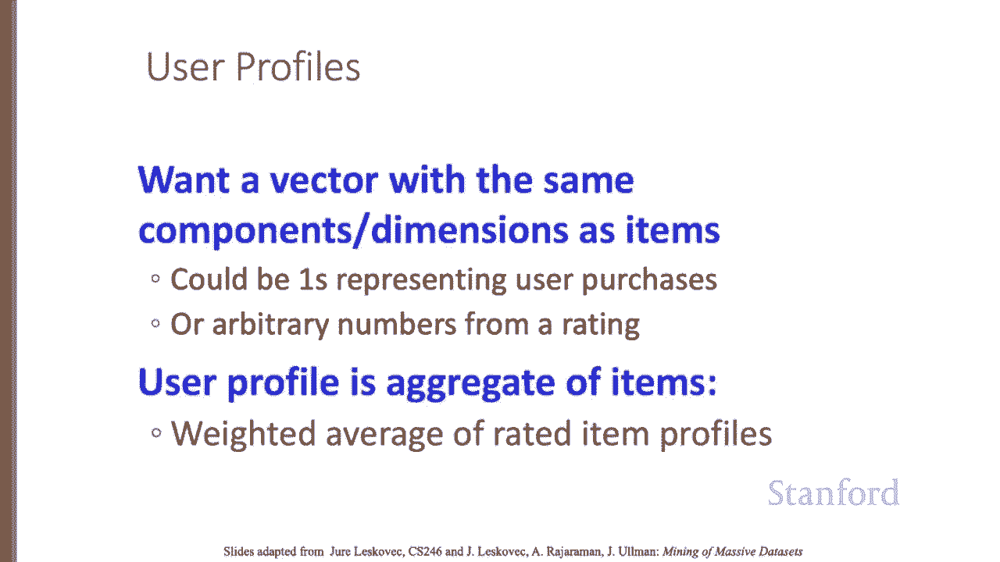
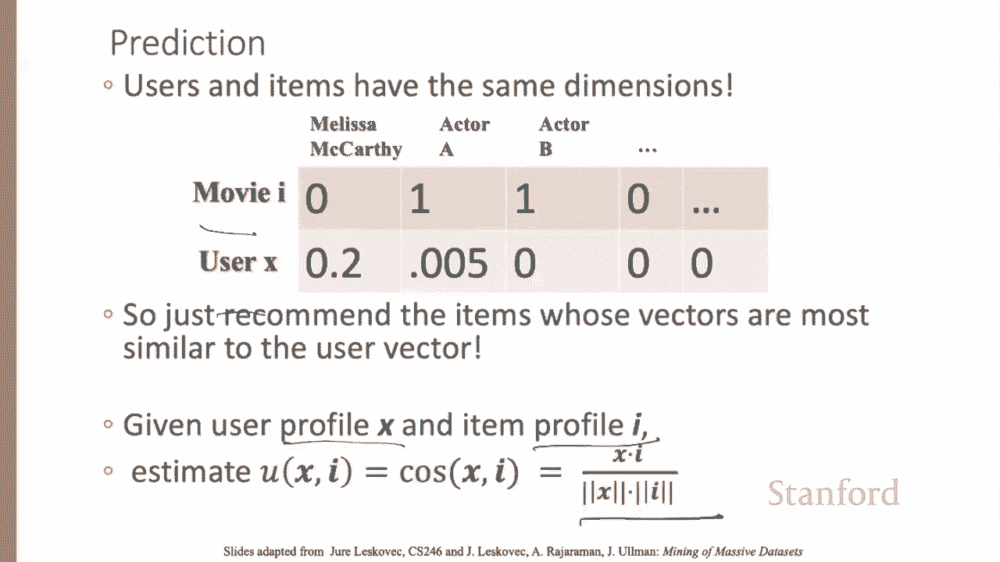
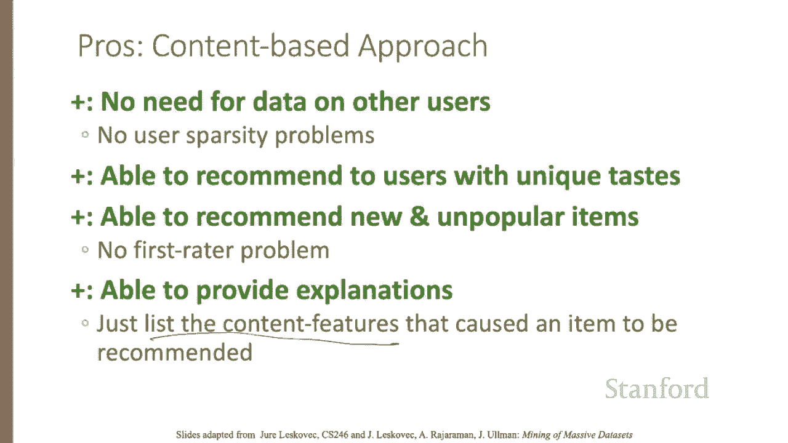
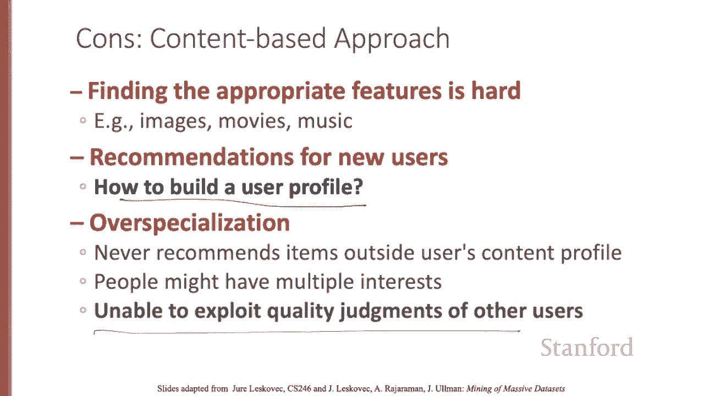

# 73：L12.2 - 基于内容的推荐系统 🎬

在本节课中，我们将要学习推荐系统的第一种方法：**基于内容的推荐**。这种方法的核心思想是利用物品本身的特征来进行推荐，而不是依赖其他用户的行为数据。

## 核心思想与流程 📝

基于内容推荐的主要思想是：向用户X推荐那些与他们**已经给予高评价的物品相似**的物品。

“相似”在这里指的是**内容上的相似**。例如，在电影推荐中，我们可以推荐拥有相同演员、导演或类型的电影。对于网站或博客，我们可以推荐具有相似标签（如烹饪、新闻、科学）或关键词的其他网站。

以下是该方法的行动流程：
1.  用户喜欢某些物品。
2.  我们拥有这些物品的特征档案。
3.  我们可以根据用户喜欢的物品，构建一个总结其偏好的**用户档案**。
4.  在数据库中寻找与用户档案匹配的物品。
5.  将这些匹配的物品推荐给用户。

## 构建物品档案 🧱

我们需要为每个物品创建一个档案，即一个**特征向量**。

*   对于电影，特征可能包括：**类型、导演、演员**。
*   对于文本，特征通常是**一组关键词**。

如何选取这些特征？
*   部分特征可以手动设定，例如，根据领域知识确定“电影类型”是重要特征。
*   部分特征可以自动学习。对于文本，我们可以计算词语的 **TF-IDF** 值，并选取那些在训练集中具有高TF-IDF值的词语作为特征。

我们可能不直接使用TF-IDF值，而是设定一个阈值。为每个超过阈值的词语在向量中创建一个维度。如果文档包含该词，则该维度值为1，否则为0。

以下是两个物品档案的示例：
*   **电影X**（约翰尼·德普主演的海盗电影）：`[动作=1, 冒险=1, 约翰尼·德普=1, 喜剧=0, 梅丽莎·麦卡西=0]`
*   **电影Y**（梅丽莎·麦卡西主演的喜剧电影）：`[动作=0, 冒险=0, 约翰尼·德普=0, 喜剧=1, 梅丽莎·麦卡西=1]`

每个物品档案都是一个由0和1组成的二进制向量。

## 处理非布尔型特征 🔢

如果我们想加入实数或有序特征呢？例如，加入一个表示“电影平均评分”的特征。这个平均值是一个实数。

这没有问题，余弦相似度计算可以处理向量中同时包含二进制值和实数值的情况。

然而，我们可能需要对非布尔型分量进行缩放，使用一个缩放因子 **α**，以确保它们既不会主导计算，也不会变得无关紧要。

假设我们计算电影X和电影Y向量之间的余弦相似度。它们的点积是 `2 + 12α²`。每个向量的长度分别是 `√(5 + 9α²)` 和 `√(5 + 16α²)`。因此，向量间夹角的余弦值为：
`cosθ = (2 + 12α²) / (√(5 + 9α²) * √(5 + 16α²))`

*   如果选择 **α = 1**（即直接使用评分值），则该表达式的值为 **0.82**。
*   如果使用 **α = 2**（即加倍强调评分值），则余弦值变为 **0.94**，相似度更高。这是因为我们强调了评分（3分和4分）是相似的。
*   相反，如果 **α = 0.5**，则会得到较低的相似度 **0.69**。

因此，**α的选择非常有影响力**，我们可能需要在一个验证集上进行调整，以最大化我们的评估指标。

## 构建用户档案 👤

我们不仅需要创建描述物品的向量，还需要创建具有相同维度、描述用户偏好的向量。

我们可以从表示用户与物品之间联系的**效用矩阵**中构建用户档案。

我们可以将用户喜欢的物品的特征值，估计为这些物品档案的某种聚合，例如，对用户评过分的物品档案取**平均值**。

例如，假设物品是由布尔型档案表示的电影，其分量对应演员。效用矩阵中，如果用户看过该电影，则值为1，否则为空。

如果用户看过的电影中，有20%包含演员梅丽莎·麦卡西，那么该用户的档案中，梅丽莎·麦卡西对应的分量值就是 **0.2**。

## 进行推荐 🎯

现在，我们拥有了相同维度下的用户档案向量和物品档案向量。

我们可以通过计算用户档案与物品档案之间的**余弦距离**，来估计用户对某个物品的偏好程度，并找到最相似的物品进行推荐。

## 优点与缺点 ⚖️

基于内容的方法有许多优点：
*   **不依赖其他用户的稀疏信息**。
*   可以为有独特品味的用户推荐。例如，如果用户刚听了一首冷门歌曲，我们可以推荐另一首冷门歌曲。
*   可以推荐**新的或罕见的物品**，因为它们都有可供选择的特征。
*   算法具有**透明度**，我们可以通过列出特征向用户解释推荐的原因。

另一方面，基于内容的方法也存在缺点：
*   需要**人工设计特征**，这很困难。
*   存在**新用户问题**，必须为新用户构建档案。
*   可能给出**多样性不足**的建议，永远不会推荐用户内容档案之外的物品。
*   与此相关，该方法**无法利用其他用户的质量判断**，而这正是协同过滤方法所擅长的。

## 总结 📚

本节课中，我们一起学习了如何根据物品的内容特征来构建推荐系统。我们了解了构建物品和用户档案的方法，如何使用余弦相似度进行匹配，以及这种方法的优缺点。基于内容的推荐是推荐系统领域一个基础且重要的方向，特别适用于解决冷启动和可解释性问题。

